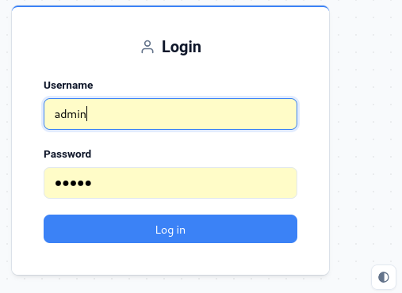
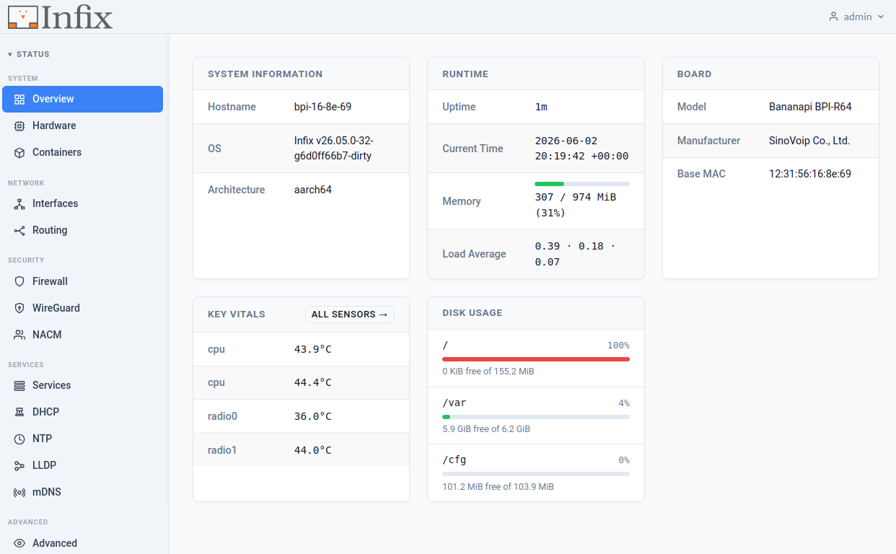
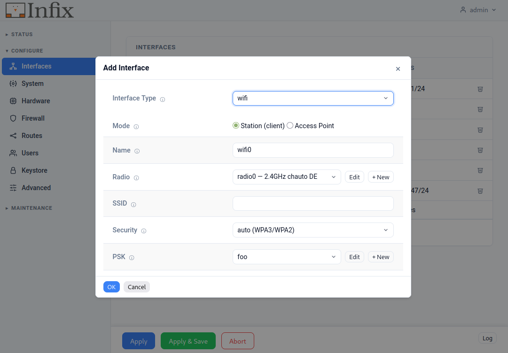

[![License Badge][]][License] [![Release Badge][]][Release] [![GitHub Status][]][GitHub] [![Discord][discord-badge]][discord-url]

Infix turns an ARM or x86 device into a managed network appliance.  The
same OS runs on a $35 Raspberry Pi and on enterprise switching hardware,
so you can build a router, an IoT gateway, or an edge device on whatever
you have on hand.

More in-depth material is available in our blog and User Guide:

- <https://www.kernelkit.org/>
- <https://www.kernelkit.org/infix/>

## See it in action

The CLI is generated from the [YANG models][inside], so it guides you with
built-in help.  Here's setting an IP address on an interface:

<pre><code>admin@infix-12-34-56:/> <b>configure</b>
admin@infix-12-34-56:/config/> <b>edit interface eth0</b>
admin@infix-12-34-56:/config/interface/eth0/> <b>set ipv4</b> <kbd>TAB</kbd>
      address     autoconf      bind-ni-name     dhcp 
      enabled     forwarding    mtu              neighbor
admin@infix-12-34-56:/config/interface/eth0/> <b>set ipv4 address 192.168.2.200 prefix-length 24</b>
admin@infix-12-34-56:/config/interface/eth0/> <b>show</b>
type ethernet;
ipv4 {
  address 192.168.2.200 {
    prefix-length 24;
  }
}
admin@infix-12-34-56:/config/interface/eth0/> <b>diff</b>
interfaces {
  interface eth0 {
+    ipv4 {
+      address 192.168.2.200 {
+        prefix-length 24;
+      }
+    }
  }
}
admin@infix-12-34-56:/config/interface/eth0/> <b>leave</b>
admin@infix-12-34-56:/> <b>show interfaces</b>
<u>INTERFACE       PROTOCOL   STATE       DATA                                  </u>
lo              ethernet   UP          00:00:00:00:00:00
                ipv4                   127.0.0.1/8 (static)
                ipv6                   ::1/128 (static)
eth0            ethernet   UP          52:54:00:12:34:56
                ipv4                   192.168.2.200/24 (static)
                ipv6                   fe80::5054:ff:fe12:3456/64 (link-layer)
admin@infix-12-34-56:/> <b>copy running startup</b>
</code></pre>

<kbd>TAB</kbd> completes available options and <kbd>?</kbd> shows online help
for each option and argument. `show` displays the current config, and `diff`
shows exactly what changed before you commit it with `leave`.  See the [CLI
documentation][3] for more.

## Web interface

If the CLI isn't your style, the same configuration is available through the
web interface.  Log in from a browser, keep an eye on your device from the
Status dashboard and use the Configure > Interface setup wizard to create more
advanced setups, or just fold out an interface to add an IP address.

  
  
  

The web interface is built on the same concepts as the CLI, so operational
status and state are kept separate from configuration and commands.

## Try it in 5 minutes

You don't need hardware to get started:

- **In a virtual lab** — run a full topology in [GNS3][gns3-post] and test
  networks entirely in software.
- **From source** — [build it and `make run`][build-post] to boot Infix in
  QEMU, from `git clone` to pinging the internet.
- **On real hardware** — grab a [pre-built image][5] for your board, or run
  the `x86_64` image in any VM.

Log in with `admin` / `admin` on the virtual and pre-built images.  On
shipped products the factory-reset credentials are customizable — we
typically provision a unique per-device password stored in EEPROM/VPD.

## Supported hardware

- **Raspberry Pi 2B/3B/4B/CM4** - a good starting point; built-in WiFi and Ethernet
- **Banana Pi-R64/R3/R3 Mini/R4** - multi-port routers and gateways
- **NanoPi R2S** - compact dual-port router
- **x86_64** - VMs and mini PCs, for development or production
- **Marvell CN9130 CRB, EspressoBIN** - ARM64 development boards
- **Microchip SparX-5i** - enterprise switching
- **Microchip SAMA7G54-EK** - ARM Cortex-A7 evaluation kit
- **NXP i.MX8MP EVK** - ARM64 SoC evaluation kit
- **StarFive VisionFive2** - RISC-V board

*Why start with Raspberry Pi?* It's cheap, easy to get hold of, has
built-in WiFi and Ethernet, and runs the same Infix you'd deploy in
production — so what you learn on it carries straight over.

> [!TIP]
> 📖 **[Complete documentation][4]** • 💬 **[Join our Discord][discord-url]**

## Why Infix

**🔒 Immutable**  
Read-only filesystem with atomic upgrades.  An update either applies
cleanly or rolls back, so a failed upgrade or a power cut midway through
won't leave you with a half-broken system.

**🤝 Friendly**  
The CLI is generated from the YANG models, so every command carries its
own help — hit <kbd>?</kbd> or <kbd>TAB</kbd> to see what's available.
The same models are reachable over NETCONF and RESTCONF, with
[documentation][4] for when you get stuck.

**🛡️ Secure**  
A small attack surface, separation between system and data, and
container isolation.  Since the system partition is read-only, a
compromised service or container can't rewrite the OS underneath it.

## Use cases

1. **Home labs & hobbyists**:  
   Turn a Raspberry Pi into a router with WiFi  
1. **IoT & edge**:  
   Build gateways you can update in the field  
1. **Small business networks**:  
   Routing, firewalling, and VLANs on affordable hardware  
1. **Developers & makers**:  
   Prototype networking ideas, or build a custom appliance with containers  
1. **Network professionals**:  
   The same tooling from lab to production — spin up a digital twin in raw
   Qemu or [GNS3](https://gns3.com/infix)

## Under the hood

<a href="https://bitsign.se">
  <picture>
    <source media="(prefers-color-scheme: dark)" srcset="https://bitsign.se/assets/badges/bitsign-badge-dark-mode.png">
    <source media="(prefers-color-scheme: light)" srcset="https://bitsign.se/assets/badges/bitsign-badge-light-mode.png">
    
  </picture>
</a>

Built on [Linux][0], [Buildroot][1], and [sysrepo][2]:

- **Immutable OS**: read-only filesystem, atomic updates, rollback on failure
- **YANG configuration**: standard models with an auto-generated CLI and APIs
- **Hardware acceleration**: switchdev offload for wire-speed forwarding
- **Container integration**: Docker, with access to host network and hardware
- **Memory efficient**: runs on devices with as little as 256 MB RAM
- **Code signing**: releases are cryptographically signed

Because the whole system is modeled in YANG, every setting is reachable
the same way: from the CLI over console or SSH, or remotely over the
native NETCONF and RESTCONF APIs.  The same models drive development,
testing, and day-to-day monitoring.

> Check the *[Latest Build][]* for bleeding-edge features.

## Contributing

Bug reports, ideas, and pull requests are welcome.  Start with
[CONTRIBUTING][contributing] and the [code of conduct][coc].  Found a
security issue?  Follow the [security policy][security].  Need a hand?
See [support options][support] or [join us on Discord][discord-url].

---

  
   Infix development is sponsored by <a href="https://wires.se">Wires</a>

[0]: https://www.kernel.org
[1]: https://buildroot.org/ "Buildroot Homepage"
[2]: https://www.sysrepo.org/ "Sysrepo Homepage"
[3]: https://www.kernelkit.org/infix/latest/cli/introduction/
[4]: https://www.kernelkit.org/infix/
[5]: https://github.com/kernelkit/infix/releases/latest
[inside]:          https://www.kernelkit.org/posts/inside-infix/
[gns3-post]:       https://www.kernelkit.org/posts/infix-in-gns3/
[build-post]:      https://www.kernelkit.org/posts/building-infix-from-source/
[contributing]:    .github/CONTRIBUTING.md
[coc]:             .github/CODE_OF_CONDUCT.md
[security]:        .github/SECURITY.md
[support]:         .github/SUPPORT.md
[Latest Build]:    https://github.com/kernelkit/infix/releases/tag/latest "Latest build"
[License]:         https://en.wikipedia.org/wiki/GPL_license
[License Badge]:   https://img.shields.io/badge/License-GPL%20v2-blue.svg
[Release]:         https://github.com/kernelkit/infix/releases/latest
[Release Badge]:   https://img.shields.io/github/v/release/kernelkit/infix 
[GitHub]:          https://github.com/kernelkit/infix/actions/workflows/build.yml/
[GitHub Status]:   https://github.com/kernelkit/infix/actions/workflows/build.yml/badge.svg
[Coverity Scan]:   https://scan.coverity.com/projects/29393
[Coverity Status]: https://scan.coverity.com/projects/29393/badge.svg
[discord-badge]:   https://img.shields.io/discord/1182652155618918411.svg?logo=discord
[discord-url]:     https://discord.gg/6bHJWQNVxN
