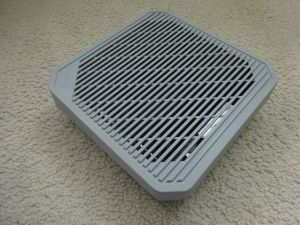

# Acer Connect Vero W6m



## Overview

The Acer Connect Vero W6m is a compact WiFi 6/6E router platform based
on the MediaTek MT7986A SoC.  In Infix it is supported as an eMMC-based
target that reuses the factory secure boot chain while replacing the
system partitions with an Infix installation.

The Acer Connect Vero W6m is based on the same MT7986a SoC as the
BPI-R3, with tri-band WiFi (2.4 GHz + 5 GHz + 6 GHz) using a PCIe
MT7916 module and the SoC's built-in MT7976 DBDC radio.

## Default WiFi Layout

The factory configuration on this branch enables all three radios in AP
mode and bridges them into the default LAN bridge `br0`:

- `radio0` / `wifi0-ap`: 2.4 GHz, SSID `Infix`
- `radio1` / `wifi1-ap`: 6 GHz, SSID `Infix6G`
- `radio2` / `wifi2-ap`: 5 GHz, SSID `Infix5G`

6 GHz operation is enabled in the MT7915e driver configuration, and all
three APs use the same default passphrase `infixinfix` from the factory
configuration.

Secure boot is enabled on this device, so the factory bootloader
(partitions 1-4: bl2, u-boot-env, factory, fip) must not be modified.
Infix is installed by replacing partitions 5+ while keeping the
factory bootloader intact.  The stock U-Boot chainloads the Infix
U-Boot from the first partition after fip.

## Prerequisites

- Serial console access (115200 8N1) — required to interrupt U-Boot.
  Disassembly is needed to reach the UART header.  See the [OpenWrt
  Vero W6m page][vero-openwrt] for details.
- TFTP server on the local network with `u-boot.bin` for the initial
  RAM boot.
- SSH access from the running Infix system to a host that stores
  `infix-vero-w-emmc.img`.
- Ethernet cable connected between the PC and the Vero Internet/WAN
  port.
- DHCP server running on the PC, serving addresses on that link during
  installation.
- **Save the MAC addresses** from the stock U-Boot environment before
  installing.  Interrupt autoboot and run `printenv` to note down:
  `2gMAC`, `5gMAC`, `6gMAC`, `LANMAC`, and `WANMAC`.

## Required Files

Prepare these files on a host reachable from the Vero:

1. **Infix Vero image:**
   - [infix-vero-w-emmc.img][1] (Complete system image)
2. **eMMC bootloader** (extracted from):
   - [bpi-r3-emmc-boot-2025.01-latest.tar.gz][2]
   - Extract `u-boot.bin` from the tarball to your TFTP server

## Installing Infix

Connect the PC directly to the Vero Internet/WAN port before starting
the installation.  The PC should provide DHCP service on that link so
the stock U-Boot and the temporary Infix system can reach the TFTP/SSH
host.

1. **RAM-load Infix U-Boot** from the stock U-Boot serial console
   (hit any key to stop autoboot):

   ```
   setenv serverip <TFTP_SERVER_IP>
   setenv ipaddr <VERO_IP>
   setenv bootmenu_default 7
   tftpboot 0x46000000 u-boot.bin
   go 0x46000000
   ```

   `serverip` must point to your TFTP server and `ipaddr` must be a free
   address for the Vero on the same subnet.  `bootmenu_default 7`
   bypasses secure boot verification.  The Infix U-Boot will
   automatically netboot the Infix system.

2. **From running Infix**, stream the image directly to eMMC:

   ```bash
   ssh <USER>@<HOST> "dd if=/path/to/infix-vero-w-emmc.img bs=512 skip=17408 status=none" | \
   dd of=/dev/mmcblk0 bs=512 seek=17408 conv=fsync
   sync
   ```

   This writes only the Infix partitions (starting after fip at sector
   17408), leaving the factory bootloader and calibration data intact.
   Do not interrupt the transfer; if it fails, rerun the command from
   the beginning.

3. **Update the GPT** to replace stock partitions 5+ with the Infix
   layout:

   ```bash
   sudo sgdisk --zap-all /dev/mmcblk0
   sudo sgdisk -a 1 \
       -n2:8192:9215      -c2:u-boot-env  \
       -n3:9216:13311     -c3:factory      \
       -n4:13312:17407    -c4:fip          \
       -n5:17408:+32M     -c5:infix-uboot \
       -n6:0:+8M          -c6:aux         \
       -n7:0:+250M        -c7:primary     \
       -n8:0:+250M        -c8:secondary   \
       -n9:0:+128M        -c9:cfg         \
       -n10:0:+128M       -c10:var        \
       -p /dev/mmcblk0
   ```

4. **Configure U-Boot to chainload Infix permanently** — reboot and
   interrupt stock U-Boot again:

   ```
   setenv bootmenu_default 7
   setenv bootcmd 'mmc read 0x46000000 0x4400 0x10000; go 0x46000000'
   saveenv
   reset
   ```

   The `bootcmd` reads the Infix U-Boot (at sector 0x4400/17408)
   into RAM and jumps to it.  After `reset`, Infix boots from eMMC.

[vero-openwrt]: https://openwrt.org/toh/acer/predator_vero_w6m
[1]: https://github.com/kernelkit/infix/releases/download/latest-boot/infix-vero-w-emmc.img
[2]: https://github.com/kernelkit/infix/releases/download/latest-boot/bpi-r3-emmc-boot-2025.01-latest.tar.gz
