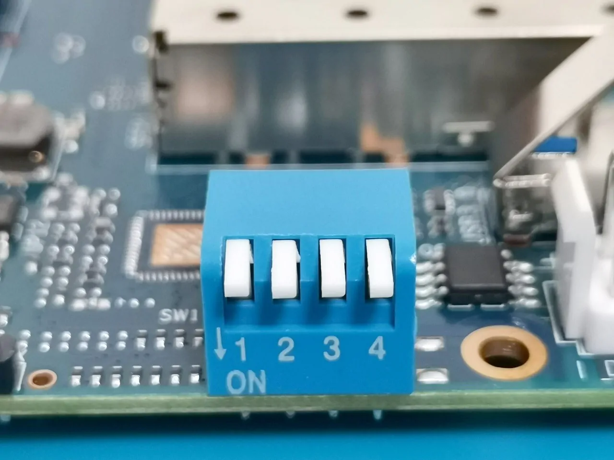

# Banana Pi BPI-R3


## Overview

The Banana Pi R3 is a high-performance networking board with full Infix
support for all enabled features including switched Ethernet ports, WiFi,
and SFP interfaces.

### Hardware Features

- MediaTek MT7986 ARM Cortex-A53 quad-core processor @ 2.0 GHz
- 2 GB DDR4 RAM
- 8 GB eMMC storage + microSD card slot
- 5x Gigabit Ethernet ports (4x LAN, 1x WAN)
- 2x SFP cages for fiber connectivity (1G/2.5G)
- Dual-band WiFi (2.4 GHz + 5 GHz)
- USB 3.0 port
- Mini PCIe slot

### Default Network Configuration

Infix comes preconfigured with:

- **LAN ports** (lan1-lan4): Bridged for internal networking
- **WAN port**: DHCP client enabled for internet connectivity
- **SFP ports** (sfp1, sfp2): Available for configuration
- **WiFi interfaces** (wifi0, wifi1): Available for configuration

## Getting Started

### Quick Start with SD Card

The easiest way to get started is using an SD card:

1. **Download the SD card image:** [infix-bpi-r3-sdcard.img][2]
2. **Flash the image to an SD card:** see [this guide][0]
3. **Set boot switches:**
   - Set DIP switches to **0000** (SD card boot mode)
   - Switch positions are on the underside of the board near the SD slot
4. **Boot the board:**
   - Insert the SD card
   - Connect power
   - Connect to LAN port or console (115200 8N1)
   - Default login: `admin` / `admin`

### Boot Switch Reference

The BPI-R3 has a 4-position DIP switch that controls boot media:



| Position | Mode        | Description                           |
|----------|-------------|---------------------------------------|
| 0000     | SD card     | Boot from microSD card (recommended)  |
| 0110     | eMMC        | Boot from internal eMMC storage       |
| 1010     | SPI NAND    | Boot from SPI NAND (advanced users)   |

> [!NOTE]
> Switch position is read from left to right: "0" = OFF, "1" = ON.  
> When the DIP switch is in the "UP" position it is OFF(0).

## Advanced: Installing to eMMC

For production deployments or better performance, you can install Infix
to the internal eMMC storage. This is more complex but provides faster
boot times and eliminates the external SD card.

### Why Use eMMC?

**Advantages:**

- Faster boot and better performance
- No external SD card to manage
- More robust for industrial/embedded deployments

**Disadvantages:**

- More complex installation process
- Requires intermediate NAND boot step
- Harder to recover from errors

### Prerequisites

- FTDI USB-to-serial cable (3.3V) for console access
- microSD card with Infix (for initial boot)
- USB flash drive (FAT32 formatted)
- Downloaded files (see below)

### Required Files

Download and place these files on a FAT32-formatted USB drive:

1. **Intermediate NAND bootloader** (from Frank-W's U-Boot):
   - [bpi-r3_spim-nand_bl2.img][5] (BL2 loader)
   - [bpi-r3_spim-nand_fip.bin][6] (FIP image)
2. **Infix eMMC image:**
   - [infix-bpi-r3-emmc.img][3] (Complete system image)
3. **eMMC bootloader** (extracted from):
   - [bpi-r3-emmc-boot-2025.01-latest.tar.gz][4]
   - Extract `bl2.img` from the tarball to your USB drive

> [!WARNING]
> The following process involves multiple boot mode changes.  Take your
> time verify each step carefully.

### Installation Steps

#### Step 1: Boot from SD card

1. Set boot switches to **0000** (SD card mode)
2. Insert SD card with Infix
3. Power on and break into U-Boot (press Ctrl-C during boot)

#### Step 2: Flash intermediate NAND bootloader

This step installs a temporary bootloader to NAND that will help us
flash the eMMC. From the U-Boot prompt:

```
usb start
mtd erase spi-nand0
fatload usb 0:1 0x50000000 bpi-r3_spim-nand_bl2.img
mtd write spi-nand0 0x50000000 0x0 0x100000
fatload usb 0:1 0x50000000 bpi-r3_spim-nand_fip.bin
mtd write spi-nand0 0x50000000 0x380000 0x200000
```

#### Step 3: Boot from NAND

1. Power off the board
2. Set boot switches to **1010** (NAND mode)
3. Power on - you should boot into U-Boot again

#### Step 4: Write Infix image to eMMC

From the U-Boot prompt:

```
usb start
fatload usb 0:1 0x50000000 infix-bpi-r3-emmc.img
setexpr blocks ${filesize} / 0x200
mmc write 0x50000000 0x0 ${blocks}
```

This writes the complete Infix system (partitions, rootfs, etc.) to eMMC.

#### Step 5: Configure eMMC boot

Now configure the eMMC boot partition and write the bootloader:

```
mmc partconf 0 1 1 1
mmc erase 0x0 0x400
fatload usb 0:1 0x50000000 bl2.img
mmc write 0x50000000 0x0 0x400
mmc partconf 0 1 1 0
```

#### Step 6: Boot from eMMC

1. Power off the board
2. Set boot switches to **0110** (eMMC mode)
3. Remove SD card (optional, but recommended to verify eMMC boot)
4. Power on

Your BPI-R3 should now boot Infix from internal eMMC storage!

## Troubleshooting

### Board won't boot

- Verify boot switch positions (check twice!)
- Ensure power supply provides adequate current (12V/2A recommended)
- Try booting from SD card with switches at **0000**

### Can't break into U-Boot

- Ensure serial console is connected properly (115200 8N1, 3.3V)
- Press Ctrl-C immediately when you see boot messages
- Try power cycling and pressing Ctrl-C repeatedly

### eMMC boot fails after installation

- Boot from NAND (**1010**) and verify eMMC image was written
- Check USB drive contents - ensure all files are present
- Re-run Step 5 (eMMC boot configuration)

### Reverting to SD card

Simply set boot switches back to **0000** and boot from SD card. The
eMMC installation does not affect SD card functionality.

## Additional Resources

- [Infix Documentation][1]
- [Official BPI-R3 Wiki][7]
- [Release Downloads][8]

## Building Custom Images

See the main Infix documentation for building from source. To build both
SD card and eMMC images locally:

```bash
# Build bootloaders for both SD and eMMC
make x-bpi-r3-sd-boot
make x-bpi-r3-emmc-boot

# Build main system
make aarch64

# Create SD card image
./utils/mkimage.sh -od bananapi-bpi-r3

# Create eMMC image
./utils/mkimage.sh -odt emmc bananapi-bpi-r3
```

[0]: https://kernelkit.org/posts/flashing-sdcard/
[1]: https://kernelkit.org/infix/latest/
[2]: https://github.com/kernelkit/infix/releases/download/latest-boot/infix-bpi-r3-sdcard.img
[3]: https://github.com/kernelkit/infix/releases/download/latest-boot/infix-bpi-r3-emmc.img
[4]: https://github.com/kernelkit/infix/releases/download/latest-boot/bpi-r3-emmc-boot-2025.01-latest.tar.gz
[5]: https://github.com/frank-w/u-boot/releases/download/CI-BUILD-2025-10-bpi-2025.10-2025-10-13_1032/bpi-r3_spim-nand_bl2.img
[6]: https://github.com/frank-w/u-boot/releases/download/CI-BUILD-2025-10-bpi-2025.10-2025-10-13_1032/bpi-r3_spim-nand_fip.bin
[7]: https://wiki.banana-pi.org/Banana_Pi_BPI-R3
[8]: https://github.com/kernelkit/infix/releases/tag/latest-boot
