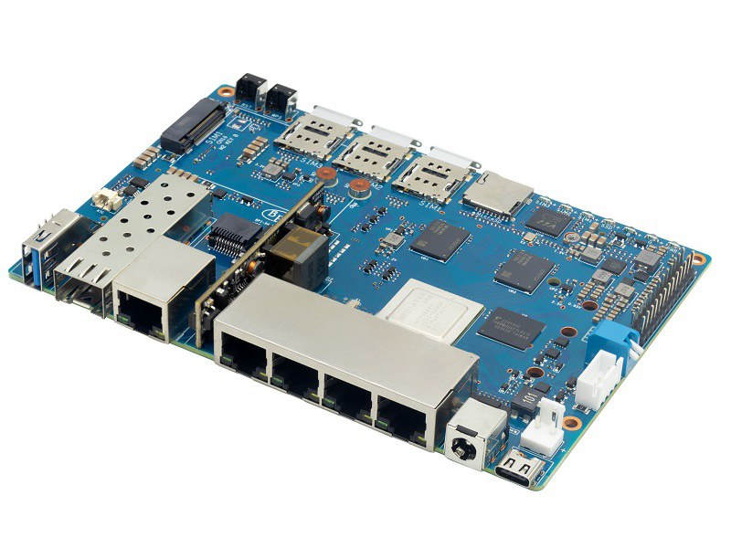
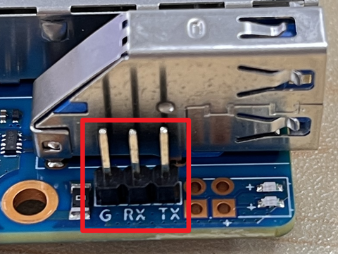
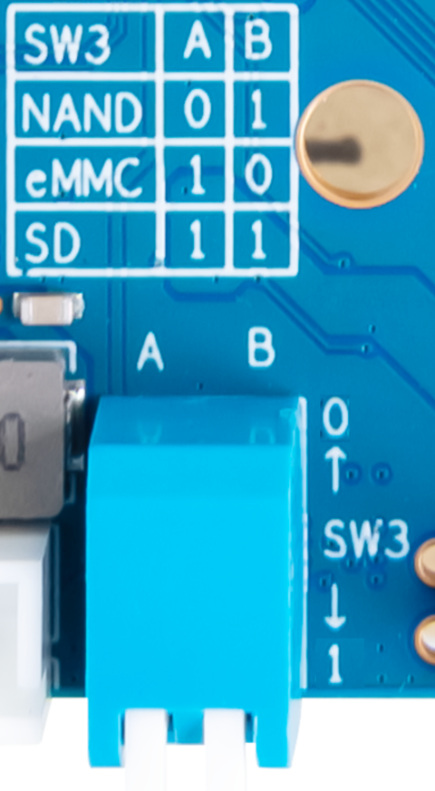

# Banana Pi BPI-R4 / BPI-R4-2g5 / BPI-R4P



## Overview

The Banana Pi BPI-R4 is a high-performance networking board built around the
MediaTek MT7988A SoC (Filogic 880).  It is a successor to the BPI-R3 and
represents a significant step up: the CPU switches from in-order Cortex-A53
cores to out-of-order Cortex-A73 cores, and the MT7531 switch is now part of
the SOC. The base model comes with two SFP+ cages supporting 1.25/2.5/5/10
Gbps, and the R4P model comes with one SFP+ cage and one 2.5 Gbps RJ45 jack,
which with an optional PoE board means the board can act as PD.  Unlike the
BPi-R3, however, there is no on-board WiFi support, that requires an external
tri-band WiFi 7 (IEEE 802.11be) card.

### Variants

| **Feature**      | **BPI-R4**       | **BPI-R4-2g5**    | **BPI-R4P**               |
|------------------|------------------|-------------------|---------------------------|
| 1G switch ports  | wan, lan1–lan3   | lan0–lan3         | lan0–lan3                 |
| 2.5G RJ45 (WAN)  | —                | wan               | wan (PoE input)           |
| SFP+ port(s)     | sfp1, sfp2 (10G) | sfp1 (10G)        | sfp1 (10G)                |
| Linux DT         | bpi-r4           | bpi-r4-2g5        | bpi-r4-2g5 (same)         |

On the standard BPI-R4 the four 1G switch ports are labeled `wan`, `lan1`, `lan2`,
and `lan3`.  On the R4-2g5 and R4P, the port that would otherwise be `wan` on the
switch is relabeled `lan0` via a device tree overlay, since the actual WAN port on
those variants is the dedicated 2.5G internal PHY on the separate RJ45 jack.

The BPI-R4P is mechanically and electrically identical to the BPI-R4-2g5
with an additional PoE daughterboard header.  From a Linux kernel and
Infix perspective the two boards are treated identically.

### SoC: MediaTek MT7988A vs MT7986 (BPI-R3)

The MT7988A (Filogic 880) and MT7986 (Filogic 820) may look similar from
their part numbers, but they are built on entirely different silicon with
distinct system architectures:

| **Aspect**       | **MT7988A (BPI-R4)**     | **MT7986 (BPI-R3)**       |
|------------------|--------------------------|---------------------------|
| CPU cores        | 4x Cortex-A73 @ 1.8 GHz  | 4x Cortex-A53 @ 2.0 GHz   |
| CPU architecture | ARMv8-A, out-of-order    | ARMv8-A, in-order         |
| Internal switch  | 1 Gbps per port          | 1 Gbps per port           |
| Uplinks          | USXGMII (native 10 Gbps) | USXGMII (native 2.5 Gbps) |
| WiFi             | MT7996E PCIe module      | MT7915E (built-in)        |
| WiFi standard    | WiFi 7 (802.11be)        | WiFi 6 (802.11ax)         |
| WiFi bands       | 2.4 / 5 / 6 GHz          | 2.4 / 5 GHz               |
| Hardware crypto  | EIP-197 NPU              | EIP-93                    |
| PCIe slots       | 4 (2x mPCIe, 2x M.2)     | 1 mPCIe                   |
| Boot ROM offset  | Sector 1024 (0x80000)    | Sector 1024 (0x80000)     |

### Hardware Features

- **SoC:** MediaTek MT7988A (Filogic 880)
- **CPU:** Quad-core ARM Cortex-A73, up to 1.8 GHz
- **RAM:** 4 GB DDR4
- **Storage:** 8 GB eMMC, microSD card slot, SPI NAND flash
- **Ethernet switch:** 4-port 1 GbE (10/100/1000) internal DSA switch
- **SFP+ ports:** 2x 10 Gbps USXGMII (standard R4) or 1x SFP+ (R4-2g5/R4P)
- **WiFi:** optional MediaTek MT7996E PCIe module — tri-band WiFi 7 (2.4/5/6 GHz)
- **USB:** 1x USB 3.0 (xHCI)
- **PCIe:** 2x mPCIe (SIM2/SIM3), 1x M.2 Key-B (SIM1), 1x M.2 Key-M (SSD)
- **RTC:** PCF8563 on I2C
- **Fan:** PWM-controlled cooling with thermal management
- **Console:** UART at 115200 8N1 (3.3 V, USB-to-serial adapter required)

### Default Network Configuration

Infix ships with the following factory defaults.

**Standard BPI-R4:**

- **LAN bridge** (`br0`, 192.168.0.1/24): `lan1`, `lan2`, `lan3` (1G switch ports)
- **WAN port** (`wan`): DHCP client, used for internet uplink (1G switch port)
- **SFP+ ports** (`sfp1`, `sfp2`): Present but unconfigured

**BPI-R4-2g5 and BPI-R4P:**

- **LAN bridge** (`br0`, 192.168.0.1/24): `lan0`, `lan1`, `lan2`, `lan3` (1G switch ports)
- **WAN port** (`wan`): DHCP client, used for internet uplink (2.5G internal PHY)
- **SFP+ port** (`sfp1`): Present but unconfigured

> [!NOTE]
> If an optional WiFi 7 (MT7996E) PCIe card is installed, the radio interfaces
> are bridged into the LAN as access points.  WiFi is not included with the board
> and is not part of the factory default configuration.


## Getting Started



### Quick Start with SD Card

1. **Download the SD card image:** [infix-bpi-r4-sdcard.img][2]
2. **Flash the image to an SD card:** see [this guide][0]
3. **Set boot switches to SD card mode** (see Boot Switch Reference below)
4. **Insert the SD card, connect power and a serial console (115200 8N1)**
5. Default login: `admin` / `admin`

### Boot Switch Reference



The BPI-R4 has a 2-position DIP switch (SW3) that selects the boot media.
Switch positions are printed on the board near the SD card slot.

| A   | B   | Boot media (SW3) |
|-----|-----|------------------|
| OFF | ON  | SPI NAND         |
| ON  | OFF | eMMC             |
| ON  | ON  | SD card          |

> [!NOTE]
> "OFF" = switch in the UP position = logical 0.

## Installing to eMMC

For production use or better reliability, install Infix to the internal
eMMC storage.

> [!IMPORTANT]
> The MT7988A has a single MMC controller that can only operate in one mode
> (SD or eMMC) per boot session.  The SD card U-Boot cannot switch to eMMC
> mode mid-session, so an intermediate NAND bootloader step is required to
> write the eMMC — the same approach as BPi-R3.
>
> The MT7988A boot chain is: **BROM → BL2 → FIP (BL31 + U-Boot)**.  The FIP
> (Firmware Image Package) bundles ARM Trusted Firmware (BL31) and U-Boot
> together; it is not just a U-Boot binary.  When BL2 runs, it loads the FIP
> from a fixed offset and hands off to BL31, which then jumps into U-Boot.
>
> The factory SPI NAND contains a minimal recovery U-Boot that only supports
> TFTP — it has no USB command.  You cannot use it to load files from a USB
> drive.  Similarly, the factory eMMC ships with a basic OpenWRT image.
> You must first flash a full-featured U-Boot (from Frank-W) to SPI NAND via
> the SD card U-Boot before you can write the eMMC.
>
> This process involves three boot mode changes and multiple flash operations.
> Take your time and verify each step carefully.

### Prerequisites

- USB-to-serial adapter (3.3 V) for console access
- USB flash drive (FAT32 formatted)
- microSD card with Infix SD image, for initial boot
- Downloaded files (see below)

### Required Files

Place these files on a FAT32-formatted USB drive:

1. **Infix eMMC image:** [infix-bpi-r4-emmc.img][3]
2. **eMMC bootloader** (from): [bpi-r4-emmc-boot-2026.01-latest.tar.gz][4]
   - Extract `bl2.img` from the tarball to your USB drive
3. **Intermediate NAND bootloader** from Frank-W's U-Boot (for BPI-R4, SPI NAND):
   - [bpi-r4_spim-nand_bl2.img][13] — BL2 first-stage loader
   - [bpi-r4_spim-nand_fip.bin][14] — FIP image (BL31 + U-Boot)

### Step 1: Boot from SD card

1. Set boot switches to **SD card mode** (SW3: A=ON, B=ON)
2. Insert the SD card with the Infix image
3. Power on and break into U-Boot (press Ctrl-C during countdown)

### Step 2: Flash intermediate NAND bootloader

This installs a full-featured U-Boot to SPI NAND so the board can load files
from USB in the next step.  From the SD card U-Boot prompt:

```
usb start
mtd erase spi-nand0
fatload usb 0:1 0x50000000 bpi-r4_spim-nand_bl2.img
mtd write spi-nand0 0x50000000 0x0 0x100000
fatload usb 0:1 0x50000000 bpi-r4_spim-nand_fip.bin
mtd write spi-nand0 0x50000000 0x580000 0x200000
```

### Step 3: Boot from NAND

1. Power off the board
2. Set boot switches to **SPI NAND mode** (SW3: A=OFF, B=ON)
3. Power on — you should boot into U-Boot again

### Step 4: Write Infix image to eMMC

From the U-Boot prompt:

```
usb start
fatload usb 0:1 0x50000000 infix-bpi-r4-emmc.img
setexpr blocks ${filesize} / 0x200
mmc write 0x50000000 0x0 ${blocks}
```

### Step 5: Configure eMMC boot partition

Write the BL2 bootloader to the eMMC boot partition:

```
mmc partconf 0 1 1 1
mmc erase 0x0 0x400
fatload usb 0:1 0x50000000 bl2.img
mmc write 0x50000000 0x0 0x400
mmc partconf 0 1 1 0
```

### Step 6: Boot from eMMC

1. Power off the board
2. Set boot switches to **eMMC mode** (SW3: A=ON, B=OFF)
3. Remove the SD card (optional, recommended to verify eMMC boot)
4. Power on

Your BPI-R4 should now boot Infix from internal eMMC storage.

## Troubleshooting

### Board won't boot

- Verify boot switch positions — double-check against the wiki
- Ensure the power supply provides adequate current (12 V / 3 A recommended)
- Check the serial console output at 115200 8N1

### Can't break into U-Boot

- Connect the serial console before powering on
- Press Ctrl-C immediately when boot messages appear
- Try power cycling and pressing Ctrl-C repeatedly during the countdown

### eMMC boot fails after installation

- Boot from NAND (SW3=ON) and verify the eMMC write completed without errors
- Re-run the `mmc partconf` sequence — a missed step is the most common
  cause of failure
- Use `mmc info` to confirm the eMMC is detected

### No network connectivity

The interface names on BPI-R4 differ from BPI-R3.  Confirm what Linux
has created with `ip link` and compare with the factory configuration:

- `wan`, `lan1`–`lan3`: 1G switch ports (standard R4)
- `wan`, `lan0`–`lan3`: on R4-2g5/R4P, `wan` is the 2.5G internal PHY; `lan0`–`lan3` are 1G switch ports
- `sfp1` (and `sfp2` on standard R4): 10G SFP+ cage(s)

If interface renames look wrong, check `dmesg | grep renamed` and if
you spot any errors, please report as an issue to the Infix tracker
on GitHub.

## Board Variants

### BPI-R4

The base model BPi-R4 ports look like this, the `wan` port is the same physical
switch port as `lan0` on the R4-2g5/R4P, but here it serves as the WAN port in
the factory default configuration.

```
.-.
| |                      .-----.-----.-----.-----.
| |   _______   _______  |     |     |     |     | .---.
| |  |       | |       | |     |     |     |     | |   | .-----.
'-'  '-------' '-------' '-----'-----'-----'-----' '---' '-----'
USB1    sfp1      sfp2     wan  lan1  lan2  lan3   DC12V  PD20V
```

### BPI-R4-2g5 and BPI-R4P

These variants substitute one SFP+ cage for an internal 2.5 Gbps PHY
connected to a standard RJ45 jack.  From a kernel perspective they use
the `mt7988a-bananapi-bpi-r4-2g5` device tree.

The BPI-R4P additionally supports an optional PoE input daughterboard on
the 2.5 Gbps RJ45 port.  The PoE circuitry is passive with respect to
Linux — no special kernel driver is required for basic operation.

For these board variants, the WAN role moves to the dedicated 2.5G internal PHY,
so all four switch ports become LAN ports (`lan0`–`lan3`) instead of three:

```
.-.
| |            .-----.   .-----.-----.-----.-----.
| |   _______  |     |   |     |     |     |     | .---.
| |  |       | |     |   |     |     |     |     | |   | .-----.
'-'  '-------' '-----'   '-----'-----'-----'-----' '---' '-----'
USB1    sfp1     wan      lan0  lan1  lan2  lan3   DC12V  PD20V
```

### Selecting the Board Variant

U-Boot cannot automatically distinguish the standard R4 from the R4-2g5/R4P at
boot time (the on-board EEPROM is not programmed from factory).  Instead, the
variant is read from the persistent U-Boot environment on the `aux` partition,
and you have to set it manually using `fw_setenv` from a UNIX shell:

```bash
# For BPI-R4-2g5 or BPI-R4P (1x SFP+ + 1x 2.5 Gbps RJ45):
sudo fw_setenv BOARD_VARIANT 2g5

# To revert to the standard BPI-R4 (2x SFP+) clear the setting:
sudo fw_setenv BOARD_VARIANT
```

> [!IMPORTANT]
> The change takes effect on the next reboot.  No re-flashing is required, but
> you may want to do a factory reset to activate the changes in your system
> `startup-config`: `sudo factory -y` from shell, or the CLI.

`fw_setenv` writes to the `uboot.env` file on the aux partition.  U-Boot
reads this at every boot (before loading the kernel) and selects the
matching device tree:

| `BOARD_VARIANT` | Device tree loaded                |
|-----------------|-----------------------------------|
| *(unset)*       | `mt7988a-bananapi-bpi-r4.dtb`     |
| `2g5`           | `mt7988a-bananapi-bpi-r4-2g5.dtb` |

## Additional Resources

- [Infix Documentation][1]
- [Official BPI-R4 Page][7]
- [BPI-R4 Forum][8]
- [Frank-W's site][9]
- [Release Downloads][10]
- [Bootloader Builds][11]

## Building Custom Images

```bash
# Build bootloaders for SD and eMMC
make x-bpi-r4-sd-boot
make x-bpi-r4-emmc-boot

# Build main system
make aarch64

# Create SD card image
./utils/mkimage.sh -od bananapi-bpi-r4

# Create eMMC image
./utils/mkimage.sh -odt emmc bananapi-bpi-r4
```

[0]: https://www.kernelkit.org/posts/flashing-sdcard/
[1]: https://www.kernelkit.org/infix/latest/
[2]: https://github.com/kernelkit/infix/releases/download/latest-boot/infix-bpi-r4-sdcard.img
[3]: https://github.com/kernelkit/infix/releases/download/latest-boot/infix-bpi-r4-emmc.img
[4]: https://github.com/kernelkit/infix/releases/download/latest-boot/bpi-r4-emmc-boot-2026.01-latest.tar.gz
[7]: https://docs.banana-pi.org/en/BPI-R4/BananaPi_BPI-R4
[8]: https://forum.banana-pi.org/
[9]: https://wiki.fw-web.de/doku.php?id=en:bpi-r4:start
[10]: https://github.com/kernelkit/infix/releases/tag/latest
[11]: https://github.com/kernelkit/infix/releases/tag/latest-boot
[12]: https://github.com/frank-w/u-boot/releases
[13]: https://github.com/frank-w/u-boot/releases/download/CI-BUILD-2026-01-bpi-2026.01-2026-01-15_2013/bpi-r4_spim-nand_bl2.img
[14]: https://github.com/frank-w/u-boot/releases/download/CI-BUILD-2026-01-bpi-2026.01-2026-01-15_2013/bpi-r4_spim-nand_fip.bin
