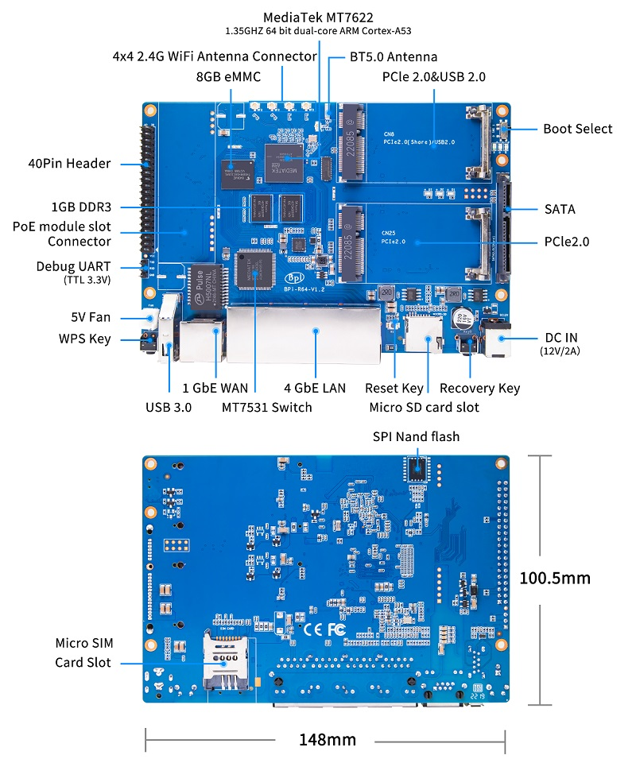
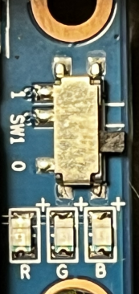
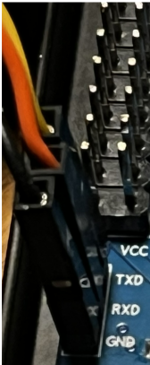

# Banana Pi BPI-R64

## Overview



The Banana Pi BPI-R64 is a networking board based on the MediaTek MT7622
(dual Cortex-A53, AArch64) SoC.

### Hardware Features

- MediaTek MT7622 ARM Cortex-A53 dual-core processor @ 1.35 GHz
- 1 GB DDR3L RAM
- 8 GB eMMC storage
- microSD card slot
- MT7531 Gigabit Ethernet switch (4x LAN + 1x WAN)
- MT7603E built-in 2.4 GHz WiFi
- USB 3.0 port
- 2x Mini PCIe slots

### Default Network Configuration

Infix comes preconfigured with:

- **LAN ports** (lan0-lan3): Bridged for internal networking
- **WAN port**: DHCP client enabled for internet connectivity
- **WiFi** (wifi0-ap): Bridged to LAN (MT7615 PCIe card if fitted, otherwise MT7603E)

## Boot Switch Reference



The BPI-R64 has a 2-position DIP switch (SW1) for selecting the boot device.
The MT7622 Boot ROM always tries SD first if a card is present, so you can
leave SW1 in the OFF (eMMC) position and simply insert or remove an SD card
to control boot device selection.

| SW1 | Boot device |
|-----|-------------|
| OFF | eMMC        |
| ON  | SD card     |

## Getting Started

### Quick Start with SD Card

1. **Flash the image to an SD card** (the filename includes the version, e.g.
   `infix-25.01-bpi-r64-sdcard.img`):



   ```sh
   dd if=infix-*-bpi-r64-sdcard.img of=/dev/sdX bs=4M status=progress
   ```

2. **Insert SD card and power on**
3. **Connect console:** 115200 8N1 — use the dedicated Debug UART header
   just below the 40-pin GPIO header; pins are labeled GND, RX, TX on the board
4. **Default login:** `admin` / `admin`

## Installing to eMMC

Unlike the BPI-R3 (where SD and eMMC share a bus, requiring a NAND intermediate
step), the BPI-R64 has separate controllers for SD (mmc1/MSDC1) and eMMC
(mmc0/MSDC0).  You can write directly to eMMC while booted from SD.

### eMMC Boot ROM Behaviour

> [!IMPORTANT]
> The MT7622 Boot ROM reads BL2 from the eMMC BOOT0 hardware partition (offset
> 0), not from the User Data Area where the main disk image lives.  The
> installation procedure below writes BL2 to BOOT0 separately to handle this.

### Procedure

Boot from SD and write the eMMC image from U-Boot using a FAT32-formatted USB
drive.

#### Step 1: Boot from SD card

1. Insert SD card with Infix
2. Power on and break into U-Boot (press Ctrl-C during boot)

#### Step 2: Write the eMMC image from U-Boot

Place `infix-bpi-r64-emmc.img` and `bl2.img` on a FAT32-formatted USB drive,
then from the U-Boot prompt:

```
usb start
fatload usb 0:1 0x44000000 infix-bpi-r64-emmc.img
setexpr blocks ${filesize} / 0x200
mmc dev 0
mmc write 0x44000000 0x0 ${blocks}
```

#### Step 3: Write BL2 to eMMC BOOT0

```
fatload usb 0:1 0x44000000 bl2.img
mmc partconf 0 1 1 1
setexpr blkcnt ${filesize} + 0x1ff
setexpr blkcnt ${blkcnt} / 0x200
mmc write 0x44000000 0x0 ${blkcnt}
mmc partconf 0 1 1 0
```

#### Step 4: Boot from eMMC

1. Power off the board
2. Remove SD card and USB drive
3. Power on

## Platform Notes

### mmc0 = eMMC, mmc1 = SD

On MT7622, MSDC0 (mmc0) is the 8-bit eMMC controller and MSDC1 (mmc1) is the
4-bit SD card controller — the reverse of many other platforms.

## Building

```sh
# Bootloader only (SD)
make O=x-boot-bpir64-sd bpi_r64_sd_boot_defconfig && make O=x-boot-bpir64-sd

# Bootloader only (eMMC)
make O=x-boot-bpir64-emmc bpi_r64_emmc_boot_defconfig && make O=x-boot-bpir64-emmc

# Compose SD image (pass the Infix rootfs output directory)
utils/mkimage.sh -b x-boot-bpir64-sd -r x-aarch64/images bananapi-bpi-r64

# Compose eMMC image
utils/mkimage.sh -b x-boot-bpir64-emmc -r x-aarch64/images -t emmc bananapi-bpi-r64
```
