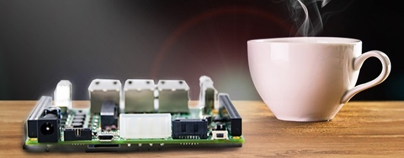

# Marvell ESPRESSObin



The [ESPRESSObin][0] is a single-board computer based on the [Marvell Armada
3720][1] (dual Cortex-A53, AArch64) SoC and the [Marvell 88E6341][2] (Topaz)
switch, oriented toward networking applications.

The board design is old but the switch offers full Linux support, including
advanced TSN features for [IEEE 1588-2019][3] (PTP) and [IEEE 802.1AS-2020][4]
(gPTP).

## Board Variants

The board has gone through several hardware revisions:

| Revision   | Storage             | Notes                          |
|------------|---------------------|--------------------------------|
| v1, v3, v5 | SPI NOR only        | Obsolete; U-Boot always in SPI |
| v7         | SPI NOR + 4 GB eMMC | Current; SD and eMMC usable    |
| Ultra      | SPI NOR + 4 GB eMMC | High-end variant               |

On **all revisions** the Boot ROM is hardwired to load U-Boot from SPI NOR
flash.  There is no strap or jumper to make the Boot ROM load directly from an
SD card.  The SD card (or eMMC on v7/Ultra) is used only for the operating
system.

## Building

The ESPRESSObin uses ext4 for its rootfs partitions rather than the default
squashfs, because the stock SPI U-Boot lacks squashfs and `blkmap` support.
The `ext4` configuration snippet enables this.  Apply it once after selecting
the defconfig, then build and compose the SD card image:

```sh
make O=x-aarch64 aarch64_defconfig
make O=x-aarch64 apply-ext4
make O=x-aarch64

utils/mkimage.sh -r x-aarch64 marvell-espressobin
```

The resulting image (`x-aarch64/images/infix-espressobin-sdcard.img`) contains
a GPT disk with the standard Infix partition layout, using ext4 instead of the
read-only squashfs:

| Partition | Label     | Contents                     |
|-----------|-----------|------------------------------|
| 1         | aux       | RAUC upgrade state (ext4)    |
| 2         | primary   | Rootfs slot primary (ext4)   |
| 3         | secondary | Rootfs slot secondary (ext4) |
| 4         | cfg       | Persistent config (ext4)     |
| 5         | var       | Runtime data (ext4)          |

## Writing to SD Card

```sh
dd if=infix-espressobin-sdcard.img of=/dev/sdX bs=4M status=progress conv=fsync
```

## Upgrading

The build produces `x-aarch64/images/infix-aarch64-ext4.pkg`, a RAUC bundle
containing the ext4 rootfs.  Once the board is running Infix, upgrade over the
network in the usual way:

```
upgrade ftp://192.168.1.1/infix-aarch64-ext4.pkg
```

RAUC writes the new rootfs to the inactive slot, updates `BOOT_ORDER` in
`/mnt/aux/uboot.env`, and the next boot picks it up automatically.

> [!NOTE]
> Use `infix-aarch64-ext4.pkg`, not the standard `infix-aarch64.pkg`.  The
> standard bundle contains a squashfs rootfs which the stock U-Boot cannot
> boot.

## Booting with the Stock SPI U-Boot

The stock Marvell U-Boot has `ext4load` and the standard variables
(`$kernel_addr`, `$fdt_addr`, `$loadaddr`, `$console`, `$image_name`,
`$fdt_name`) already set sensibly.  Connect to the board's console port, the
micro USB connector, at 115200 8N1, interrupt autoboot, and paste the commands
below.

### Environment Variable Reference

These variables are pre-set in the stock U-Boot environment.  Restore them
with these values if they are ever lost or corrupted:

```
setenv kernel_addr  0x5000000
setenv fdt_addr     0x4f00000
setenv loadaddr     0x5000000
setenv console      'console=ttyMV0,115200 earlycon=ar3700_uart,0xd0012000'
setenv image_name   boot/Image
setenv extra_params quiet
```

`$fdt_name` selects the device tree for your specific board revision:

| Board revision | `fdt_name` value                                    |
|----------------|-----------------------------------------------------|
| v3 / v5        | `boot/marvell/armada-3720-espressobin.dtb`          |
| v7             | `boot/marvell/armada-3720-espressobin-v7.dtb`       |
| Ultra          | `boot/marvell/armada-3720-espressobin-ultra.dtb`    |
| v3/v5 eMMC     | `boot/marvell/armada-3720-espressobin-emmc.dtb`     |
| v7 eMMC        | `boot/marvell/armada-3720-espressobin-v7-emmc.dtb`  |

```
setenv fdt_name boot/marvell/armada-3720-espressobin.dtb   # adjust for your board
```

### Simple Boot

Fixed boot from the primary slot, useful for initial bring-up:

```
setenv bootcmd 'mmc dev 0; \
  ext4load mmc 0:2 $kernel_addr $image_name; \
  ext4load mmc 0:2 $fdt_addr $fdt_name; \
  setenv bootargs $console root=PARTLABEL=primary rw rootwait $extra_params rauc.slot=primary; \
  booti $kernel_addr - $fdt_addr'
saveenv
```

### Automatic Slot Selection (RAUC Integration)

The CLI `upgrade` command writes to the inactive slot and updates `uboot.env`
on the `aux` partition with the new boot order.  On the next boot U-Boot reads
`BOOT_ORDER` from the aux partition and selects the appropriate slot.  The
setup below also defines `bootcmd_primary`, `bootcmd_secondary`, and
`bootcmd_net` for manual use (see [Manual Slot Selection](#manual-slot-selection)
and [Netbooting](#netbooting)):

```
setenv bootcmd_boot \
  'mmc dev 0; \
   ext4load mmc 0:$bootpart $kernel_addr $image_name; \
   ext4load mmc 0:$bootpart $fdt_addr $fdt_name; \
   setenv bootargs $console root=PARTLABEL=$bootslot rw rootwait $extra_params rauc.slot=$bootslot; \
   booti $kernel_addr - $fdt_addr'

setenv bootcmd_primary   'setenv bootpart 2; setenv bootslot primary;   run bootcmd_boot'
setenv bootcmd_secondary 'setenv bootpart 3; setenv bootslot secondary; run bootcmd_boot'

setenv bootcmd_net \
  'dhcp $kernel_addr $image_name; \
   tftpboot $fdt_addr $fdt_name; \
   setenv bootargs $console root=PARTLABEL=primary rw rootwait $extra_params rauc.slot=primary; \
   booti $kernel_addr - $fdt_addr'

setenv bootcmd \
  'setenv bootpart 2; setenv bootslot primary; setenv auxpart 1; \
   if ext4load mmc 0:$auxpart $loadaddr /uboot.env; then \
     env import -c $loadaddr $filesize BOOT_ORDER; \
   fi; \
   if test "$BOOT_ORDER" = "secondary primary" || \
      test "$BOOT_ORDER" = "secondary primary net"; then \
     setenv bootpart 3; setenv bootslot secondary; \
   fi; \
   if test "$BOOT_ORDER" = "net" || \
      test "$BOOT_ORDER" = "net primary" || \
      test "$BOOT_ORDER" = "net secondary primary"; then \
     run bootcmd_net; \
   fi; \
   echo ">> Booting $bootslot from mmc 0:$bootpart ..."; \
   run bootcmd_boot'

saveenv
```

### Manual Slot Selection

To boot a specific slot without waiting for the autoboot countdown, interrupt
the bootloader (press any key) and run one of the convenience commands defined
above:

```
run bootcmd_primary      # boot from primary   (partition 2)
run bootcmd_secondary    # boot from secondary (partition 3)
run bootcmd_net          # netboot via DHCP/TFTP
```

You can also force a permanent change to which slot boots next by setting
`BOOT_ORDER` directly from Linux (the change persists across reboots):

```sh
fw_setenv BOOT_ORDER "secondary primary"   # next boot: secondary
fw_setenv BOOT_ORDER "primary secondary"   # next boot: primary  (default)
```

### Netbooting

The stock U-Boot supports TFTP.  This is useful for testing a new kernel or
device tree without reflashing the SD card.  Set up a TFTP server with the
contents of the Infix `boot/` directory (from the built rootfs at
`x-aarch64/target/boot/`) and configure the variables:

```
setenv serverip 192.168.1.1    # IP of your TFTP server
setenv ipaddr   192.168.1.100  # board IP (omit if using dhcp)
saveenv
```

Then netboot manually:

```
run bootcmd_net
```

`bootcmd_net` uses `dhcp` to obtain an IP address and the `$serverip` from
the DHCP server (option 66), then downloads `$image_name` and `$fdt_name`
via TFTP.  The kernel mounts the primary SD card slot as root, so the SD
card must still be present.

To make netbooting the default on next boot (e.g. for iterative kernel
development), set `BOOT_ORDER` from Linux:

```sh
fw_setenv BOOT_ORDER "net primary secondary"
```

This causes `bootcmd` to attempt netboot first; on failure it falls through
to the primary slot on the SD card.

[0]: https://wiki.espressobin.net/
[1]: https://www.marvell.com/content/dam/marvell/en/public-collateral/embedded-processors/marvell-embedded-processors-armada-37xx-hardware-specifications.pdf
[2]: https://www.marvell.com/content/dam/marvell/en/public-collateral/switching/marvell-link-street-88E6341-product-brief.pdf
[3]: https://standards.ieee.org/ieee/1588/6825/
[4]: https://standards.ieee.org/ieee/802.1AS/7121/
