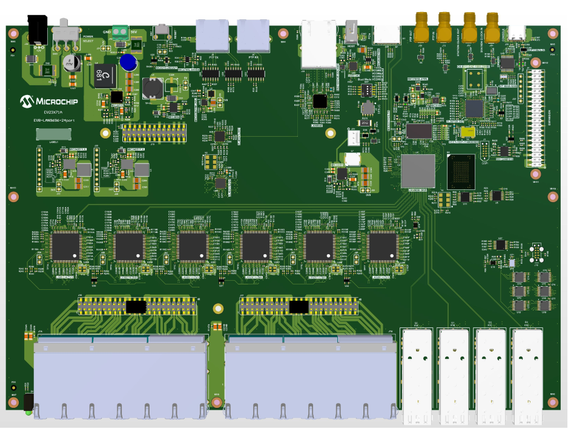

# Microchip EV23X71A (Laguna)



Evaluation board for the Microchip LAN969x (Laguna) family, a TSN capable
28-port switch with a Cortex-A53 CPU core.

| **Property** | **Value**                                   |
|--------------|---------------------------------------------|
| SoC          | LAN969x, ARM Cortex-A53 single-core @ 1 GHz |
| Memory       | 1 GiB DDR4 x16 RAM                          |
| Storage      | 4 GiB eMMC on SDMMC0, 2 MiB QSPI NOR        |
| Switch       | 24 x GbE copper, 4 x SFP+, 1 x RGMII NPI    |
| Console      | `ttyAT0`, 115200 8N1                        |

## Status

Supported:

- switch core and SerDes, all ports
- eMMC, I2C (including the SFP mux), SPI, USB host
- watchdog, temperature sensor, SGPIO LEDs
- our own boot chain, from BL2 to a slot booted out of the eMMC, with
  the environment held in the authenticated control device tree

Not yet done:

- TSN queueing.  PSFP and time aware shaping need `NET_SCH_TAPRIO`,
  `NET_ACT_GATE`, and `NET_SCH_CBS`, all currently off.  Ingress
  classification (`dcb`) and traffic classes (`mqprio`) are configurable
  from the QoS model but not yet verified on this board
- HSR/PRP offload, see above
- MAC addresses.  With no environment in flash the board falls back to
  `lan969x_otp_get_mac()`, which derives 30 addresses for this board
  from OTP, but the OTP address block is blank on our sample, so
  interfaces come up random.  Provisioning it is a one way operation,
  `boot-monitor.rb --otp-data <offset>:<hexstring>` in monitor mode

## Boot Chain

The board ships with Microchip's boot chain in the eMMC `fip` and `fip.bak`
partitions.  The Firmware Image Package (FIP) contains all the components of
ARM Trusted Firmware (TF-A) required to boot the system: BL2, BL31, BL33
(U-Boot), any certificates and the optional BL32 (OP-TEE).

The first-stage bootloader (BL1) in mask ROM walks through the FIP sources in
turn, `fip`, then `fip.bak`, then a raw offset, moving on whenever an image
fails to load or authenticate.  Leaving a working FIP in `fip.bak` is thus a
way back from a bad one.

When a valid FIP is found and loaded into SRAM, BL1 jumps to BL2 which brings
up DDR and loads BL31 and U-Boot as BL33.

> [!NOTE]
> The vendor U-Boot has neither `blkmap`, SquashFS support nor `sysboot`, so
> it cannot map a signed `rootfs.itb` and read `/boot/syslinux/*.conf` out of
> it, which is how Infix boots.  It is possible to [Netboot](#netboot) from
> it, though we recommend going for the adapted [Bootloader](#bootloader) to
> be able to boot properly from eMMC.

## Boot Mode Strapping

The DIP switch marked *VCore Configuration Strapping* tells BL1 where to
look for the FIP:

| **VCORE[3:0]** | **Mode**     | **Description**                                |
|----------------|--------------|------------------------------------------------|
| 0000           | eMMC FC0     | Boot from eMMC, boot trace on Flexcom0, 115200 |
| 0001           | QSPI0 FC0    | Boot from NOR, boot trace on Flexcom0, 115200  |
| 0011           | eMMC         | Boot from eMMC                                 |
| 0100           | QSPI0        | Boot from NOR                                  |
| 1000           | QSPI0 FC0 HS | Boot from NOR, boot trace on Flexcom0, 921600  |
| 1010           | TF-A FC0     | TF-A monitor on Flexcom0, 115200               |
| 1011           | TF-A FC0 HS  | TF-A monitor on Flexcom0, 921600               |
| 1111           | SPI client   | QSPI0 as SPI client, internal CPU disabled     |

Only the "Flexcom0" modes give the firmware a console.  For the rest
`lan969x_console_init()` selects none, so BL1, BL2, and BL31 print nothing and
the first line on the wire is U-Boot's banner, which brings up its own
console.

That is also the only way to quiet the firmware.  Our `LOG_LEVEL` covers BL2
and BL31, but BL1 lives in mask ROM and traces at the level it was built with
in 2023, so its `INFO:` lines cannot be turned off from here.  Use 0000 while
working on the boot chain, when that trace is what you came for, and 0011 for
a quiet boot.

### Debricking

> [!TIP]
> Keep a released vendor FIP in the NOR flash while working with U-Boot or any
> other part of the FIP, so that 0001 always reaches a prompt no matter what
> the eMMC holds.  From a running U-Boot:
>
> ```
> setenv autoboot off
> dhcp
> tftpboot ${loadaddr} lan969x_a0-release.fip
> run nor_fip_upd
> ```
>
> Even with both flashes unusable the board is recoverable.  Strap 1010 leaves
> BL1 in TF-A monitor mode, which [`fwu-lan969x_a0-release.html`][4] drives
> over USB, writing the GPT and FIP to either flash from blank.

## Bootloader

Infix keeps its own U-Boot from Microchip's tree, which carries the LAN969x
support, together with Microchip's Trusted Firmware:

```bash
make laguna_boot_defconfig
make
```

The build produces one `fip.bin`, with BL2, BL31, and U-Boot as BL33 in it.
Microchip package BL2 inside the FIP, unlike MediaTek where it lives in a
partition of its own, so there is a single artifact to place.  BL1 in ROM
authenticates BL2, so the FIP always carries certificates, which is why the
build needs mbed TLS to parse X.509 in BL1 and BL2.  That comes from the
`mbedtls-atf` package, pinned to the 2.28 series ATF 2.8 builds against, since
Buildroot's `mbedtls` tracks 3.x.

This defconfig builds the `mchp_lan969x_defconfig` plus local fragments, which
add `blkmap`, SquashFS, `sysboot`, and the signed image validation the Infix
boot flow needs, and pin the control device tree to this board.  The board
environment, `lan969x-env.dtsi`, sets the load addresses and names the kernel
device tree to pick out of the SquashFS.

Two build variables are not obvious.  `KEY_ALG=ecdsa`, because the LAN969x
crypto driver is built around the Silex ECDSA engine and will not compile
against an mbed TLS configured for RSA only.  And `GENERATE_COT=1`, because
BL1 authenticates BL2: without it the FIP has no certificates and the ROM
refuses to boot it.

Trusted Firmware is pinned to a commit rather than a tag, since no tag carries
the fix for `ERR-LAN969X-001`.  The boot ROM's ECDSA verifier mishandles any
P-256 value whose most significant byte is zero, which happens for about one
in 256 random coordinates or signature scalars, so roughly one build in a
hundred produced a FIP the ROM rejected:

```
INFO:    Authenticating image id=6 (sign)
INFO:    Authenticated image id=6 (sign) = 12
NOTICE:  Image(6) load error: 12
```

`cert_create` now screens the values it generates and retries, for details,
see [`ERRATA.md`][5] in the Microchip Trusted Firmware tree.

## Installing

The bootloader and the Linux image are separate builds, combined into one eMMC
image using the `mkimage.sh` script:

```bash
make laguna_boot_defconfig O=x-boot-laguna && make O=x-boot-laguna
make aarch64_defconfig && make
utils/mkimage.sh -b x-boot-laguna -r output -t emmc microchip-ev23x71a
```

Install the FIP first, copy `x-boot-laguna/images/fip.bin` to your TFTP server
directory.  Strap board to 0001, stop autoboot, and write the FIP to the eMMC:

```
setenv fip_fw fip.bin
run mmc_fip0_dlup
```

Strap back to 0000 and power cycle.  With no `aux` partition to find, the new
U-Boot reports `NO BOOTABLE MEDIA FOUND` and netboots, which is how the rest
of the install happens: see [Installing to Onboard Storage][2] for addressing
the netbooted system and streaming the image onto the eMMC.

The first boot after installing grows `var` to fill the eMMC and reboots once
by itself.  The kernel complains that the backup GPT is not at the end of the
disk until that has happened, which is expected.

### Updating the FIP

Once Infix runs from the eMMC the bootloader is just another partition,
`fip` is `mmcblk0p1` and `fip.bak` is `mmcblk0p2`, and nothing mounts
either of them:

```bash
scp x-boot-laguna/images/fip.bin admin@board:/tmp
ssh admin@board.local 'sudo dd if=/tmp/fip.bin of=/dev/mmcblk0p1 conv=fsync'
```

Reboot and check the BL2 build date in the banner.  Only then mirror it
into `fip.bak`, so that BL1's fallback stays one known good step behind
whatever is being tried in `fip`:

```bash
ssh admin@board.local 'sudo dd if=/tmp/fip.bin of=/dev/mmcblk0p2 conv=fsync'
```

The same from the U-Boot prompt, which resolves the partition by name:

```
setenv autoboot off
dhcp
tftpboot ${loadaddr} fip.bin
setexpr blkcnt ${filesize} + 0x1ff
setexpr blkcnt ${blkcnt} / 0x200
part start mmc 0 fip fipstart
mmc write ${loadaddr} ${fipstart} ${blkcnt}
```

The `mmc_fip0_dlup` helper used during bring-up belongs to the vendor
environment, so it is only there when booting the NOR image.

## Netboot

Once the Infix U-Boot is in place, netbooting needs no script at all: hand out
a `rootfs.itb` as the DHCP boot file and `ixprepdhcp` fetches, validates, and
boots it, see the [netboot HowTo][1].

The recipe below is for boards still running the vendor U-Boot, before our FIP
has been written.  Save it as `netboot.sh`, or paste the lines at the prompt
one at a time:

```
# Run: mkimage -T script -d netboot.sh netboot.scr
setenv fdt_addr_r     0x68000000
setenv kernel_addr_r  0x62000000
setenv ramdisk_addr_r 0x70000000

setenv srvpath ix/ev23x71a
tftp ${fdt_addr_r}     ${srvpath}/lan9696-ev23x71a.dtb
tftp ${kernel_addr_r}  ${srvpath}/Image
tftp ${ramdisk_addr_r} ${srvpath}/rootfs.itb

setexpr rdkbsize ${filesize} / 0x400
setenv bootargs "console=ttyAT0,115200 root=/dev/ram0 brd.rd_size=0x${rdkbsize} rauc.slot=net loglevel=4 usbcore.authorized_default=2"
booti ${kernel_addr_r} ${ramdisk_addr_r}#verity ${fdt_addr_r}
```

The addresses keep kernel, device tree, and RAM disk clear of each other in
the 896 MiB starting at 0x60000000.  `setexpr` stores bare hex, hence the `0x`
in front of `${rdkbsize}`.  `rauc.slot=net` marks the system as network booted
rather than running from a slot, the same variable `ixbootslot.sh` sets for a
real one.

Two details are peculiar to the U-Boot that ships with the board:

- Pass `rootfs.itb`, not the bare `rootfs.squashfs`.  It is built without
  `SUPPORT_RAW_INITRD`, so the `addr:size` form of the ramdisk argument is
  never parsed, and anything that is neither a FIT nor a legacy uImage is
  rejected with `Wrong Ramdisk Image Format`.

- Name the `verity` configuration.  `mchp_lan969x_defconfig` sets
  `MULTI_DTB_FIT`, since U-Boot carries a device tree for each LAN969x board,
  and in 2023.04 that makes `fit_conf_get_node()` pick a configuration by
  matching compatible strings, never falling back to the `default` property.
  Our ITB carries a ramdisk and no device tree, so there is nothing to match,
  and it fails with `Could not find configuration node`.

The ITB is signed with the Infix development key, which that U-Boot knows
nothing about, so it prints `-` for the signature and loads the ramdisk
anyway; only keys marked required in the bootloader's control device tree can
fail an image.

To boot without typing anything, wrap the script and hand it out over DHCP as
the boot file:

```bash
mkimage -T script -C none -n netboot -d netboot.sh netboot.scr
```

The vendor U-Boot will not source it by itself, its `bootcmd` runs `mmc_boot`,
so point it at the script once:

```
setenv autoboot off
setenv bootcmd 'dhcp; source ${loadaddr}'
saveenv
```

`dhcp` fetches the boot file to `${loadaddr}`, 0x64000000 in the shipped
environment and clear of the three addresses above.  `saveenv` writes the
`Env` partition in the eMMC; the original value is `run mmc_boot`.  With
a relay on the board's supply, a power cycle then becomes the whole
build, flash, and boot cycle.

## Switch Core

The board reports part `0x969b` revision 0, a LAN9696RED (lan969x-60-RED).
The driver reads `GCB_CHIP_ID` at probe but never prints it, so read it out:

```
devmem 0xe2010000 32
```

Bits 27:12 hold the part, 31:28 the revision.  Which part it is decides what
the driver offers: `sparx5_init_features()` enables PTP and PSFP for the TSN,
RED, and VAO variants only, and leaves a plain LAN9694, LAN9696, or LAN9698
without either.

| **ID**   | **Part**     | **Family**  | **PTP, PSFP** |
|----------|--------------|-------------|---------------|
| `0x9694` | LAN9694      | lan969x-40  | no            |
| `0x9691` | LAN9691VAO   | lan969x-40  | yes           |
| `0x9695` | LAN9694TSN   | lan969x-40  | yes           |
| `0x969a` | LAN9694RED   | lan969x-40  | yes           |
| `0x9696` | LAN9696      | lan969x-60  | no            |
| `0x9692` | LAN9692VAO   | lan969x-65  | yes           |
| `0x9697` | LAN9696TSN   | lan969x-60  | yes           |
| `0x969b` | LAN9696RED   | lan969x-60  | yes           |
| `0x9698` | LAN9698      | lan969x-100 | no            |
| `0x9693` | LAN9693VAO   | lan969x-100 | yes           |
| `0x9699` | LAN9698TSN   | lan969x-100 | yes           |
| `0x969c` | LAN9698RED   | lan969x-100 | yes           |
| `0x7546` | SparX-5-64   | Enterprise  | no            |
| `0x7549` | SparX-5-90   | Enterprise  | no            |
| `0x7552` | SparX-5-128  | Enterprise  | no            |
| `0x7556` | SparX-5-160  | Enterprise  | no            |
| `0x7558` | SparX-5-200  | Enterprise  | no            |
| `0x0546` | SparX-5-64i  | Industrial  | yes           |
| `0x0549` | SparX-5-90i  | Industrial  | yes           |
| `0x0552` | SparX-5-128i | Industrial  | yes           |
| `0x0556` | SparX-5-160i | Industrial  | yes           |
| `0x0558` | SparX-5-200i | Industrial  | yes           |

The register is the same on SparX-5, only the address differs, since
`TARGET_GCB` sits elsewhere in that family's register map:

```
devmem 0x611010000 32
```

The RED in the part number is hardware HSR/PRP RedBox support.

## Interfaces

The sparx5 driver leaves naming to the kernel, which hands out `eth0` and up
in probe order, this makes it off-by-one from the numbering in the official
documentation.  The product specific `90-ev23x71a-rename-ifaces.rules` renames
them to the usual interface names:

| **Device tree**    | **Interface**  | **Port**            |
|--------------------|----------------|---------------------|
| `port@0..port@23`  | `e1` .. `e24`  | 1G copper, QSGMII   |
| `port@24..port@27` | `e25` .. `e28` | 10G SFP+            |
| `port@29`          | `e29`          | 1G RGMII management |

Attaching 29 PHYs takes the driver a good half second each, far longer than
the ten seconds `hw-wait` waits for slow devices by default.  The product
therefore raises it in `/etc/default/hw-wait`, so that services which expect
the ports to exist do not start ahead of them.

## LEDs

The board has one software controlled status LED and a green and yellow pair
per SFP cage, driven over SGPIO:

```
green:status                     front panel status
green:lan-0 .. green:lan-3       SFP1 .. SFP4, green
yellow:lan-0 .. yellow:lan-3     SFP1 .. SFP4, yellow
```

The common `/etc/iitod.json` drives `green:boot` and `green:status` from
inputs this board has no LEDs for, so the product ships its own.  It blinks
`green:status` at 1 Hz while booting, holds it on once `run/startup/success`
is asserted, and flashes 5 Hz for a fail-safe boot or a panic.  The green SFP
LEDs get the kernel netdev trigger, bound to `e25` through `e28`, for link and
activity.

The yellow ones are left alone for now.  `iitod` writes any key in a rule's
`then` object straight to the LED's sysfs directory, so they can be given a
trigger later without touching any code.

## Debug and Analysis

`DEBUG_FS` is on in the aarch64 configuration, and the driver puts its VCAP
state there:

```
/sys/kernel/debug/sparx5/vcaps/
├── is0_0, is0_1, is0_2           decoded rules, CLM-0 through CLM-2
├── is2_0, is2_1, es0_0, es2_0    the remaining VCAP instances
├── raw_is0_0, raw_is2_0, ...     raw entry dump of each of the above
└── eth0 .. eth28                 per port key set selection
```

Reading `is2_0` after a `tc filter add` shows what the classifier actually
programmed, which is the quickest way to separate an unsupported match from a
broken one.  The per port files show which key sets each lookup is configured
for, which is what decides whether a rule can match on a given port at all.

Every port netdev links to its device tree node, so they can be mapped back to
switch ports whatever order they probed in:

```bash
for d in /sys/class/net/eth*; do
        echo "$(basename $d) -> $(readlink $d/of_node)"
done
```

Counters come from `ethtool`, which implements the structured groups as
well as the flat set:

```bash
ethtool -S eth0                # flat, the full sparx5 counter set
ethtool -S eth0 --all-groups   # mac, phy, ctrl, and rmon groups
ethtool -T eth0                # timestamping, empty unless the part has PTP
ethtool -m eth24               # SFP module EEPROM, read through the i2c mux
```

There is no `ethtool -p`, the driver implements no `set_phys_id`, and no
devlink support at all, so do not go looking for `devlink dev info`.

PHY registers over the GCB MDIO controller, with `mdio` from mdio-tools
(the `mdio-netlink` module is built for this kernel):

```bash
# mdio                            # list buses
# mdio e20101a8.mdio-mii phy 0x03 # the management port PHY, a LAN8841
BMCR(0x00): 0x1040
  flags: -reset -loopback +aneg-enable -power-down -isolate -aneg-restart
         -collision-test
  speed: 1000-half

BMSR(0x01): 0x796d
  capabilities: -100-t4 +100-tx-f +100-tx-h +10-t-f +10-t-h -100-t2-f -100-t2-h
  flags:        +ext-status +aneg-complete -remote-fault +aneg-capable +link
                -jabber +ext-register

ID(0x02/0x03): 0x00221652

ESTATUS(0x0F): 0x2000
  capabilities: -1000-x-f -1000-x-h +1000-t-f -1000-t-h

# mdio e20101a8.mdio-mii phy 0x04 raw 0x1
0x7949
```

The bus name is the one dmesg prints for each port, `PHY
[e20101a8.mdio-mii:0d]`, and the INDY quads answer at 0x04 through 0x1b.
Scanning the whole bus, `mdio e20101a8.mdio-mii` with no object, instead
fails with `Unable to read status (-5)`: `mscc_miim_read()` returns
`-EIO` when the controller flags a read error, which is what an address
with no PHY behind it does, and the scan gives up there.  Address a
specific PHY instead.  Loading `mdio-netlink` needs root, so run the
tool under `sudo`.

Sensors and LEDs are plain class devices, `/sys/class/hwmon/*/temp1_input`
for the die temperature and `/sys/class/leds/` for the status LED and the
SGPIO driven port LEDs.

For the eMMC, the mmc core exposes the negotiated bus parameters and the
card's own health estimate:

```bash
cat /sys/kernel/debug/mmc0/ios                        # timing, bus width, clock
cat /sys/class/mmc_host/mmc0/mmc0:0001/life_time      # EXT_CSD wear estimate
cat /sys/class/mmc_host/mmc0/mmc0:0001/pre_eol_info   # 0x01 normal, 0x03 urgent
```

[0]: https://microchip-ung.github.io/bsp-doc/
[1]: https://www.kernelkit.org/infix/latest/netboot/
[2]: https://www.kernelkit.org/infix/latest/netboot/#installing-to-onboard-storage
[4]: https://github.com/microchip-ung/arm-trusted-firmware/releases/latest
[5]: https://github.com/microchip-ung/arm-trusted-firmware
