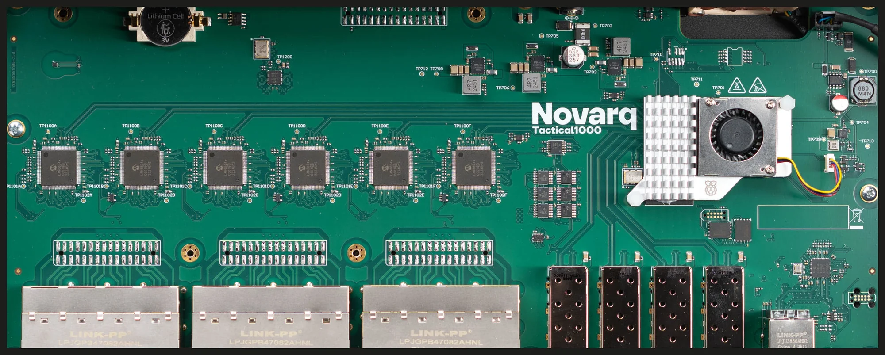

# Novarq Tactical-1000

<a href="https://novarq.com/pages/tactical-1000">

</a>

A 28-port switch built on the Microchip LAN969x (Laguna) family, a cut down
version of the EV23X71A (EVB) reference design.  See [Tactical-1000][0].

| **Property** | **Value**                                |
|--------------|------------------------------------------|
| SoC          | LAN9696TSN, ARM Cortex-A53 single-core   |
| Memory       | 2 GiB DDR4 @ 2400 MHz, ECC disabled      |
| Storage      | eMMC on SDMMC0, QSPI NOR                 |
| Switch       | 24 x GbE copper, 4 x SFP+, 1 x RGMII NPI |
| Console      | `ttyAT0`, 115200 8N1                     |

The chip reports `0x9697` in `GCB_CHIP_ID`, a LAN9696TSN.  The [EV23X71A][3]
is a `0x969b`, a LAN9696RED.

## Boot Mode

Unlike the EVB, which has a DIP switch for VCORE[3:0], this board is strapped
to 0000 (eMMC boot) with jumper resistors.  The footprint for a DIP switch is
there, next to the SoC, so the only way back from a FIP that does not load is
with a soldering iron and a good set of eyes.  See the [EVB][4] for details
how to activate the TF-A monitor on Flexcom0, then you can launch the
[`fwu-lan969x_a0-release.html`][1] tool.

## Bootloader

Currently board-specific:

```bash
make tactical_boot_defconfig O=x-boot-tactical && make O=x-boot-tactical
```

Install to `fip` and leave the vendor FIP in `fip.bak`.  BL1 falls back to
it if `fip` fails to load, but not if `fip` loads and hangs.

`/usr/libexec/infix/prod/provision-tactical` lays out the eMMC for Infix,
asking before each step.  Netboot with `init=/bin/sh` appended to `bootargs`
and run it from there, nothing from the eMMC may be mounted.

The vendor U-Boot saves its environment at `0x10100000` and `0x10300000`,
the second of which is past the 2 MiB `Env` partition; the script grows
`Env` to 4 MiB.

```bash
scp x-boot-tactical/images/fip.bin admin@board:/tmp
ssh admin@board 'sudo dd if=/tmp/fip.bin of=/dev/mmcblk0p1 conv=fsync'
```

## Device Tree

Cherry-picked from [Novarq's kernel tree][2].  One commit adapts it to
6.18 and is to be reverted on the next LTS kernel, it drops:

- the `&qspi0` flash node
- the `tmon` fan PWM
- the cooling maps for that fan, the `gpio-fan` gets one trip

## Interfaces

The copper ports run **backwards within each QSGMII quad**: `port@0` is `lan4`,
`port@3` is `lan1`, `port@4` is `lan8`, and so on in fours.  The SFP and
management ports are in order.

| **Device tree**        | **Interface**                                 | **Port**            |
|------------------------|-----------------------------------------------|---------------------|
| `port@0` .. `port@23`  | `e4`,`e3`,`e2`,`e1`, `e8`,`e7`,`e6`,`e5`, ... | 1G copper, QSGMII   |
| `port@24` .. `port@27` | `e25` .. `e28`                                | 10G SFP+            |
| `port@29`              | `e29`                                         | 1G RGMII management |

`90-tactical-1000-rename-ifaces.rules` matches on `OF_FULLNAME`, so `e1` is
the port marked 1 on the front panel.

## LEDs

One software controlled status LED, and a green and yellow pair per SFP cage,
driven over SGPIO:

```
green:status                     front panel status
green:lan-0 .. green:lan-3       SFP1 .. SFP4, green
yellow:lan-0 .. yellow:lan-3     SFP1 .. SFP4, yellow
```

`green:status` blinks at 1 Hz while booting, steady once `startup-config`
has been applied, 5 Hz for a fail-safe boot or a panic.  The green SFP LEDs
have the netdev trigger, bound to `e25` through `e28`.  The yellow ones are
unused.

## Netboot

The stock bootloader supports netbooting but not SquashFS, so this board
builds `boot.itb`: kernel, rootfs, and every device tree in the
build, one configuration each.  `#boot` is this board.  For the DHCP and
TFTP server, see the [netboot HowTo](../../../doc/netboot.md).

```
setenv autoload no
dhcp
setenv serverip <your-tftp-server>

setenv fdt_high 0xffffffffffffffff
setenv initrd_high 0xffffffffffffffff

tftp 0x70000000 boot.itb
fdt addr 0x70000000
fdt get value rdsz /images/rootfs data-size
setexpr rdkb ${rdsz} / 0x400
setenv bootargs "console=ttyAT0,115200 root=/dev/ram0 ro brd.rd_size=0x${rdkb} rauc.slot=net loglevel=4 usbcore.authorized_default=2"

bootm 0x70000000#boot
```

`brd.rd_size` is the SquashFS size in KiB.  `fdt_high` and `initrd_high`
need all 64 bits set, the shipped environment has a 32-bit `fdt_high`.

### Unattended

The `boot.scr` script runs the same steps.  With the TFTP server on another
host than the DHCP server, name it in `bootcmd`:

```
setenv boot_net 'setenv autoload no; dhcp; setenv serverip <your-tftp-server>; setenv bootfile boot.scr; tftp ${loadaddr} ${bootfile}; source ${loadaddr}'
setenv bootcmd 'run boot_net'
saveenv
```

With the DHCP server also serving TFTP, `serverip` and `bootfile` come with
the lease and `dhcp` fetches the script by itself:

```
setenv bootcmd 'dhcp; source ${loadaddr}'
saveenv
```

Here with dnsmasq:

```
enable-tftp
tftp-root=/srv/ftp
dhcp-boot=boot.scr
```

The image name is `${bootfile}` with `.scr` replaced by `.itb`.  If the fetch
fails the board resets after five seconds.

### Separate Artifacts

For trying a kernel or device tree without rebuilding the image:

```
setenv autoload no
dhcp
setenv serverip <your-tftp-server>

tftp 0x60000000 Image
tftp 0x6f000000 lan9696-tactical-1000.dtb
tftp 0x78000000 rootfs.itb

setenv fdt_high 0xffffffffffffffff
setenv initrd_high 0xffffffffffffffff
setexpr rdkb ${filesize} / 0x400
setenv bootargs "console=ttyAT0,115200 root=/dev/ram0 ro brd.rd_size=0x${rdkb} rauc.slot=net loglevel=4 usbcore.authorized_default=2"
booti 0x60000000 0x78000000#verity 0x6f000000
```

- fetch `rootfs.itb` last, `${filesize}` is the last transfer
- name the `verity` configuration, `MULTI_DTB_FIT` ignores `default`
- pass `rootfs.itb`, not the bare SquashFS, there is no `SUPPORT_RAW_INITRD`

DRAM starts at `0x60000000`.

[0]: https://novarq.com/pages/tactical-1000
[1]: https://github.com/microchip-ung/arm-trusted-firmware/releases/latest
[2]: https://github.com/novarq/linux
[3]: ../microchip-ev23x71a/README.md
[4]: https://github.com/kernelkit/infix/tree/main/board/aarch64/microchip-ev23x71a#boot-mode-strapping
