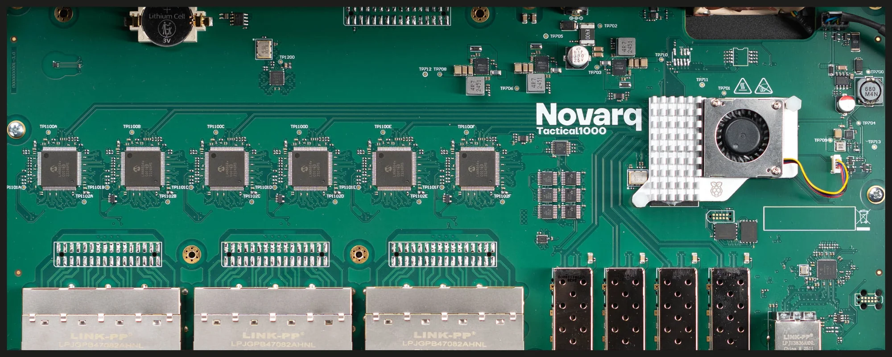

# Novarq Tactical-1000

<a href="https://novarq.com/pages/tactical-1000">

</a>

A 28-port switch built on the Microchip LAN969x (Laguna) family, a cut down
version of the EV23X71A (EVB) reference design.  See [Tactical-1000][0].

| **Property** | **Value**                                |
|--------------|------------------------------------------|
| SoC          | LAN9696TSN, ARM Cortex-A53 single-core   |
| Memory       | 2 GiB DDR4 @ 2400 MHz, ECC disabled      |
| Storage      | eMMC on SDMMC0, QSPI NOR                 |
| Switch       | 24 x GbE copper, 4 x SFP+, 1 x RGMII NPI |
| Console      | `ttyAT0`, 115200 8N1                     |

The chip reports `0x9697` in `GCB_CHIP_ID`, a LAN9696TSN.  The [EV23X71A][3]
is a `0x969b`, a LAN9696RED.

## Boot Mode

VCORE[3:0] and the SoC reset line are GPIOs on the MCP2200 behind the USB-C
console port: GP2..GP5 are VCORE0..3, GP0 is reset.  Novarq's
[`mcp2200ctl.py`][5] drives them over hidraw.  The kernel's `hid_mcp2200`
GPIO driver claims that interface first and has to go; the console,
`ttyACM0`, is `cdc_acm` and unaffected:

```bash
echo 'blacklist hid_mcp2200' | sudo tee /etc/modprobe.d/mcp2200.conf
sudo rmmod hid_mcp2200
echo 'SUBSYSTEM=="hidraw", ATTRS{idVendor}=="04d8", ATTRS{idProduct}=="00df", MODE="0660", TAG+="uaccess"' \
    | sudo tee /etc/udev/rules.d/70-mcp2200.rules
sudo udevadm control --reload
```

Replug the console cable.  Then the tool, in a venv:

```bash
git clone https://github.com/novarq/mcp2200py.git && cd mcp2200py
python3 -m venv .venv && . .venv/bin/activate
pip install -r requirements.txt
python3 mcp2200ctl.py get-gpio
```

`get-gpio` reports `0x01` as shipped: VCORE 0000, reset released.  The SoC
samples the straps on reset:

```bash
python3 mcp2200ctl.py set-tactical-1000-boot-mode tfa-monitor
python3 mcp2200ctl.py reset-tactical-1000
```

| **VCORE[3:0]** | **Mode**         | **Console**                     |
|----------------|------------------|---------------------------------|
| 0000           | `emmc-trace`     | ROM boot trace, 115200, default |
| 0011           | `emmc`           | no ROM trace                    |
| 1010           | `tfa-monitor`    | TF-A monitor, 115200            |
| 1011           | `tfa-monitor-hs` | TF-A monitor, 921600            |

The monitor is on the same USB console and takes a FIP from
[`fwu-lan969x_a0-release.html`][1], so a FIP that hangs is recoverable.
Full table and persistent defaults in Novarq's [boot modes][6] document.

## Bootloader

Currently board-specific:

```bash
make tactical_boot_defconfig O=x-boot-tactical && make O=x-boot-tactical
```

Install to `fip` and leave the vendor FIP in `fip.bak`.  BL1 falls back to
it if `fip` fails to load, but not if `fip` loads and hangs; for that, see
[Boot Mode](#boot-mode).

`/usr/libexec/infix/prod/provision-tactical` lays out the eMMC for Infix,
asking before each step.  Netboot with `init=/bin/sh` appended to `bootargs`
and run it from there, nothing from the eMMC may be mounted.

The vendor U-Boot saves its environment at `0x10100000` and `0x10300000`,
the second of which is past the 2 MiB `Env` partition; the script grows
`Env` to 4 MiB.

```bash
scp x-boot-tactical/images/fip.bin admin@board:/tmp
ssh admin@board 'sudo dd if=/tmp/fip.bin of=/dev/mmcblk0p1 conv=fsync'
```

## Device Tree

Cherry-picked from [Novarq's kernel tree][2].  One commit adapts it to
6.18 and is to be reverted on the next LTS kernel, it drops:

- the `&qspi0` flash node
- the `tmon` fan PWM
- the cooling maps for that fan, the `gpio-fan` gets one trip

## Interfaces

The copper ports run **backwards within each QSGMII quad**: `port@0` is `lan4`,
`port@3` is `lan1`, `port@4` is `lan8`, and so on in fours.  The SFP and
management ports are in order.

| **Device tree**        | **Interface**                                 | **Port**            |
|------------------------|-----------------------------------------------|---------------------|
| `port@0` .. `port@23`  | `e4`,`e3`,`e2`,`e1`, `e8`,`e7`,`e6`,`e5`, ... | 1G copper, QSGMII   |
| `port@24` .. `port@27` | `e25` .. `e28`                                | 10G SFP+            |
| `port@29`              | `mgmt`                                        | 1G RGMII management |

`90-tactical-1000-rename-ifaces.rules` matches on `OF_FULLNAME`, so `e1` is
the port marked 1 on the front panel.

## LEDs

One software controlled status LED, and a green and yellow pair per SFP cage,
driven over SGPIO:

```
green:status                     front panel status
green:lan-0 .. green:lan-3       SFP1 .. SFP4, green
yellow:lan-0 .. yellow:lan-3     SFP1 .. SFP4, yellow
```

`green:status` blinks at 1 Hz while booting, steady once `startup-config`
has been applied, 5 Hz for a fail-safe boot or a panic.  The green SFP LEDs
have the netdev trigger, bound to `e25` through `e28`.  The yellow ones are
unused.

[0]: https://novarq.com/pages/tactical-1000
[1]: https://github.com/microchip-ung/arm-trusted-firmware/releases/latest
[2]: https://github.com/novarq/linux
[3]: ../microchip-ev23x71a/README.md
[5]: https://github.com/novarq/mcp2200py
[6]: https://github.com/novarq/tactical-1000/blob/main/docs/boot-modes.md
