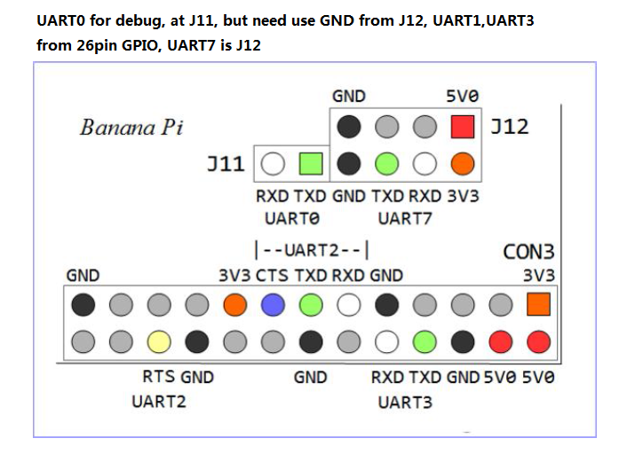

Banana Pi BPI-M1
================

The [BPI-M1][1] is the first Banana Pi board, powered by the Allwinner
A20 dual-core Cortex-A7 @ 1 GHz with 1 GB DDR3 RAM.

The board features:

- Gigabit Ethernet
- SD card slot (full size)
- SATA 2.0 port
- 2x USB 2.0 host, 1x micro USB OTG
- HDMI, composite video and audio out
- 26-pin GPIO header

> [!NOTE]
> The BPI-M1+ is a different board with its own device tree and is not
> covered by this BSP.

How to Build
------------

There are no pre-built images for ARM 32-bit, so build both Infix and
the bootloader from source.

1. Build the bootloader

        make O=x-boot-bpi-m1 bpi_m1_boot_defconfig
        make O=x-boot-bpi-m1

2. Build Infix

        make O=x-arm arm_defconfig
        make O=x-arm

3. Create the SD card image

        ./utils/mkimage.sh -b x-boot-bpi-m1 -r x-arm bananapi-bpi-m1

To test only the bootloader, e.g., to verify the console, create a
boot-only image after step 1:

        ./utils/mkimage.sh -B -b x-boot-bpi-m1 bananapi-bpi-m1

Flashing to SD Card
-------------------

[Flash the image][0] to an SD card (at least 2 GB):

```bash
sudo bmaptool copy x-boot-bpi-m1/images/infix-bpi-m1-sdcard.img /dev/sdX
```

> [!WARNING]
> Ensure `/dev/sdX` is the correct device for your SD card and not used
> by the host system!  Use `lsblk` to verify.

Booting the Board
-----------------

1. Insert the flashed SD card
2. Connect an Ethernet cable
3. Power up the board, 5V DC via the micro USB port
4. Find the assigned IP and SSH in, default login: `admin` / `admin`

The board has no user button, so U-Boot always runs in developer mode.
Use `bootmenu` on the console for factory reset.

LEDs and Buttons
----------------

| **Stage**      | **USR** (green) |
|----------------|-----------------|
| U-Boot         | on              |
| System loading | 1 Hz            |
| System up      | on              |
| Locate         | 1 Hz            |
| Fail safe      | 5 Hz            |
| Panic          | 5 Hz            |

The Ethernet port LEDs show link and activity.

The power button powers on the board, and a short press when running
powers it off.  The reset button is a hardware reset.

Unsupported Features
--------------------

The following hardware has no driver enabled in Infix:

- Analog audio and composite video out
- HDMI audio, not supported by mainline Linux on the A20
- IR receiver
- Micro USB OTG port
- Mali-400 GPU and video decoder

Console Port
------------



The debug console is UART0, TX and RX on header J11 and GND on the
neighboring header J12:

- Baud rate: 115200
- Data bits: 8
- Parity: None
- Stop bits: 1

> [!WARNING]
> Use only 3.3V serial adapters.

[0]: https://www.kernelkit.org/posts/flashing-sdcard/
[1]: https://docs.banana-pi.org/en/BPI-M1/BananaPi_BPI-M1
