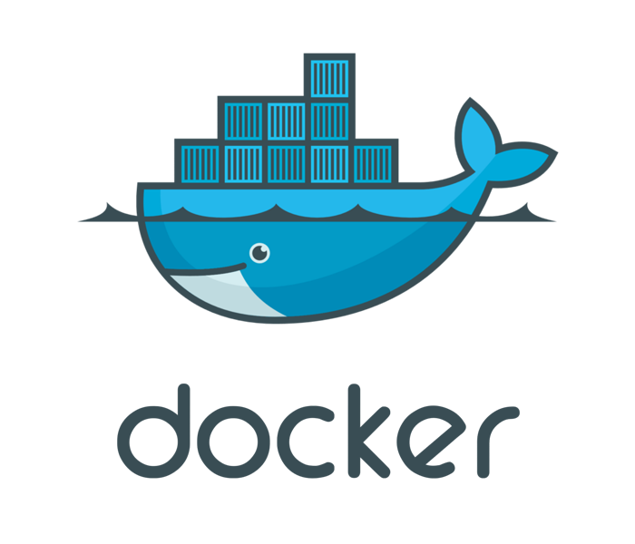

Docker Container Support
========================

{ align=right width="360" }

Infix comes with native support for Docker containers using [podman][].
The [YANG model][1] describes the current level of support, complete
enough to run both system and application containers.

Key design features of Infix, like using Linux switchdev, allow users to
assign switch ports directly to containers, not just bridged VETH pairs.
This is a rare and in many cases *unique* feature of Infix.

All network specific settings are done using the IETF interfaces YANG
model, with augments for containers to ensure smooth integration with
container networking in podman.

> [!IMPORTANT]
> Even though the `podman` command can be used directly from a shell
> prompt, we strongly recommend using the CLI commands instead.  They
> employ the services of a wrapper `container` script which handles the
> integration of Docker containers in the system.


Caution
-------

A word of warning.  Containers can run on your system in privileged
mode, as `root`, giving them full access to devices on your system.
Even though containers are fenced from the host with Linux namespaces,
resource limited using cgroups, and normally run with capped privileges,
a privileged container is relatively easy to break out of.  A trivial
example is given in the [Advanced](#advanced) section of this document.

We recommend avoiding privileged containers, if possible (they do have
valid use-cases) and instead use [capabilities](#capabilities).

Remember:

 - If the system is compromised, containers can be used to easily
   install malicious software in your system and over the network
 - Your system is as secure as anything you run in the container
 - If you run containers, there is no security guarantee of any kind
 - Running 3rd party container images on your system could open a
   security hole/attack vector/surface
 - An expert with knowledge how to build exploits will be able to
   jailbreak/elevate to root even if best practices are followed

This being said, a system suspected of being compromised can always be
restored to a safe state with a factory reset.  Provided, of course,
that it has secure boot enabled.


Getting Started
---------------

In the CLI, containers can be run in one of two ways:

 1. `container run IMAGE [COMMAND]`, or
 2. enter `configure` context, then `edit container NAME`

The first is useful mostly for testing, or running single commands in
an image.  It is a wrapper for `podman run -it --rm ...`.

The second creates a read-only container that by default automatically
start at every boot.   It basically wraps `podman create ...`.

When non-volatile storage is needed two complementary options exist:

 - **Volumes:** data stored in a volume is persisted until explicitly
   removed from the configuration, i.e., across host reboots and
   container upgrades
 - **[Content Mounts](#content-mounts):** where the content of a file
  mounted into the container is kept along with the container
  configuration in the device's `startup-config`

Podman ensures (using tmpfs) all containers have writable directories
for certain critical file system paths: `/dev`, `/dev/shm`, `/run`,
`/tmp`, and `/var/tmp`.  Meaning, what you most often need is writable
volumes for `/var/lib` and `/etc`, or only file mounts for a few files
in `/etc`.  The [actual requirements](#container-requirements) depend on
your container image and application to run.

> [!IMPORTANT]
> When running containers from public registries, double-check that they
> support the CPU architecture of your host system.  Remember, unlike
> virtualization, containers reuse the host's CPU and kernel.

{ align=right width="200" }

### Example: Hello World

Classic Hello World:

<pre class="cli"><code>admin@example:/> <b>container run docker://hello-world</b>
Starting docker://hello-world :: use Ctrl-p Ctrl-q to detach
Trying to pull docker.io/library/hello-world:latest...
Getting image source signatures
Copying blob c1ec31eb5944 done
Copying config d2c94e258d done
Writing manifest to image destination
Storing signatures

Hello from Docker!
This message shows that your installation appears to be working correctly.
</code></pre>

### Example: Web Server

A web server with [nginx][], using standard docker bridge.  Podman will
automatically create a VETH pair for us, connecting the container to the
`docker0` bridge:

<pre class="cli"><code>admin@example:/> <b>configure</b>
admin@example:/config/> <b>edit interface docker0</b>
admin@example:/config/interface/docker0/> <b>set container-network</b>
admin@example:/config/interface/docker0/> <b>end</b>
admin@example:/config/> <b>edit container web</b>
admin@example:/config/container/web/> <b>set image docker://nginx:alpine</b>
admin@example:/config/container/web/> <b>set network publish 8080:80</b>
admin@example:/config/container/web/> <b>set network interface docker0</b>
admin@example:/config/container/web/> <b>set volume cache target /var/cache</b>
admin@example:/config/container/web/> <b>leave</b>
admin@example:/> <b>show container</b>
</code></pre>

Exit to the shell and verify the service with curl, or try to attach
to your device's IP address using your browser:

<pre class="cli"><code>admin@example:~$ <b>curl http://localhost:8080</b>
</code></pre>

or connect to port 8080 of your running Infix system with a browser.
See the following sections for how to add more interfaces and manage
your container at runtime.


Container Images
----------------

The underlying `podman` project supports importing and fetching images in
a variety of ways, the most common ones are also supported by Infix.  In
this section we present how to use them and in the next section we show
how to upgrade to a newer base image.

The CLI help shows:

<pre class="cli"><code>admin@example:/config/container/system/> <b>help image</b>
<b>NAME</b>
    image &lt;string&gt;

<b>DESCRIPTION</b>
    Docker image for the container: [transport]name[:tag|@digest]

    quay.io/username/myimage     -- Pull myimage:latest
    docker://busybox             -- Pull busybox:latest from Docker Hub
    docker://ghcr.io/usr/img     -- Pull img:latest from GitHub packages
    dir:/media/usb/myimage:1.1   -- Use myimage v1.1 from USB media
    docker-archive:/tmp/archive  -- Use archive:latest from tarball
    oci-archive:/lib/oci/archive -- Use archive:latest from OCI archive
                                    May be in .tar or .tar.gz format

    Additionally, the following URIs are also supported for setups
    that do not use a HUB or similar.  Recommend using 'checksum'!

    ftp://addr/path/to/archive   -- Downloaded using wget
    http://addr/path/to/archive  -- Downloaded using curl
    https://addr/path/to/archive -- Downloaded using curl

    Note: if a remote repository cannot be reached, the creation of the
          container will be put on a queue that retries pull every time
          there is a route change in the host's system.
</code></pre>

> [!TIP]
> The built-in help system in the CLI is generated from the YANG model,
> so the same information is also available for remote NETCONF users.

The two most common variants are `docker://` and `oci-archive:/`.

The former requires a working Docker registry and the latter operates on
a plain OCI archive.  Infix does not come with a built-in registry, so
the `docker://` option is best used with external services, which in
turn require [networking][0] to be up.  In a deployment phase the
easiest may be to set up a single interface on your host system with
DHCP client.

The default method is `docker://`, so when setting the `image` for your
container, you can omit the `docker://` prefix.  You can also use the
admin-exec command `container pull docker://...`, and when configuring a
container `podman` will check first if it has the image before trying to
download anything.  (See also the upgrade section, below.)

The `oci-archive:/` is interesting since many users may not have, or do
not want to, publish their images in a registry.  Use the Docker [OCI
exporter][5] or any other tool that supports generating [OCI Image][3]
format.  Infix supports loading both `.tar` or `.tar.gz` formats.

Here we show a simple example of fetching an OCI image to the system,
but many others exist, tools like `wget`, `curl`, and `scp` come to
mind.

**Shell OCI Example:**

<pre class="cli"><code>admin@example:~$ <b>cd /var/tmp/</b>
admin@example:/var/tmp$ <b>sudo wget https://github.com/kernelkit/curiOS/releases/download/edge/curios-oci-amd64.tar.gz</b>
Connecting to github.com (140.82.121.3:443)
wget: note: TLS certificate validation not implemented
Connecting to objects.githubusercontent.com (185.199.109.133:443)
saving to 'curios-oci-amd64.tar.gz'
curios-oci-amd64.tar 100% |*********************************| 7091k  0:00:00 ETA
'curios-oci-amd64.tar.gz' saved
admin@example:/var/tmp$ <b>ll</b>
total 7104
drwxr-xr-x    3 root     root          4096 Mar 27 14:22 ./
drwxr-xr-x   14 root     root          4096 Mar 27 11:57 ../
-rw-r--r--    1 root     root       7261785 Mar 27 14:22 curios-oci-amd64.tar.gz
drwx------    6 frr      frr           4096 Mar 27 11:57 frr/
</code></pre>

Importing the image into Podman can be done either from the CLI
admin-exec context ...

<pre class="cli"><code>admin@example:/var/tmp$ <b>cli</b>
admin@example:/> <b>container load /var/tmp/curios-oci-amd64.tar.gz name curios:edge</b>
</code></pre>

> [!TIP]
> The `name curios:edge` is the tag you give the imported (raw) archive
> which you can then reference in your container image configuration:
> `set image curios:edge`.

... or by giving the container configuration the full path to the OCI
archive, which helps greatly with container upgrades (see below):

<pre class="cli"><code>admin@example:/config/container/system/> <b>set image oci-archive:/var/tmp/curios-oci-amd64.tar.gz</b>
</code></pre>

**Checksum Example:**

<pre class="cli"><code>admin@example:/> <b>configure</b>
admin@example:/config/> <b>edit container sys</b>
admin@example:/config/container/sys/> <b>set hostname sys</b>
admin@example:/config/container/sys/> <b>set image ftp://192.168.122.1/curios-oci-amd64-v24.05.0.tar.gz</b>
admin@example:/config/container/sys/> <b>set checksum</b>
    md5 sha256 sha512
admin@example:/config/container/sys/> <b>set checksum sha256 4f01077036527498ed910f1a3e80645ae3eff629d10043cf80ebc6850c99c629</b>
admin@example:/config/container/sys/> <b>leave</b>
admin@example:/> <b>copy running-config startup-config</b>
admin@example:/> <b>show container</b>
<span class="header">NAME  STATUS         NETWORK  MEMORY (KiB)  CPU%</span>
sys   Up 5 seconds                  72/512  0.02

admin@example:/> <b>show log</b>
...
Nov 20 07:24:56 example container[5040]: Fetching ftp://192.168.122.1/curios-oci-amd64-v24.05.0.tar.gz
Nov 20 07:24:56 example container[5040]: curios-oci-amd64-v24.05.0.tar.gz downloaded successfully.
Nov 20 07:24:56 example container[5040]: curios-oci-amd64-v24.05.0.tar.gz checksum verified OK.
Nov 20 07:24:57 example container[5040]: Cleaning up extracted curios-oci-amd64-v24.05.0
Nov 20 07:24:57 example container[5040]: podman create --name sys --conmon-pidfile=/run/container:sys.pid --read-only --replace --quiet --cgroup-parent=containers  --restart=always --systemd=false --tz=local --hostname sys --log-driver k8s-file --log-opt path=/run/containers/sys.fifo --network=none curios-oci-amd64-v24.05.0
Nov 20 07:24:57 example container[3556]: b02e945c43c9bce2c4be88e31d6f63cfdb1a3c8bdd02179376eb059a49ae05e4
</code></pre>


Understanding Image Tags
------------------------

Docker images use tags to identify different versions of the same image.
Understanding the difference between *mutable* and *immutable* tags is
important for managing container upgrades effectively.

### Mutable Tags

Tags like `:latest`, `:edge`, or `:stable` are *mutable* — they point to
different images over time as new versions are published to the registry.

**Advantages:**

 - Convenient: upgrade without changing configuration
 - Simple: use the CLI command `container upgrade NAME` to get the latest version,  
   there is even a convenient RPC for controlling the remotely
 - Good for: development, testing, and systems that auto-update

**Trade-offs:**

 - Less reproducible: different systems may run different versions
 - Less predictable: upgrades happen when you pull, not when you plan
 - Harder to rollback: previous version may no longer be available

**Example mutable tags:**

```
docker://nginx:latest          # Always points to newest release
docker://myapp:edge            # Development/bleeding edge version
oci-archive:/var/tmp/app.tar   # Local archive that may be replaced
```

### Immutable Tags

Version-specific tags like `:v1.0.1`, `:24.11.0`, or digest references
like `@sha256:abc123...` are *immutable* — they always reference the
exact same image content.

**Advantages:**

 - Reproducible: all systems run identical versions
 - Predictable: upgrades only happen when you change configuration
 - Auditable: clear history of what ran when
 - Good for: production, compliance, and controlled deployments

**Trade-offs:**

 - More explicit: must update configuration to upgrade
 - Requires planning: need to know which version to use

**Example immutable tags:**

```
docker://nginx:1.25.3          # Specific version number
docker://myapp:v2.1.0          # Semantic version tag
docker://nginx@sha256:abc123   # Cryptographic digest (most immutable)
```

> [!TIP]
> **Best practice for production:** Use specific version tags (`:v1.0.1`)
> rather than mutable tags (`:latest`). This ensures all your systems run
> identical software and upgrades happen only when you decide.

Upgrading Container Images
---------------------------

{ align=right width="100" }

The applications in your container are an active part of the system as a
whole, so make it a routine to keep your container images up-to-date!

### How Container Lifecycle Works

Infix intelligently manages container lifecycles to provide a smooth
experience while minimizing unnecessary work:

**At first setup:** When you configure a container for the first time,
Infix fetches the image (if needed) and creates the container instance.

**At boot time:** Infix checks if the container needs to be recreated by
comparing checksums for:

 - The image archive that the container was built from
 - The container configuration script

**When configuration changes:** If you modify any container settings
(network, volumes, environment, etc.), the container is automatically
recreated with the new configuration.

**When explicitly upgraded:** Using the `container upgrade` command forces
a fresh pull of the image and recreates the container.

This means that in most cases, **containers persist across reboots** and
are only recreated when actually necessary. Your container's state stored
in volumes is preserved across recreations.  Since Infix containers use a
read-only root filesystem, any changes written outside of volumes or the
writable paths provided by Podman (`/dev`, `/dev/shm`, `/run`, `/tmp`,
`/var/tmp`) will be lost when the container is recreated.

### Method 1: Upgrading Immutable Tags

When using version-specific tags, you upgrade by explicitly changing the
image reference in your configuration:

<pre class="cli"><code>admin@example:/> <b>configure</b>
admin@example:/config/> <b>edit container web</b>
admin@example:/config/container/web/> <b>set image docker://nginx:1.25.3</b>
admin@example:/config/container/web/> <b>leave</b>
</code></pre>

**What happens:**

 1. Podman pulls the new image in the background (if not already present)
 2. Your container is automatically stopped
 3. The container is recreated with the new image
 4. The container is started with your existing volumes intact

**Example:** Upgrading from one version to another:

<pre class="cli"><code>admin@example:/> <b>configure</b>
admin@example:/config/> <b>edit container system</b>
admin@example:/config/container/system/> <b>show image</b>
image ghcr.io/kernelkit/curios:v24.11.0;
admin@example:/config/container/system/> <b>set image ghcr.io/kernelkit/curios:v24.12.0</b>
admin@example:/config/container/system/> <b>leave</b>
admin@example:/> <b>show log</b>
...
Dec 13 14:32:15 example container[1523]: Pulling ghcr.io/kernelkit/curios:v24.12.0...
Dec 13 14:32:18 example container[1523]: Stopping old container instance...
Dec 13 14:32:19 example container[1523]: Creating new container with updated image...
Dec 13 14:32:20 example container[1523]: Container system started successfully
</code></pre>

### Method 2: Upgrading Mutable Tags

For images using mutable tags like `:latest` or `:edge`, use the
`container upgrade` command:

<pre class="cli"><code>admin@example:/> <b>container upgrade NAME</b>
</code></pre>

This command:

 1. Stops the running container
 2. Pulls the latest version of the image from the registry
 3. Recreates the container with the new image
 4. Starts the container automatically

**Example using registry:**

<pre class="cli"><code>admin@example:/> <b>container upgrade system</b>
system
Trying to pull ghcr.io/kernelkit/curios:edge...
Getting image source signatures
Copying blob 07bfba95fe93 done
Copying config 0cb6059c0f done
Writing manifest to image destination
Storing signatures
0cb6059c0f4111650ddbc7dbc4880c64ab8180d4bdbb7269c08034defc348f17
system: not running.
59618cc3c84bef341c1f5251a62be1592e459cc990f0b8864bc0f5be70e60719
</code></pre>

**Example using local OCI archive:**

An OCI archive image can be upgraded in a similar manner. First, get the
new archive onto the system (see Container Images section above), then,
provided the `oci-archive:/path/to/archive` format is used in your
configuration, call the upgrade command:

<pre class="cli"><code>admin@example:/> <b>container upgrade system</b>
Upgrading container system with local archive: oci-archive:/var/tmp/curios-oci-amd64.tar.gz ...
7ab4a07ee0c6039837419b7afda4da1527a70f0c60c0f0ac21cafee05ba24b52
</code></pre>

OCI archives can also be fetched from ftp/http/https URLs. In that case,
the upgrade works the same way as a registry image — Infix downloads the
new archive and recreates the container.

### Embedded Container Images

> [!TIP]
> Containers running from OCI images embedded in the operating system,
> e.g., `/lib/oci/mycontainer.tar.gz`, are automatically kept in sync
> with the Infix system image version.
>
> **How it works:** When you build a custom Infix image with embedded OCI
> archives, those containers will be upgraded whenever you upgrade the
> Infix operating system itself. At boot, Infix checks if the embedded
> image has changed and automatically recreates the container if needed.
>
> **Example:** default builds of Infix include a couple of OCI images
> for reference, one is `/lib/oci/curios-nftables-v24.11.0.tar.gz`, but
> there is also a symlink called `curios-nftables-latest.tar.gz` in the
> same directory, which is what the Infix regression tests use in the
> image configuration of the container. When the system is upgraded and
> the embedded image changes, the test containers are automatically
> recreated with the new version.
>
> This approach ensures your embedded containers always match your system
> version without any manual intervention.


Capabilities
-------------

An unprivileged container works for almost all use-cases, but there are
occasions where they are too restricted and users start looking for the
`privileged` flag.  Capabilities offers a middle ground.

For example, a system container from which `ping` does not work:

<pre class="cli"><code>admin@example:/config/container/system/> <b>edit capabilities</b>
admin@example:/config/container/system/capabilities/> <b>set add net_raw</b>
admin@example:/config/container/system/capabilities/> <b>end</b>
admin@infix-00-00-00:/config/container/system/> <b>show</b>
...
capabilities {
  add net_raw;
}
...
</code></pre>

Infix supports a subset of all [capabilities][6] that are relevant for
containers.  Please note, that this is an advanced topic that require
time and analysis of your container application to figure out which
capabilities you need.


Resource Limits
---------------

Containers can be configured with resource limits to control their memory
and CPU usage. This helps prevent containers from consuming excessive system
resources and ensures fair resource allocation across multiple containers.

### Configuring Resource Limits

Resource limits are set per container and include:

 - **Memory:** Maximum memory usage in kibibytes (KiB)
 - **CPU:** Maximum CPU usage in millicores (1000 millicores = 1 CPU core)

Example configuration limiting a container to 512 MiB of memory and 1.5 CPU cores:

<pre class="cli"><code>admin@example:/> <b>configure</b>
admin@example:/config/> <b>edit container web</b>
admin@example:/config/container/web/> <b>edit resource-limit</b>
admin@example:/config/container/web/resource-limit/> <b>set memory 524288</b>
admin@example:/config/container/web/resource-limit/> <b>set cpu 1500</b>
admin@example:/config/container/web/resource-limit/> <b>leave</b>
</code></pre>

Common CPU limit examples:

 - `500` = 0.5 cores (50% of one core)
 - `1000` = 1.0 cores (one full core)
 - `2000` = 2.0 cores (two full cores)

### Monitoring Resource Usage

Runtime resource usage statistics are available in the operational datastore:

<pre class="cli"><code>admin@example:/> <b>show container web</b>
...
</code></pre>

Use `show container usage` to see resource consumption across all containers,
including memory, CPU, block I/O, network I/O, and process counts.


Networking and Containers
-------------------------

By default, unlike other systems, persistent[^1] containers have no
networking enabled.  All network access has to be set up explicitly.
Currently two types of of container networks are supported:

 - `host`: an managed host interface, e.g., one end of a VETH pair,
   or even a physical interface
 - `bridge`: an IP masquerading bridge

In the former the interface is delegated to (moved into) the container,
while in the latter a VETH pair is automatically created by Podman and
one end delegated to the container, while the other end is assigned to
the bridge (see the next section).

> [!TIP]
> For more information on VETH pairs, see the [Networking Guide][0].


### Container Bridge

A container bridge is what most container setups use and users want.


The difference from a regular bridge is that the container runtime fully
manages them -- connecting containers with automatically created VETH
pairs (look at the bridge port names) and setting up firewall rules
between the host and other containers, as well as managing port
forwarding.  This transparent background management is what makes
container use seem to be so simple.

All interface configuration is done in configure context.

<pre class="cli"><code>admin@example:/> <b>configure</b>
admin@example:/config> <b>edit interface docker0</b>
admin@example:/config/interface/docker0/> <b>set container-network</b>
admin@example:/config/interface/docker0/> <b>leave</b>
</code></pre>

There is more to this story.  When using the CLI, and sticking to common
interface nomenclature, Infix helps you with some of the boring stuff.
E.g., creating a new interface with a name like `brN` or `dockerN`
automatically *infers* the interface types, which you would otherwise
have to set manually:

<pre class="cli"><code>admin@example:/config/interface/docker0/> <b>set type bridge</b>
admin@example:/config/interface/docker0/> <b>set container-network type bridge</b>
</code></pre>

> [!IMPORTANT]
> When configuring the system via an API such as NETCONF or RESTCONF, no
> settings are inferred.  Instead it is up to the caller to fully define
> the desired setup.  This makes the CLI very useful for first setup and
> then extracting the resulting XML from the shell using the `cfg -X`
> command.

We have to declare the interface as a container network, ensuring the
interface cannot be used by the system for any other purpose.  E.g., a
container `host` interface is supposed to be used by a container, by
declaring it as such we can guarantee that it would never accidentally
be added as a bridge or lag port.  Hence, to move an interface currently
set as a `bridge-port` it must be removed from the bridge before being
given to a container.

The default subnet for a container `bridge` is 172.17.0.0/16, the bridge
takes the `.1` address and hand out the rest of the range to containers
in a round-robin like fashion.  A container with this `network` get an
automatically created VETH pair connection to the bridge and a lot of
other networking parameters (DNS, default route) are set up.

Some of the defaults of a container `bridge` can be changed, e.g.,
instead of `set container-network type bridge`, above, do:

<pre class="cli"><code>admin@example:/config/interface/docker0/> <b>edit container-network</b>
admin@example:/config/…/container-network/> <b>set type bridge</b>
admin@example:/config/…/container-network/> <b>edit subnet 192.168.0.0/16</b>
admin@example:/config/…/subnet/192.168.0.0/16/> <b>set gateway 192.168.255.254</b>
admin@example:/config/…/subnet/192.168.0.0/16/> <b>end</b>
admin@example:/config/…/container-network/> <b>edit route 10.0.10.0/24</b>
admin@example:/config/…/route/10.0.10.0/24/> <b>set gateway 192.168.10.254</b>
admin@example:/config/…/route/10.0.10.0/24/> <b>end</b>
admin@example:/config/…/container-network/> <b>end</b>
admin@example:/config/interface/docker0/> <b>leave</b>
</code></pre>

Other network settings, like DNS and domain, use built-in defaults, but
can be overridden from each container.  Other common settings per
container is the IP address and name of the network interface inside the
container.  The default, after each stop/start cycle, or reboot of the
host, is to name the interfaces `eth0`, `eth1`, in the order they are
given in the `network` list, and to give the container the next address
in a `bridge`.  Below an example of a system container calls `set
network interface docker0`, here we show how to set options for that
network:

<pre class="cli"><code>admin@example:/config/container/ntpd/> <b>edit network interface docker0</b>
admin@example:/config/…/network/interface/docker0/>
admin@example:/config/…/network/interface/docker0/> <b>set option</b>
&lt;string&gt;  Options for masquerading container bridges.
admin@example:/config/…/network/interface/docker0/> <b>help option</b>
NAME
        option &lt;string&gt;

DESCRIPTION
        Options for masquerading container bridges.

        Example: ip=1.2.3.4            -- request a specific IP (IPv4 or IPv6)
                 mac=00:01:02:c0:ff:ee -- set fixed MAC address in container
                 interface_name=foo0   -- set interface name inside container

admin@example:/config/…/network/interface/docker0/> <b>set option ip=172.17.0.2</b>
admin@example:/config/…/network/interface/docker0/> <b>set option interface_name=wan</b>
admin@example:/config/…/network/interface/docker0/> <b>leave</b>
</code></pre>


### Container Host Interface

Another common use-case is to move network interfaces into the network
namespace of a container[^3].  This of course works with plain Ethernet
interfaces as well, but here we will use one end of a VETH pair as an
example.

The network `option` setting is available also for this case, but only
the `interface_name=foo0` option works.  Which is still very useful.  To
set:

 - IP address, use IPv4/IPv6 settings in the interface settings
 - MAC address, to use the `custom-phys-address` in the interface settings

For an example of both, see the next section.

> [!IMPORTANT]
> **VETH Pair Limitation:** When using VETH pairs with containers, at least
> one side of the pair must remain in the host namespace. It is currently
> not possible to create VETH pairs where both ends are assigned to different
> containers. One end must always be accessible from the host.

[^3]: Something which the container bridge network type does behind the
    scenes with one end of an automatically created VETH pair.


#### Routed Setup

In this routed setup we reserve 192.168.0.0/24 for the network between
the host and the `ntpd` container.


Configuration is a straight-forward VETH pair setup where we name the
container-end of pair `ntpd`.  This is just a convenience for us when
reading the configuration later.  The *real action* happens on the last
line where we declare the `ntpd` end as a container network interface:

<pre class="cli"><code>admin@example:/config/> <b>edit interface veth0</b>
admin@example:/config/interface/veth0/> <b>set veth peer ntpd</b>
admin@example:/config/interface/veth0/> <b>set ipv4 address 192.168.0.1 prefix-length 24</b>
admin@example:/config/interface/veth0/> <b>end</b>
admin@example:/config/> <b>edit interface ntpd</b>
admin@example:/config/interface/ntpd/> <b>set ipv4 address 192.168.0.2 prefix-length 24</b>
admin@example:/config/interface/ntpd/> <b>set custom-phys-address static 00:c0:ff:ee:00:01</b>
admin@example:/config/interface/ntpd/> <b>set container-network</b>
</code></pre>

> [!TIP]
> Notice how you can also set a custom MAC address at the same time.

Adding the interface to the container is the same as before, but since
everything for host interfaces is set up in the interfaces context, we
can take a bit of a shortcut.

<pre class="cli"><code>admin@example:/config/container/ntpd/> <b>set network interface ntpd</b>
admin@example:/config/container/ntpd/> <b>leave</b>
</code></pre>

> [!TIP]
> Use the `set network interface ntpd option interface_name=foo0` to set
> the name of the interface inside the container to `foo0`.

The point of the routed case is that port forwarding from the container
in this case is limited to a single interface, not *all interfaces* as
is the default in the masquerading container bridge setup.


#### Bridged Setup

A perhaps more common case is to bridge the other end of the VETH pair
with other physical ports.  In this section we show how to add a new
pair to give our container two interfaces:


We start by adding the second VETH pair:

<pre class="cli"><code>admin@example:/config/> <b>edit interface veth1a</b>
admin@example:/config/interface/veth1a/> <b>set veth peer veth1</b>
admin@example:/config/interface/veth1a/> <b>set ipv4 address 192.168.1.2 prefix-length 24</b>
</code></pre>

> [!NOTE]
> The LAN bridge (br1) in this example has IP address 192.168.1.1.

When a container has multiple host interfaces it can often be useful to
have a default route installed.  This can be added from the host with a
`0.0.0.0/0` route on one of the interfaces:

<pre class="cli"><code>admin@example:/config/interface/veth1a/> <b>set container-network route 0.0.0.0/0 gateway 192.168.1.1</b>
admin@example:/config/interface/veth1a/> <b>show</b>
type veth;
container-network {
  type host;
  route 0.0.0.0/0 {
    gateway 192.168.1.1;
  }
}
veth {
  peer veth1;
}
admin@example:/config/interface/veth1a/> <b>end</b>
admin@example:/config/> <b>set interface veth1 bridge-port bridge br1</b>
</code></pre>

Please note, container network routes require the base interface also
have a static IP address set.  Setting only the route, but no address,
means the route is skipped.


### Host Networking

The third use-case is host networking, this is where a container share
the network namespace of the host.  An example here could be a nftables
or ntpd container -- single applications which add core functionality to
the host operating system.

The host networking setup cannot be combined with any other network.

For an example, [see below](#application-container-nftables).


Mounts and Volumes
------------------

It is possible to mount files, directories, and even files matching a
glob, into a container.  This gives precise control over the container's
file system:

<pre class="cli"><code>admin@example:/config/container/system/> <b>edit mount leds</b>
admin@example:/config/container/system/mount/leds> <b>set source /sys/class/leds</b>
admin@example:/config/container/system/mount/leds> <b>set target /sys/class/leds</b>
admin@example:/config/container/system/mount/leds> <b>end</b>
admin@example:/config/container/system/>
</code></pre>

Any type of file can be *bind mounted* into the container, just watch
out for permissions though.  In the example above, `/sys/class/leds` is
not writable from a container unless it runs in *privileged* mode.  For
plain configuration files you get more freedom, and your container can
rely on, e.g., *inotify* events to trigger reloading its services when
you change the file on the host.

So it depends on the container, and indeed your overall setup, what to
use.  An intriguing option is *Content Mounts*, which when changed also
trigger a container restart.

Other times *volumes* are a better fit.  A volume is an automatically
created read-writable entity that follows the life of your container.

<pre class="cli"><code>admin@example:/config/container/ntpd/> <b>set volume varlib target /var/lib</b>
</code></pre>

Volumes are persistent across both reboots and upgrades of the base
image.  They are created by Podman when the container first starts up,
unlike a regular bind mount it synchronizes with the contents of the
underlying container image's path at first use.  I.e., "bind-mount, if
empty: then rsync".

> [!NOTE]
> Infix support named volumes (only), and it is not possible to share a
> volume between containers.  All the tricks possible with volumes may
> be added in a later release.

### Volume Management

Volumes are persistent storage that survive container restarts and image
upgrades, making them ideal for application data. However, this also means
they **are not automatically removed** when a container is deleted from the
configuration.

This design choice prevents accidental data loss, especially in scenarios
where:

 - A container is temporarily removed and re-added with the same name
 - A container is replaced with a different configuration but same name
 - System upgrades or configuration changes affect container definitions

To clean up unused volumes and reclaim disk space, use the admin-exec
command:

<pre class="cli"><code>admin@example:/> <b>container prune</b>
Deleted Images
...
Deleted Volumes
ntpd-varlib
system-data

Total reclaimed space: 45.2MB
</code></pre>

The `container prune` command safely removes:

 - Unused container images
 - Volumes not attached to any container (running or stopped)
 - Other unused container resources

> [!TIP]
> You can monitor container resource usage with the command:
>
> <pre class="cli"><code>admin@example:/> <b>show container usage</b>
> </code></pre>
>
> This displays disk space used by images, containers, and volumes,
> helping you decide when to run the prune command.
>
> To see which volumes exist and which containers use them:
>
> <pre class="cli"><code>admin@example:/> <b>show container volumes</b>
> </code></pre>

### Content Mounts

Content mounts are a special type of file mount where the file contents
is stored with the container configuration.  This can be very useful
when deploying similar systems at multiple sites.  When the host loads
its `startup-config` (or even `factory-config`) a temporary file is
created using the decoded base64 data from the `content` node.

<pre class="cli"><code>admin@example:/config/container/ntpd/> <b>edit mount ntpd.conf</b>
admin@example:/config/container/ntpd/mount/ntpd.conf> <b>text-editor content</b>
... interactive editor starts up ...
admin@example:/config/container/ntpd/mount/ntpd.conf> <b>set target /etc/ntpd.conf</b>
admin@example:/config/container/ntpd/mount/ntpd.conf> <b>end</b>
admin@example:/config/container/ntpd/>
</code></pre>

The editor is a small [Emacs clone called Mg][2], see the built-in help
text, or press Ctrl-x Ctrl-c to exit and save.  When the editor exits
the contents are base64 encoded and stored in the candidate datastore.

> [!NOTE]
> Since these files are always recreated when the host is restarted,
> changes made by the container are not preserved, or saved back to the
> host's startup-config.

Infix has three different text editors available.  For more information,
see [CLI Text Editor](cli/text-editor.md).


Example Containers
------------------

### System Container

Let's try out what we've learned by setting up a system container, a
container providing multiple services, using the `docker0` interface
we created previously:

<pre class="cli"><code>admin@example:/> <b>configure</b>
admin@example:/config> <b>edit container system</b>
admin@example:/config/container/system/> <b>set image ghcr.io/kernelkit/curios:edge</b>
admin@example:/config/container/system/> <b>set network interface docker0</b>
admin@example:/config/container/system/> <b>set publish 222:22</b>
admin@example:/config/container/system/> <b>leave</b>
</code></pre>

> [!NOTE]
> Ensure you have a network connection to the registry.  If the image
> cannot be pulled, creation of the container will be put in a queue and
> be retried every time there is a change in the routing table, e.g.,
> default route is added, and every 60 seconds.

Provided the image is downloaded successfully, a new `system` container
now runs behind the docker0 interface, forwarding container port 22 to
port 222 on all of the host's interfaces.  (See `help publish` in the
container configuration context for the full syntax.)

Available containers can be accessed from admin-exec:

<pre class="cli"><code>admin@example:/> <b>show container</b>
<span class="header">NAME     STATUS        NETWORK  MEMORY (KiB)  CPU%</span>
system   Up 16 hours   docker0       136/512  0.02
</code></pre>

This is a system container, so you can "attach" to it by starting a
shell (or logging in with SSH):

<pre class="cli"><code>admin@example:/> <b>container shell system</b>
root@439af2917b44:/#
</code></pre>

Notice how the hostname inside the container changes.  By default the
container ID (hash) is used, but this can be easily changed:

<pre class="cli"><code>root@439af2917b44:/# <b>exit</b>
admin@example:/> <b>configure</b>
admin@example:/config/> <b>edit container system</b>
admin@example:/config/container/system/> <b>set hostname sys101</b>
admin@example:/config/container/system/> <b>leave</b>
admin@example:/> <b>container shell system</b>
root@sys101:/#
</code></pre>

In fact, the container `hostname` setting supports the same format
specifiers as the host's `hostname` setting:

 - `%i`: OS ID, from `/etc/os-release`, from Menuconfig branding
 - `%h`: Default hostname, from `/etc/os-release`, from branding
 - `%m`: NIC specific part of base MAC, e.g., to `c0-ff-ee`
 - `%%`: Literal %

The most useful combination is probably `"container-name-%m"`, which in
this example give the container hostname `container-name-c0-ff-ee`.

[^1]: this does not apply to the admin-exec command `container run`.
    This command is intended to be used for testing and evaluating
	container images.  Such containers are given a private network
	behind an IP masquerading bridge.


### Application Container: nftables

Infix currently does not have a native firewall configuration, and even
when it does it will never expose the full capabilities of `nftables`.
For advanced setups, the following is an interesting alternative.

<pre class="cli"><code>admin@example:/> <b>configure</b>
admin@example:/config> <b>edit container nftables</b>
admin@example:/config/container/nftables/> <b>set image ghcr.io/kernelkit/curios-nftables:edge</b>
admin@example:/config/container/nftables/> <b>set network host</b>
admin@example:/config/container/nftables/> <b>set privileged</b>
admin@example:/config/container/nftables/> <b>edit mount nftables.conf</b>
admin@example:/config/…/mount/nftables.conf/> <b>set target /etc/nftables.conf</b>
admin@example:/config/…/mount/nftables.conf/> <b>text-editor content</b>
... interactive editor starts up where you can paste your rules ...
admin@example:/config/…/mount/nftables.conf/> <b>leave</b>
</code></pre>

Notice how we `set network host`, so the container can see and act on
all the host's interfaces, and that we also have to run the container
in *privileged* mode.


### Application Container: ntpd

The default NTP server/client in Infix is Chrony, a fully working and
capable workhorse for most use-cases.  However, it does not support a
feature like multicasting, for that you need ISC ntpd.

As we did with `nftables`, previously, we can use host networking and
set up a read-only config file that is bind-mounted into the container's
file system and store in the host's `startup-config`.  However, `ntpd`
also saves clock drift information in `/var/lib/ntpd`, so we will also
use volumes in this example.

<pre class="cli"><code>admin@example:/> <b>configure</b>
admin@example:/config> <b>edit container ntpd</b>
admin@example:/config/container/ntpd/> <b>set image ghcr.io/kernelkit/curios-ntpd:edge</b>
admin@example:/config/container/ntpd/> <b>set network interface ntpd</b>    # From veth0 above
admin@example:/config/container/ntpd/> <b>edit mount ntp.conf</b>
admin@example:/config/container/ntpd/mount/ntp.conf/> <b>set target /etc/ntp.conf</b>
admin@example:/config/container/ntpd/mount/ntp.conf/> <b>text-editor content</b>
... interactive editor starts up where you can paste your rules ...
admin@example:/config/container/ntpd/mount/ntp.conf/> <b>end</b>
admin@example:/config/container/ntpd/> <b>edit volume varlib</b>
admin@example:/config/container/ntpd/volume/varlib/> <b>set target /var/lib</b>
admin@example:/config/container/ntpd/volume/varlib/> <b>leave</b>
admin@example:/> <b>copy running-config startup-config</b>
</code></pre>

The `ntp.conf` file is stored in the host's `startup-config` and any
state data in the container's `/var/lib` is retained between reboots
and across image upgrades.


Advanced
--------

This section covers advanced, and sometimes dangerous, topics.  Please
read any warnings and always consider the security aspects.

### Running Host Commands From Container

SSH login with keys is very handy, both remote scripting friendly *and
secure*, but it does require a few extra configuration steps.  The way
to set it up is covered in part in [SSH Authorized Key][4].

Another *insecure* approach is to access the host system directly,
bypassing the namespaces that make up the boundary between host and
container.

> [!CAUTION]
> Please note, this completely demolishes the isolation barrier between
> container and host operating system.  It is only suitable in
> situations where the container serves more as a unit of distribution
> rather than as a separate component of the system.  *Strongly
> recommended* to use this only in trusted setups!  Consider also
> limiting the time frame in which this is active!

First, enable *Privileged* mode, this unlocks the door and allows the
container to manage resources on the host system.  An example is the
`nftables` container mentioned previously.

<pre class="cli"><code>admin@example:/config/container/system/> <b>set privileged</b>
</code></pre>

Second, mount the host's `/proc/1` directory to somewhere inside your
container.  Here we pick `/1`:

<pre class="cli"><code>admin@example:/config/container/system/> <b>edit mount host</b>
admin@example:/config/container/system/mount/host/> <b>set source /proc/1</b>
admin@example:/config/container/system/mount/host/> <b>set target /1</b>
admin@example:/config/container/system/mount/host/> <b>leave</b>
</code></pre>

Third, from inside the container, use the host's PID 1 namespaces with
the `nsenter`[^2] command to slide through the container's walls.  Here
we show two example calls to `hostname`, first the container's own name
and then asking what the hostname is on the host:

<pre class="cli"><code>root@sys101:/# <b>hostname</b>
sys101
root@sys101:/# <b>nsenter -m/1/ns/mnt -u/1/ns/uts -i/1/ns/ipc -n/1/ns/net hostname</b>
example
</code></pre>

One use-case for this method is when extending Infix with a management
container that connects to other systems.  For some tips on how to
control an Infix system this way, see [Scripting Infix](scripting.md).

[^2]: The `nsenter` program is available from either the util-linux
    package in Debian/Ubuntu/Mint, or in BusyBox.  Note, however,
	it may not be enabled by default in BusyBox.


Container Requirements
----------------------

In addition to general [*best practices*][7] for container images, there
are a few more things to consider when targeting embedded systems:

 - Ensure the image targets the CPU architecture of the target system,  
   learn more about [Multi-platform Builds][8]
 - Follow [best practices for naming and tagging][10], e.g., `:latest` vs `:1.0`
 - Follow [OCI recommendations and layout][9],  
   learn more about [OCI and Docker Exporters][6]

If the [Docker documentation][11] is not enough, there are plenty of
[guides online][12] with examples on how to create your own container
image.  For the more advanced, please see the next section.


### Advanced Users

Most people prefer their system containers small, often based on Alpine
Linux, or similar, with only a few small applications, including their
own, and an SSH server perhaps.  For some developers, even this is too
big, so they roll their own from source.  This section is for you.

Depending on your needs, here is a checklist:

 - you need something that can forward signals, e.g.,
   - [tini][]
   - [Bash only][13], or
   - BusyBox init, a classic most embedded developers know, but read on ...
 - a system container only need the bare necessities of a system bringup
   - E.g., BusyBox's init, [but not everything][15]
   - Some of the networking is set up by Podman and CNI for you, but
     you may want to run a DHCP client?
   - Do *not* rename interfaces inside the container, use the dedicated
     `interface_name` option in the configuration instead
   - Remember, Podman provides a `tmpfs` for all critical system paths:
     `/dev`, `/dev/shm`, `/run`, `/tmp`, and `/var/tmp`, so you don't
     need to clean or set up any of these mount points

Examples using `tini` and BusyBox init are available from the KernelKit
[curiOS project][14].  It is a small Buildroot based container image
builder that generates OCI compatible image tarballs without any tools
from Docker or Podman -- ready-made images exist for testing on both
AMD64 and ARM64 targets, as well as `docker pull` images and and OCI
tarballs with SHA256 checksums for integrity checking.

Finally, if you build your own version of Infix, and embed OCI tarballs
in the system image, then see the tip at the end of [Upgrading a
Container Image](#embedded-container-images) (above).

[0]:      networking.md
[1]:      https://github.com/kernelkit/infix/blob/main/src/confd/yang/infix-containers.yang
[2]:      https://github.com/troglobit/mg
[3]:      https://github.com/opencontainers/image-spec/blob/main/image-layout.md
[4]:      system.md#ssh-authorized-key
[5]:      https://docs.docker.com/build/exporters/oci-docker/
[6]:      https://man7.org/linux/man-pages/man7/capabilities.7.html
[7]:      https://docs.docker.com/build/building/best-practices/
[8]:      https://docs.docker.com/build/building/multi-platform/
[9]:      https://github.com/opencontainers/image-spec/blob/main/image-layout.md
[10]:     https://docs.docker.com/get-started/docker-concepts/building-images/build-tag-and-publish-an-image/#tagging-images
[11]:     https://www.docker.com/blog/multi-arch-images/
[12]:     https://lemariva.com/blog/2018/05/tutorial-docker-on-embedded-systems-raspberry-pi-beagleboard
[13]:     https://sirikon.me/posts/0009-pid-1-bash-script-docker-container.html
[14]:     https://github.com/kernelkit/curiOS/
[15]:     https://github.com/kernelkit/curiOS/blob/2e4748f65e356b2c117f586cd9420d7ba66f79d5/board/system/rootfs/etc/inittab
[tini]:   https://github.com/krallin/tini
[nginx]:  https://hub.docker.com/_/nginx
[podman]: https://podman.io
