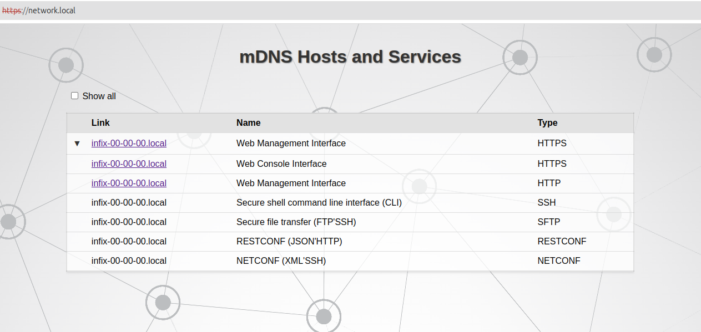

Discover Infix Units
====================

```
 .----.      Ethernet       .-------.
 | PC +---------------------+ Infix |
 '----' if1            eth0 '-------'
```
Figure 1: PC directly connected over Ethernet to Infix unit (here eth0).


When you wish to discover the IP address of an Infix switch, the simplest
way is probably to *ping the IPv6 all-hosts* address (ff02::1) over a
directly connected Ethernet cable. The unit's link-local IPv6 address is
seen in the response.

In the example below, the PC is connected to Infix via interface *tap0*
(*tap0* is *if1* in Figure 1) and Infix responds with address
*fe80::ff:fe00:0*.

```
linux-pc:# ping -6 -L -c 3 ff02::1%tap0
PING ff02::1%tap0(ff02::1%tap0) 56 data bytes
64 bytes from fe80::ff:fe00:0%tap0: icmp_seq=1 ttl=64 time=0.558 ms
64 bytes from fe80::ff:fe00:0%tap0: icmp_seq=2 ttl=64 time=0.419 ms
64 bytes from fe80::ff:fe00:0%tap0: icmp_seq=3 ttl=64 time=0.389 ms

--- ff02::1%tap0 ping statistics ---
3 packets transmitted, 3 received, 0% packet loss, time 2043ms
rtt min/avg/max/mdev = 0.389/0.455/0.558/0.073 ms
linux-pc:# 
```

The PC could connect then connect to Infix, e.g., using SSH.

```
linux-pc:# ssh admin@fe80::ff:fe00:0%tap0
admin@fe80::ff:fe00:0%tap0's password: admin
admin@infix-00-00-00:~$ 
```

## Discovery mechanisms available in Infix

Infix advertises its presence via the [mDNS](#mdns) and [LLDP](#lldp)
discovery protocols.


### LLDP

Infix supports LLDP (IEEE 802.1AB). For a unit with factory default
settings, the PC can readout the link-local IPv6 address from the
Management Address TLV using *tcpdump* or other sniffing tools[^1].
```
linux-pc:# tcpdump -i tap0 -Qin -v ether proto 0x88cc
tcpdump: listening on tap0, link-type EN10MB (Ethernet), snapshot length 262144 bytes
15:51:52.061071 LLDP, length 193
    Chassis ID TLV (1), length 7
      Subtype MAC address (4): 02:00:00:00:00:00 (oui Unknown)
    Port ID TLV (2), length 7
      Subtype MAC address (3): 02:00:00:00:00:00 (oui Unknown)
    Time to Live TLV (3), length 2: TTL 120s
    System Name TLV (5), length 14: infix-00-00-00
    System Description TLV (6), length 91
      Infix by KernelKit Linux 5.19.17 #1 SMP PREEMPT_DYNAMIC Wed Jun 7 08:47:23 CEST 2023 x86_64
    System Capabilities TLV (7), length 4
      System  Capabilities [Bridge, WLAN AP, Router, Station Only] (0x009c)
      Enabled Capabilities [Station Only] (0x0080)
    Management Address TLV (8), length 24
      Management Address length 17, AFI IPv6 (2): fe80::ff:fe00:0
      Interface Index Interface Numbering (2): 2
    Port Description TLV (4), length 4: eth0
    Organization specific TLV (127), length 9: OUI IEEE 802.3 Private (0x00120f)
      Link aggregation Subtype (3)
        aggregation status [supported], aggregation port ID 0
    Organization specific TLV (127), length 9: OUI IEEE 802.3 Private (0x00120f)
      MAC/PHY configuration/status Subtype (1)
        autonegotiation [none] (0x00)
        PMD autoneg capability [unknown] (0x8000)
        MAU type Unknown (0x0000)
    End TLV (0), length 0
^C
1 packet captured
linux-pc:# 
```

If the unit has an IPv4 address assigned, it is shown in an additional
Management Address TLV.

> **Note** The Management Addresses shown by LLDP are not
> necessarily associated with the port transmitting the LLDP message. 

In the example below, the IPv4 address (10.0.1.1) happens to be
assigned to *eth0*, while the IPv6 address (2001:db8::1) is not.

```
linux-pc:# sudo tcpdump -i tap0 -Qin -v ether proto 0x88cc
tcpdump: listening on tap0, link-type EN10MB (Ethernet), snapshot length 262144 bytes
15:46:07.908665 LLDP, length 207
    Chassis ID TLV (1), length 7
      Subtype MAC address (4): 02:00:00:00:00:00 (oui Unknown)
    Port ID TLV (2), length 7
      Subtype MAC address (3): 02:00:00:00:00:00 (oui Unknown)
    Time to Live TLV (3), length 2: TTL 120s
    System Name TLV (5), length 14: infix-00-00-00
    System Description TLV (6), length 91
      Infix by KernelKit Linux 5.19.17 #1 SMP PREEMPT_DYNAMIC Wed Jun 7 08:47:23 CEST 2023 x86_64
    System Capabilities TLV (7), length 4
      System  Capabilities [Bridge, WLAN AP, Router, Station Only] (0x009c)
      Enabled Capabilities [Station Only] (0x0080)
    Management Address TLV (8), length 12
      Management Address length 5, AFI IPv4 (1): 10.0.1.1
      Interface Index Interface Numbering (2): 2
    Management Address TLV (8), length 24
      Management Address length 17, AFI IPv6 (2): 2001:db8::1
      Interface Index Interface Numbering (2): 3
    Port Description TLV (4), length 4: eth0
    Organization specific TLV (127), length 9: OUI IEEE 802.3 Private (0x00120f)
      Link aggregation Subtype (3)
        aggregation status [supported], aggregation port ID 0
    Organization specific TLV (127), length 9: OUI IEEE 802.3 Private (0x00120f)
      MAC/PHY configuration/status Subtype (1)
        autonegotiation [none] (0x00)
        PMD autoneg capability [unknown] (0x8000)
        MAU type Unknown (0x0000)
    End TLV (0), length 0
^C
1 packet captured
2 packets received by filter
0 packets dropped by kernel
linux-pc:#
```

[^1]: [lldpd: implementation of IEEE 802.1ab
    (LLDP)](https://github.com/lldp/lldpd) includes *lldpcli*, which
    is handy to sniff and display LLDP packets.

### mDNS

DNS-SD/mDNS can be used to discover Infix units and services. Infix
units present their IP addresses, services and hostname within the
.local domain. This method has good client support in Apple and Linux
systems. On Linux, tools such as *avahi-browse* or *mdns-scan*[^2] can
be used to search for devices advertising their services via mDNS.

```
linux-pc:# avahi-browse -ar
+   tap0 IPv6 infix-00-00-00                                SFTP File Transfer   local
+   tap0 IPv4 infix-00-00-00                                SFTP File Transfer   local
+   tap0 IPv6 infix-00-00-00                                SSH Remote Terminal  local
+   tap0 IPv4 infix-00-00-00                                SSH Remote Terminal  local
=   tap0 IPv4 infix-00-00-00                                SFTP File Transfer   local
   hostname = [infix-00-00-00.local]
   address = [10.0.1.1]
   port = [22]
   txt = []
=   tap0 IPv4 infix-00-00-00                                SSH Remote Terminal  local
   hostname = [infix-00-00-00.local]
   address = [10.0.1.1]
   port = [22]
   txt = []
=   tap0 IPv6 infix-00-00-00                                SFTP File Transfer   local
   hostname = [infix-00-00-00.local]
   address = [fe80::ff:fe00:0]
   port = [22]
   txt = []
=   tap0 IPv6 infix-00-00-00                                SSH Remote Terminal  local
   hostname = [infix-00-00-00.local]
   address = [fe80::ff:fe00:0]
   port = [22]
   txt = []
^C
linux-pc:#
```

Additionally, *avahi-resolve-host-name* can be used to verify domain
name mappings for IP addresses. By default, it translates from IPv4
addresses. This function allows users to confirm that addresses are
mapped correctly.

```
linux-pc:# avahi-resolve-host-name infix-00-00-00.local
infix-00-00-00.local	10.0.1.1
linux-pc:#
```

Resolved addresses can also be used for tasks like pinging or
establishing an SSH connection to the device, as demonstrated below:

```
linux-pc:# ping infix-00-00-00.local -c 3
PING infix-00-00-00.local (10.0.1.1) 56(84) bytes of data.
64 bytes from 10.0.1.1: icmp_seq=1 ttl=64 time=0.852 ms
64 bytes from 10.0.1.1: icmp_seq=2 ttl=64 time=1.12 ms
64 bytes from 10.0.1.1: icmp_seq=3 ttl=64 time=1.35 ms

--- infix-00-00-00.local ping statistics ---
3 packets transmitted, 3 received, 0% packet loss, time 2003ms
rtt min/avg/max/mdev = 0.852/1.105/1.348/0.202 ms

linux-pc:# ssh admin@infix-00-00-00.local
(admin@infix-00-00-00.local) Password: 
.-------.
|  . .  | Infix -- a Network Operating System
|-. v .-| https://kernelkit.org
'-'---'-

Run the command 'cli' for interactive OAM

linux-pc:#
```

To disable mDNS/mDNS-SD, type the commands:
```
admin@infix-00-00-00:/> configure 
admin@infix-00-00-00:/config/> set mdns enabled false 
admin@infix-00-00-00:/config/> leave
```

#### Short Hostname 

With the help of the mdns-alias, mDNS functionality allows the device
to be accessible as *infix.local* rather than its full hostname 
(e.g., infix-00-00-00.local). This alias works seamlessly on a network
with a single Infix device. However, if multiple Infix devices are
present (e.g., infix-00-00-00.local, infix-01-01-01.local), each device
requires a unique hostname to avoid conflicts, as infix.local would not
uniquely identify multiple devices. The shortened names can also be
used for actions like pinging or establishing an SSH connection:

```
linux-pc:# ping infix.local -c 3
PING infix.local (10.0.1.1) 56(84) bytes of data.
64 bytes from 10.0.1.1: icmp_seq=1 ttl=64 time=0.751 ms
64 bytes from 10.0.1.1: icmp_seq=2 ttl=64 time=2.28 ms
64 bytes from 10.0.1.1: icmp_seq=3 ttl=64 time=1.42 ms

--- infix.local ping statistics ---
3 packets transmitted, 3 received, 0% packet loss, time 2003ms
rtt min/avg/max/mdev = 0.751/1.482/2.281/0.626 ms

linux-pc:# ssh admin@infix.local
(admin@infix-00-00-00.local) Password: 
.-------.
|  . .  | Infix -- a Network Operating System
|-. v .-| https://kernelkit.org
'-'---'-

Run the command 'cli' for interactive OAM

linux-pc:#
```

#### Web Service Availability

The web service on the Infix device is primarily served by the nginx
daemon, which acts as a frontend. It routes incoming requests to the
netbrowse service, a network browser responsible for providing the web
management and console interfaces. This layered approach allows nginx
to handle HTTP/HTTPS requests and forward them to netbrowse, accessible
via the https://network.local portal.

Type https://network.local in the browser and the following should be
shown:



The web interface shows all mDNS hosts and their services advertised
on the network. At this point it is possible to further navigate to
web management interface or remote (web) console.

To disable the web server, use the following:
```
admin@infix-00-00-00:/> configure 
admin@infix-00-00-00:/config/> set web netbrowse enabled false
admin@infix-00-00-00:/> leave
```

[^2]: [mdns-scan](http://0pointer.de/lennart/projects/mdns-scan/): a
    tool for scanning for mDNS/DNS-SD published services on the local
    network
