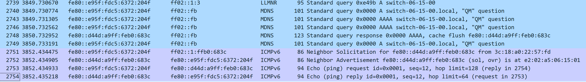
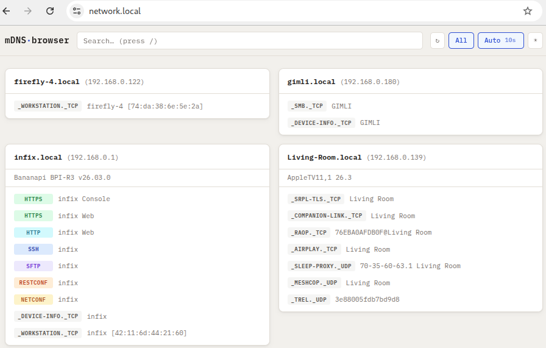

# Device Discovery

Infix advertises itself via the [mDNS-SD](#mdns-sd) and [LLDP](#lldp)
discovery protocols.  mDNS-SD has good client support in Windows, macOS
and on Linux systems.  More on these protocols later.

An even simpler method is available when directly attached to an Infix
device:

```
.----.       Ethernet      .--------.
| PC +---------------------+ Device |
'----' if1              e1 '--------'
```

With IPv6 you can *ping the all-hosts* address (ff02::1), the device's
link-local IPv6 address is then seen in the response.  In the following
example, the PC here uses *tap0* as *if1*, Infix responds with address
*fe80::ff:fec0:ffed*.

<pre class="cli"><code>linux-pc:# <b>ping -6 -L -c 3 ff02::1%tap0</b>
PING ff02::1%tap0(ff02::1%tap0) 56 data bytes
64 bytes from fe80::ff:fec0:ffed%tap0: icmp_seq=1 ttl=64 time=0.558 ms
64 bytes from fe80::ff:fec0:ffed%tap0: icmp_seq=2 ttl=64 time=0.419 ms
64 bytes from fe80::ff:fec0:ffed%tap0: icmp_seq=3 ttl=64 time=0.389 ms

--- ff02::1%tap0 ping statistics ---
3 packets transmitted, 3 received, 0% packet loss, time 2043ms
rtt min/avg/max/mdev = 0.389/0.455/0.558/0.073 ms
linux-pc:#
</code></pre>

> [!TIP]
> The `-L` option ignores local responses from the PC.

This address can then be used to connect to the device, e.g., using SSH.
Notice the syntax `username@address%interface`:

<pre class="cli"><code>linux-pc:# <b>ssh admin@fe80::ff:fec0:ffed%tap0</b>
admin@fe80::ff:fec0:ffed%tap0's password: admin
admin@infix-c0-ff-ee:~$
</code></pre>

### Windows

Infix advertises a `_workstation._tcp` DNS-SD record alongside its other
mDNS services.  Windows 10 (build 1709+) and Windows 11 recognise this
record and show the device in **File Explorer → Network** automatically —
no extra software required.

From the command line, use the `.local` hostname directly:

<pre class="cli"><code>C:\> <b>ping infix-c0-ff-ee.local</b>
C:\> <b>ssh admin@infix-c0-ff-ee.local</b>
</code></pre>

> [!NOTE]
> IPv6 multicast ping (`ping ff02::1%if1`) may not display responses on
> Windows even though the Infix device replies correctly.  If you need to
> confirm connectivity, Wireshark will show the ICMPv6 echo replies
> arriving.  Use mDNS (see [mDNS-SD](#mdns-sd) below) as the reliable
> alternative.
>
> 

## LLDP

Infix supports LLDP (IEEE 802.1AB). For a device with factory default
settings, the link-local IPv6 address can be read from the Management
Address TLV using *tcpdump* or other sniffing tools[^1]:

<pre class="cli"><code>linux-pc:# <b>tcpdump -i tap0 -Qin -v ether proto 0x88cc</b>
tcpdump: listening on tap0, link-type EN10MB (Ethernet), snapshot length 262144 bytes
15:51:52.061071 LLDP, length 193
    Chassis ID TLV (1), length 7
      Subtype MAC address (4): 02:00:00:c0:ff:ee (oui Unknown)
    Port ID TLV (2), length 7
      Subtype MAC address (3): 02:00:00:c0:ff:ee (oui Unknown)
    Time to Live TLV (3), length 2: TTL 120s
    System Name TLV (5), length 14: infix-c0-ff-ee
    System Description TLV (6), length 91
      Infix by KernelKit Linux 5.19.17 #1 SMP PREEMPT_DYNAMIC Wed Jun 7 08:47:23 CEST 2023 x86_64
    System Capabilities TLV (7), length 4
      System  Capabilities [Bridge, WLAN AP, Router, Station Only] (0x009c)
      Enabled Capabilities [Station Only] (0x0080)
    Management Address TLV (8), length 24
      Management Address length 17, AFI IPv6 (2): fe80::ff:fec0:ffed
      Interface Index Interface Numbering (2): 2
    Port Description TLV (4), length 4: eth0
    Organization specific TLV (127), length 9: OUI IEEE 802.3 Private (0x00120f)
      Link aggregation Subtype (3)
        aggregation status [supported], aggregation port ID 0
    Organization specific TLV (127), length 9: OUI IEEE 802.3 Private (0x00120f)
      MAC/PHY configuration/status Subtype (1)
        autonegotiation [none] (0x00)
        PMD autoneg capability [unknown] (0x8000)
        MAU type Unknown (0x0000)
    End TLV (0), length 0
^C
1 packet captured
linux-pc:#
</code></pre>

If the device has an IPv4 address assigned, it is shown in an additional
Management Address TLV.

> [!NOTE]
> The Management Addresses shown by LLDP are not necessarily associated
> with the port transmitting the LLDP message.

In the example below, the IPv4 address (10.0.1.1) happens to be
assigned to *eth0*, while the IPv6 address (2001:db8::1) is not.

<pre class="cli"><code>linux-pc:# <b>sudo tcpdump -i tap0 -Qin -v ether proto 0x88cc</b>
tcpdump: listening on tap0, link-type EN10MB (Ethernet), snapshot length 262144 bytes
15:46:07.908665 LLDP, length 207
    Chassis ID TLV (1), length 7
      Subtype MAC address (4): 02:00:00:c0:ff:ee (oui Unknown)
    Port ID TLV (2), length 7
      Subtype MAC address (3): 02:00:00:c0:ff:ee (oui Unknown)
    Time to Live TLV (3), length 2: TTL 120s
    System Name TLV (5), length 14: infix-c0-ff-ee
    System Description TLV (6), length 91
      Infix by KernelKit Linux 5.19.17 #1 SMP PREEMPT_DYNAMIC Wed Jun 7 08:47:23 CEST 2023 x86_64
    System Capabilities TLV (7), length 4
      System  Capabilities [Bridge, WLAN AP, Router, Station Only] (0x009c)
      Enabled Capabilities [Station Only] (0x0080)
    Management Address TLV (8), length 12
      Management Address length 5, AFI IPv4 (1): 10.0.1.1
      Interface Index Interface Numbering (2): 2
    Management Address TLV (8), length 24
      Management Address length 17, AFI IPv6 (2): 2001:db8::1
      Interface Index Interface Numbering (2): 3
    Port Description TLV (4), length 4: eth0
    Organization specific TLV (127), length 9: OUI IEEE 802.3 Private (0x00120f)
      Link aggregation Subtype (3)
        aggregation status [supported], aggregation port ID 0
    Organization specific TLV (127), length 9: OUI IEEE 802.3 Private (0x00120f)
      MAC/PHY configuration/status Subtype (1)
        autonegotiation [none] (0x00)
        PMD autoneg capability [unknown] (0x8000)
        MAU type Unknown (0x0000)
    End TLV (0), length 0
^C
1 packet captured
2 packets received by filter
0 packets dropped by kernel
linux-pc:#
</code></pre>

The following capabilities are available via NETCONF/RESTCONF or the Infix CLI.

### LLDP Enable/Disable

The LLDP service can be disabled using the following commands.

<pre class="cli"><code>admin@infix-c0-ff-ee:/> <b>configure</b>
admin@infix-c0-ff-ee:/config/> <b>no lldp</b>
admin@infix-c0-ff-ee:/config/> <b>leave</b>
admin@infix-c0-ff-ee:/>
</code></pre>

To reenable it from the CLI config mode:

<pre class="cli"><code>admin@test-00-01-00:/config/> <b>set lldp enabled</b>
admin@test-00-01-00:/config/> <b>leave</b>
</code></pre>

### LLDP Message Transmission Interval

By default, LLDP uses a `message-tx-interval` of 30 seconds, as defined
by the IEEE standard. Infix allows this value to be customized.
To change it using the CLI:

<pre class="cli"><code>admin@test-00-01-00:/config/> <b>set lldp message-tx-interval 1</b>
admin@test-00-01-00:/config/> <b>leave</b>
</code></pre>

### LLDP Administrative Status per Interface

Infix supports configuring the LLDP administrative status on a per-port
basis. The default mode is `tx-and-rx`, but the following options are
also supported:

- `rx-only` – Receive LLDP packets only
- `tx-only` – Transmit LLDP packets only
- `disabled` – Disable LLDP on the interface

Example configuration:

<pre class="cli"><code>admin@test-00-01-00:/config/> <b>set lldp port e8 dest-mac-address 01:80:C2:00:00:0E admin-status disabled</b>
admin@test-00-01-00:/config/> <b>set lldp port e5 dest-mac-address 01:80:C2:00:00:0E admin-status rx-only</b>
admin@test-00-01-00:/config/> <b>set lldp port e6 dest-mac-address 01:80:C2:00:00:0E admin-status tx-only</b>
admin@test-00-01-00:/config/> <b>leave</b>
</code></pre>

> [!NOTE]
> The destination MAC address must be the standard LLDP multicast
> address: `01:80:C2:00:00:0E`.

###  Displaying LLDP Neighbor Information

In CLI mode, Infix also provides a convenient `show lldp` command to
list LLDP neighbors detected on each interface:

<pre class="cli"><code>admin@test-00-01-00:/> <b>show lldp</b>
<span class="header">INTERFACE       REM-IDX   TIME        CHASSIS-ID          PORT-ID                           </span>
e5              1         902         00:a0:85:00:04:01   00:a0:85:00:04:07
e6              3         897         00:a0:85:00:03:01   00:a0:85:00:03:07
e8              2         901         00:a0:85:00:02:01   00:a0:85:00:02:05
</code></pre>

## mDNS-SD

DNS-SD/mDNS-SD can be used to discover Infix devices and services.  By
default, Infix use the `.local` domain for advertising services.  Some
networks use `.lan` instead, so this configurable:

<pre class="cli"><code>admin@infix-c0-ff-ee:/> <b>configure</b>
admin@infix-c0-ff-ee:/config/> <b>edit mdns</b>
admin@infix-c0-ff-ee:/config/mdns/> <b>set domain lan</b>
</code></pre>

Other available settings include limiting the interfaces mDNS responder
acts on, `allow`:

<pre class="cli"><code>admin@infix-c0-ff-ee:/config/> <b>set interfaces allow e1</b>
</code></pre>

or `deny`.  The `allow` and `deny` settings are complementary, `deny` always wins.

<pre class="cli"><code>admin@infix-c0-ff-ee:/config/> <b>set interfaces deny wan</b>
</code></pre>

Use `leave` to activate the new settings, then inspect the operational
state and any detected neighbors with `show mdns` from admin-exec
context:

<pre class="cli"><code>admin@gateway:/> <b>show mdns</b>
Enabled         : yes
Domain          : local
Deny            : wan

<span class="header">HOSTNAME           ADDRESS        LAST SEEN  SERVICES                                       </span>
Living-Room.local  192.168.0.139  17:28:43   trel(59813) sleep-proxy(61936) raop(7000) srpl-tls(853)
firefly-4.local    192.168.0.122  17:28:37   workstation(9)
gimli.local        192.168.0.180  17:28:37   smb(445)
infix.local        192.168.0.1    17:28:38   https(443) workstation(9) ssh(22) https(443)
</code></pre>

----

In Linux, tools such as *avahi-browse* or *mdns-scan*[^2] can be used to
search for devices advertising their services via mDNS.

<pre class="cli"><code>linux-pc:# <b>avahi-browse -ar</b>
+   tap0 IPv6 infix-c0-ff-ee                                SFTP File Transfer   local
+   tap0 IPv4 infix-c0-ff-ee                                SFTP File Transfer   local
+   tap0 IPv6 infix-c0-ff-ee                                SSH Remote Terminal  local
+   tap0 IPv4 infix-c0-ff-ee                                SSH Remote Terminal  local
=   tap0 IPv4 infix-c0-ff-ee                                SFTP File Transfer   local
   hostname = [infix-c0-ff-ee.local]
   address = [10.0.1.1]
   port = [22]
   txt = []
=   tap0 IPv4 infix-c0-ff-ee                                SSH Remote Terminal  local
   hostname = [infix-c0-ff-ee.local]
   address = [10.0.1.1]
   port = [22]
   txt = []
=   tap0 IPv6 infix-c0-ff-ee                                SFTP File Transfer   local
   hostname = [infix-c0-ff-ee.local]
   address = [fe80::ff:fec0:ffed]
   port = [22]
   txt = []
=   tap0 IPv6 infix-c0-ff-ee                                SSH Remote Terminal  local
   hostname = [infix-c0-ff-ee.local]
   address = [fe80::ff:fec0:ffed]
   port = [22]
   txt = []
^C
linux-pc:#
</code></pre>

> [!TIP]
> The `-t` option is also very useful, it stops browsing automatically
> when a "more or less complete list" has been printed.  However, some
> devices on the LAN may be in deep sleep so run the command again if
> you cannot find the device you are looking for.

Additionally, *avahi-resolve-host-name* can be used to verify domain
name mappings for IP addresses.  By default, it translates from IPv4
addresses.  This function allows users to confirm that addresses are
mapped correctly.

<pre class="cli"><code>linux-pc:# <b>avahi-resolve-host-name infix-c0-ff-ee.local</b>
infix-c0-ff-ee.local	10.0.1.1
linux-pc:#
</code></pre>

Thanks to mDNS we can use the advertised name instead of the IP
address for operations like `ping` and `ssh` as shown below:

<pre class="cli"><code>linux-pc:# <b>ping infix-c0-ff-ee.local -c 3</b>
PING infix-c0-ff-ee.local (10.0.1.1) 56(84) bytes of data.
64 bytes from 10.0.1.1: icmp_seq=1 ttl=64 time=0.852 ms
64 bytes from 10.0.1.1: icmp_seq=2 ttl=64 time=1.12 ms
64 bytes from 10.0.1.1: icmp_seq=3 ttl=64 time=1.35 ms

--- infix-c0-ff-ee.local ping statistics ---
3 packets transmitted, 3 received, 0% packet loss, time 2003ms
rtt min/avg/max/mdev = 0.852/1.105/1.348/0.202 ms

linux-pc:# <b>ssh admin@infix-c0-ff-ee.local</b>
(admin@infix-c0-ff-ee.local) Password:
.-------.
|  . .  | Infix OS — Immutable.Friendly.Secure
|-. v .-| https://www.kernelkit.org
'-'---'-

Run the command 'cli' for interactive OAM

linux-pc:#
</code></pre>

To disable mDNS/mDNS-SD, type the commands:

<pre class="cli"><code>admin@infix-c0-ff-ee:/> <b>configure</b>
admin@infix-c0-ff-ee:/config/> <b>no mdns</b>
admin@infix-c0-ff-ee:/config/> <b>leave</b>
</code></pre>

### Human-Friendly Hostname Alias

Each Infix device advertises itself as *infix.local*, in addition to its
full hostname (e.g., *infix-c0-ff-ee.local* or *foo.local*).  This alias
works seamlessly on a network with a single Infix device, and makes it
easy to connect when the exact hostname is not known in advance.  The
examples below show how the alias can be used for actions such as
pinging or establishing an SSH connection:

<pre class="cli"><code>linux-pc:# <b>ping infix.local -c 3</b>
PING infix.local (10.0.1.1) 56(84) bytes of data.
64 bytes from 10.0.1.1: icmp_seq=1 ttl=64 time=0.751 ms
64 bytes from 10.0.1.1: icmp_seq=2 ttl=64 time=2.28 ms
64 bytes from 10.0.1.1: icmp_seq=3 ttl=64 time=1.42 ms

--- infix.local ping statistics ---
3 packets transmitted, 3 received, 0% packet loss, time 2003ms
rtt min/avg/max/mdev = 0.751/1.482/2.281/0.626 ms

linux-pc:# <b>ssh admin@infix.local</b>
(admin@infix.local) Password:
.-------.
|  . .  | Infix OS — Immutable.Friendly.Secure
|-. v .-| https://www.kernelkit.org
'-'---'-

Run the command 'cli' for interactive OAM

admin@infix-c0-ff-ee:~$
</code></pre>

When multiple Infix devices are present on the LAN the alias will not
uniquely identify a device; *infix.local* will refer to any of the
Infix devices, likely the one that first appeared.

> [!NOTE]
> When multiple Infix devices are present on the LAN, use the full name,
> e.g., *infix-c0-ff-ee.local* or *foo.local* rather than the alias
> *infix.local* to deterministically connect to the device.


### Browse Network Using *network.local*

Another mDNS alias that all Infix devices advertise is *network.local*.
This is a web service which basically runs `avahi-browse` and displays a
table of other Infix devices and their services.



With multiple Infix devices on the LAN, one will take the role of your
portal to access all others, if it goes down another takes its place.

To disable the netbrowse service, and the *network.local* alias, the
following commands can be used:

<pre class="cli"><code>admin@infix-c0-ff-ee:/> <b>configure</b>
admin@infix-c0-ff-ee:/config/> <b>edit web</b>
admin@infix-c0-ff-ee:/config/web/> <b>no netbrowse</b>
admin@infix-c0-ff-ee:/config/web/> <b>leave</b>
</code></pre>


[^1]: E.g., [lldpd](https://github.com/lldp/lldpd) which includes the
    *lldpcli* too, handy to sniff and display LLDP packets.
[^2]: [mdns-scan](http://0pointer.de/lennart/projects/mdns-scan/): a
    tool for scanning for mDNS/DNS-SD services on the local network.
