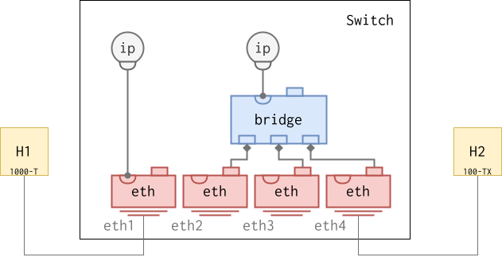

# Ethernet Interfaces

This document covers physical Ethernet interfaces and virtual Ethernet
(VETH) pairs.  For VLAN interfaces stacked on top of an Ethernet port
or bridge, see [VLAN Interfaces](vlan.md).

## Physical Ethernet Interfaces

### Ethernet Settings and Status

Physical Ethernet interfaces provide low-level settings for speed/duplex as
well as packet status and [statistics](#ethernet-statistics).

By default, Ethernet interfaces defaults to auto-negotiating speed/duplex
modes, advertising all speed and duplex modes available.  In the example
below, the switch would by default auto-negotiate speed 1 Gbps on port eth1
and 100 Mbps on port eth4, as those are the highest speeds supported by H1 and
H2 respectively.

A quick at-a-glance view of the physical link is available in the summary
listing.  When a port is up, a physical-layer row appears above the ethernet
row, naming the IEEE PMD type (e.g. `1000baseT`, `10GbaseLR`) in the PROTOCOL
column and the negotiated duplex in DATA.  When the link is down the row is
omitted and the interface name falls onto the ethernet row.

<pre class="cli"><code>admin@example:/> <b>show interface</b>
INTERFACE       PROTOCOL      STATE       DATA             
eth1            1000baseT     UP          duplex: full
                ethernet                  00:53:00:06:11:01
eth2            1000baseT     UP          duplex: full
                ethernet                  00:53:00:06:11:02
eth3            ethernet      DOWN        00:53:00:06:11:03
eth4            100baseTX     UP          duplex: full
                ethernet                  00:53:00:06:11:04
...
</code></pre>

The detail view spells everything out, including auto-negotiation
state and the speed in Mbit/s.

<pre class="cli"><code>admin@example:/> <b>show interface eth1</b>
name                : eth1
index               : 2
mtu                 : 1500
operational status  : up
link mode           : 1000baseT
auto-negotiation    : on
duplex              : full
speed               : 1000
physical address    : 00:53:00:06:11:01
ipv4 addresses      :
ipv6 addresses      :
in-octets           : 75581
out-octets          : 43130
...
admin@example:/> <b>show interface eth4</b>
name                : eth4
index               : 5
mtu                 : 1500
operational status  : up
link mode           : 100baseTX
auto-negotiation    : on
duplex              : full
speed               : 100
physical address    : 00:53:00:06:11:04
ipv4 addresses      :
ipv6 addresses      :
in-octets           : 75439
out-octets          : 550704
...
admin@example:/>
</code></pre>

### Restricting advertised link modes

Auto-negotiation is the right default for almost all links, but sometimes a
port has to come up at a fixed speed, usually when talking to old hardware
that won't auto-negotiate or does it badly.  IEEE Std 802.3.2-2025 dropped
the old "turn off auto-negotiation, then set a fixed speed and duplex"
approach.  Instead you restrict the set of PMD types the port may advertise:
list a single PMD and the link pins to that mode against any peer that
supports it.

> [!NOTE]
> Earlier Infix releases needed `enable false` plus explicit `speed` and
> `duplex` leaves.  IEEE Std 802.3.2-2025 retired the `eth:speed` leaf, so
> the speed now comes from the `advertised-pmd-types` entry instead.
> Existing `startup-config.cfg` files are migrated automatically on upgrade.

Each entry in `auto-negotiation/advertised-pmd-types` is an IEEE PMD-type
identity (`ieee802-ethernet-phy-type:pmd-type-*`).  The separate `duplex`
leaf controls half vs full duplex.

The example below pins port `eth3` to 100 Mbit/s half-duplex.

<pre class="cli"><code>admin@example:/> <b>configure</b>
admin@example:/config/> <b>edit interface eth3 ethernet</b>
admin@example:/config/interface/eth3/ethernet/> <b>set auto-negotiation advertised-pmd-types pmd-type-100BASE-TX</b>
admin@example:/config/interface/eth3/ethernet/> <b>set duplex half</b>
admin@example:/config/interface/eth3/ethernet/> <b>show</b>
auto-negotiation {
  advertised-pmd-types [ ieee802-ethernet-phy-type:pmd-type-100BASE-TX ];
}
duplex half;
admin@example:/config/interface/eth3/ethernet/> <b>leave</b>
admin@example:/>
</code></pre>

List several PMDs to advertise all of them; auto-negotiation then settles
on the highest mode both ends support.

> [!IMPORTANT]
> When pinning a link mode, make sure both ends share at least one common
> (PMD, duplex) combination, otherwise the link will not come up.

#### Duplex and advertised modes

A PMD type like `10BASE-T` or `100BASE-TX` says nothing about duplex on its
own, but the kernel tracks half and full duplex as separate link modes.
Infix advertises both variants of every PMD you list, then narrows to one
duplex when the `duplex` leaf is set:

| `advertised-pmd-types`     | `duplex` | Resulting advertised modes               |
|----------------------------|----------|------------------------------------------|
| `[10BASE-T]`               | _unset_  | `10baseT/Half` + `10baseT/Full`          |
| `[10BASE-T]`               | `full`   | `10baseT/Full`                           |
| `[10BASE-T]`               | `half`   | `10baseT/Half`                           |
| `[10BASE-T, 100BASE-TX]`   | _unset_  | all four half/full combinations          |
| `[10BASE-T, 100BASE-TX]`   | `full`   | `10baseT/Full` + `100baseT/Full`         |
| _unset_                    | _unset_  | every mode the PHY supports (default)    |

So `duplex` filters the PMDs you listed.  PMDs with no half-duplex variant
(everything above 1 Gbps) only ever advertise full.

#### Disabling auto-negotiation

The method above keeps auto-negotiation on and only limits what it
advertises, so the peer still negotiates as usual.  That doesn't help with
gear that won't negotiate at all, like some old switches or a back-to-back
copper link.  For those, set `auto-negotiation/enable false` together with a
single `advertised-pmd-types` entry to force a fixed speed and duplex with
negotiation off:

<pre class="cli"><code>admin@example:/config/interface/eth3/ethernet/> <b>set auto-negotiation enable false</b>
admin@example:/config/interface/eth3/ethernet/> <b>set auto-negotiation advertised-pmd-types pmd-type-100BASE-TX</b>
admin@example:/config/interface/eth3/ethernet/> <b>set duplex full</b>
</code></pre>

With `enable false` you must list exactly one PMD: it sets the speed, and
the `duplex` leaf sets half or full.  Leave `duplex` out and Infix uses
whatever the PMD supports, normally full.

Auto-MDIX usually rides along with auto-negotiation, so turning negotiation
off can leave both ends picking the same MDI/MDI-X pinout.  The link then
comes up electrically but carries no traffic.  When that happens, force
opposite pinouts with the `mdi-x` leaf — set one end true (MDI-X) and the
other false (MDI):

<pre class="cli"><code>admin@example:/config/interface/eth3/ethernet/> <b>set mdi-x false</b>
</code></pre>

Leaving `mdi-x` unset keeps Auto-MDIX in charge, which is correct whenever
auto-negotiation is on.

> [!NOTE]
> Whether `enable false` reaches the external PHY depends on the driver.
> Direct-attach NICs handle it directly.  Switch user ports go through the
> switch driver, and some accept the request at the MAC but leave the PHY
> auto-negotiating: the kernel reports the configured speed while the wire
> runs at whatever was negotiated, and traffic stalls.  If that happens,
> read the PHY's BMCR register (e.g. with `mdio` from `mdiotools`) to see
> what the PHY is actually doing.

The detail view exposes a `supported` block (operational state,
backed by the `supported-pmd-types` leaf-list) listing the PMD types
the kernel currently believes the interface can operate at.  For
SFP/SFP+ cages this set reflects the inserted module: plug in a 10G
LR optic and `supported` will narrow to `10GbaseLR` only.  Combined
with the operational `link mode` row above it, this makes it trivial
to confirm what an unknown transceiver actually is — no `ethtool -m`
round-trip needed.

<pre class="cli"><code>admin@example:/> <b>show interface eth13</b>
name               : eth13
type               : ethernet
operational status : up
link mode          : 10GbaseLR
auto-negotiation   : off
supported          : 10GbaseLR
duplex             : full
speed              : 10000
...
</code></pre>

### Ethernet statistics

Ethernet packet statistics[^1] can be listed as shown below.

<pre class="cli"><code>admin@example:/> <b>show interface eth1</b>
name                : eth1
index               : 2
mtu                 : 1500
operational status  : up
link mode           : 1000baseT
auto-negotiation    : on
duplex              : full
speed               : 1000
physical address    : 00:53:00:06:11:0a
ipv4 addresses      :
ipv6 addresses      :
in-octets           : 75581
out-octets          : 43130

eth-in-frames                : 434
eth-in-multicast-frames      : 296
eth-in-broadcast-frames      : 138
eth-in-error-fcs-frames      : 0
eth-in-error-oversize-frames : 0
eth-out-frames               : 310
eth-out-multicast-frames     : 310
eth-out-broadcast-frames     : 0
eth-out-good-octets          : 76821
eth-in-good-octets           : 60598
admin@example:/>
</code></pre>

## VETH Pairs

A Virtual Ethernet (VETH) pair is basically a virtual Ethernet cable.  A
cable can be "plugged in" to a bridge and the other end can be given to
a [container](container.md), or plugged into another bridge.

The latter example is useful if you have multiple bridges in the system
with different properties (VLAN filtering, IEEE group forwarding, etc.),
but still want some way of communicating between these domains.

<pre class="cli"><code>admin@example:/> <b>configure</b>
admin@example:/config/> <b>edit interface veth0a</b>
admin@example:/config/interface/veth0a/> <b>set veth peer veth0b</b>
admin@example:/config/interface/veth0a/> <b>end</b>
admin@example:/config/> <b>diff</b>
interfaces {
+  interface veth0a {
+    type veth;
+    veth {
+      peer veth0b;
+    }
+  }
+  interface veth0b {
+    type veth;
+    veth {
+      peer veth0a;
+    }
+  }
}
admin@example:/config/>
</code></pre>

> [!TIP]
> This is another example of the automatic inference of the interface
> type from the name.  Any name can be used, but then you have to set
> the interface type to `veth` manually.

[^1]: Ethernet counters are described in *ieee802-ethernet-interface.yang*
    and *infix-ethernet-interface.yang*.  There is a dedicated document on
    [Ethernet Counters](eth-counters.md) that provide additional details
    on the statistics support.
