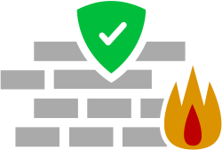
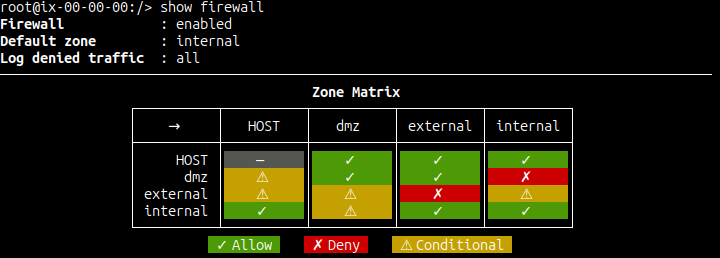
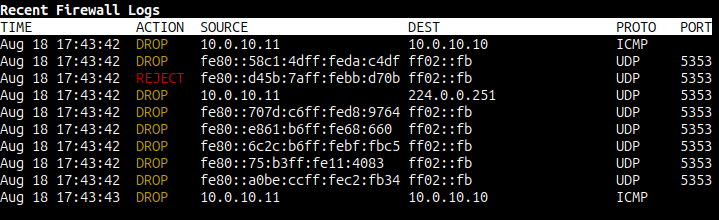

{ align=left width="60" }

# Firewall Documentation

## Introduction

The Infix firewall aims to simplify network security.  Instead of complex
per-interface rules, you work with *zones* and *policies*.  A zone defines a
level of trust with all interfaces or networks assigned to it, and policies
regulate the traffic flow between zones.

The firewall controls three distinct traffic flows: traffic destined for the
host itself, traffic between interfaces within the same zone (intra-zone), and
traffic between different zones (inter-zones).

{align=right width=340}

The zone approach is not just more intuitive and maintainable, it allows you
to think more in terms of trust relationships:

- "internal networks can access the Internet"
- "Internet cannot access my internal network, except this port forward"

When you add new interfaces to existing zones, they automatically inherit the
established security policies.  The amount of actual rules *that matter to
you* is kept to a minimum.

> [!TIP] Impatient and ready to get going?
> [Fast forward to the Examples: End Device, Home/Office Router, Enterprise Gateway](#examples)

## Zones

Zones are logical groupings of network interfaces and IP networks that share
the same trust level.  Each zone has a *default action* that determines what
happens to traffic destined for the host itself (INPUT chain).  A LAN zone may
have this set to *accept*, while a DMZ zone may be set to *reject* by default
and only allow a subset of *services*, e.g., DHCP, DNS, and SSH, on input.

A small but important thing to remember is that interfaces and networks cannot
share the same zone.  This may seem a bit odd at first, but they serve very
different purposes:

- A zone with interfaces is usually a zone where traffic ingresses: WAN, LAN
- A zone with networks is usually a target or transit zone for traffic: DMZ

The YANG model will give you a warning if both are set in a zone.

### Intra-Zone Traffic

For a LAN zone, you may want to allow IP routing between all interfaces and
networks within the same zone.  This is often referred to as *intra-zone*
traffic and requires an explicit policy from the zone to itself.  When such
a policy exists, devices on different interfaces within the same zone can
communicate directly with each other.

To enable intra-zone forwarding, create a policy where both ingress and
egress are set to the same zone, e.g., `lan` → `lan`.

### Port Forwarding

Port forwarding (DNAT) is configured directly on zones and redirects incoming
traffic from one port to a different internal address and port.  This allows
external access to internal services.

Each zone can have port forwarding rules that apply to traffic arriving at
that zone's interfaces or matching its networks.  The forwarded traffic must
then be allowed by appropriate policies to reach the destination zone.

The *Firewall Matrix* shows a ⚠ conditional warning flag, coloring the zone
yellow, when exceptions like port forwarding are active.



### Default Zone Concept

Infix requires you to specify a default zone.  Any interface not explicitly
assigned to a zone automatically belongs to the default zone.  This ensures
that no interface is left without firewall protection.

Choose your default zone carefully — it should be the most restrictive zone
appropriate for unmanaged interfaces.  For routers, this is typically the
`wan` zone, but you can of course also set up a dedicated `block` zone.

## Policies

> [!NOTE]
> Firewall policies only control whether traffic is allowed or blocked.  For
> actual routing between interfaces to work, you must also enable
> [IP forwarding](network.md#ipv4-forwarding) on the relevant interfaces.

{ align=right width="420" }

Policy rules control traffic **between** zones.  By default all inter-zone
traffic is rejected.  Meaning you must explicitly allow the traffic flows
you intend.

IP masquerading (SNAT) is a policy setting that applies to traffic egressing
a target zone.  (Essential for Internet access from private networks.)

A policy, like zones, have a default action.  If it is *not* set to `accept`
you must specify which services on the host any zone interface and network are
allowed access to.

See the [examples below](#enterprise-gateway) for how to set up a policy.  The
built-in help system can also be useful:

```
admin@example:/config/firewall/policy/lan-to-dmz/> help masquerade
NAME
        masquerade <true/false>

DESCRIPTION
        Enable masquerading (SNAT) for traffic matching this policy.

        Matching traffic will have their source IP address changed on egress,
        using the IP address of the interface the traffic egresses.";

admin@example:/config/firewall/policy/lan-to-dmz/>
```

### Symbolic Names

The symbolic names `HOST` and `ANY` are available for use in both `ingress`
and `egress` zones.  In fact, the CLI uses inference when first enabling the
firewall to inject a default policy to allow an IPv6 autoconf address.

### Custom Filters

For more advanced firewall scenarios *custom filters* can be used.  The only
support currently are various ICMP type traffic control.  Enough to support
the default `allow-host-ipv6` policy.

## Services

Several pre-defined services exist, that cover most use-cases, but you can
also define custom services for applications not covered by the built-in ones.

### Built-in services

Infix provides predefined services for common protocols:

- **`ssh`**: Secure Shell (port 22/tcp)
- **`http`**: Web traffic (port 80/tcp)
- **`https`**: Secure web traffic (port 443/tcp)
- **`dns`**: Domain Name System (port 53/tcp and 53/udp)
- **`dhcp`**: DHCP server (port 67/udp)
- **`dhcpv6-client`**: DHCPv6 client traffic
- **`netconf`**: Network Configuration Protocol (port 830/tcp)
- **`restconf`**: REST-based Network Configuration Protocol (port 443/tcp)

... and more, see `infix-firewall-services.yang` for details

## Examples

### End Device Protection

For devices on untrusted networks like public Wi-Fi or other open Internet
connections.  Provides maximum protection while allowing essential
connectivity.

```
admin@example:/> configure
admin@example:/config/> edit firewall
admin@example:/config/firewall/> set default public
admin@example:/config/firewall/> edit zone public
admin@example:/config/firewall/zone/public/> set description "Public untrusted network - end device protection"
admin@example:/config/firewall/zone/public/> set action drop
admin@example:/config/firewall/zone/public/> set interface eth0
admin@example:/config/firewall/zone/public/> set service ssh
admin@example:/config/firewall/zone/public/> set service dhcpv6-client
admin@example:/config/firewall/zone/public/> leave
```

### Home/Office Router

For typical routers that need to protect internal devices while providing
internet access.  The LAN zone trusts internal devices, while the WAN zone
blocks external threats.

```
admin@example:/> configure
admin@example:/config/> edit firewall
admin@example:/config/firewall/> set default wan
admin@example:/config/firewall/> edit zone lan
admin@example:/config/firewall/zone/lan/> set description "Internal LAN network - trusted"
admin@example:/config/firewall/zone/lan/> set action accept
admin@example:/config/firewall/zone/lan/> set interface eth1
admin@example:/config/firewall/zone/lan/> set service ssh
admin@example:/config/firewall/zone/lan/> set service dhcp
admin@example:/config/firewall/zone/lan/> set service dns
admin@example:/config/firewall/zone/lan/> end
admin@example:/config/firewall/> edit zone wan
admin@example:/config/firewall/zone/wan/> set description "External WAN interface - untrusted"
admin@example:/config/firewall/zone/wan/> set action drop
admin@example:/config/firewall/zone/wan/> set interface eth0
admin@example:/config/firewall/zone/wan/> end
admin@example:/config/firewall/> edit policy lan-to-wan
admin@example:/config/firewall/policy/lan-to-wan/> set description "Allow LAN traffic to WAN with SNAT"
admin@example:/config/firewall/policy/lan-to-wan/> set ingress lan
admin@example:/config/firewall/policy/lan-to-wan/> set egress wan
admin@example:/config/firewall/policy/lan-to-wan/> set action accept
admin@example:/config/firewall/policy/lan-to-wan/> set masquerade
admin@example:/config/firewall/policy/lan-to-wan/> leave
```

> [!NOTE]
> Policy rules apply in a stateful, unidirectional manner.  Meaning, you only
> consider one direction of the traffic.  The return traffic (established,
> related) is implicitly allowed.

### Enterprise Gateway

For businesses that need to host public services while protecting internal
resources.  We can build upon the Home/Office Router example above and add
a DMZ zone with additional policies for controlled access.

```
admin@example:/> configure
admin@example:/config/> edit firewall zone dmz
admin@example:/config/firewall/zone/dmz/> set description "Semi-trusted public services"
admin@example:/config/firewall/zone/dmz/> set action drop
admin@example:/config/firewall/zone/dmz/> set interface eth1
admin@example:/config/firewall/zone/dmz/> set service ssh
admin@example:/config/firewall/zone/dmz/> end
admin@example:/config/firewall/> edit policy loc-to-wan
admin@example:/config/firewall/policy/loc-to-wan/> set description "Allow local networks (LAN+DMZ) to WAN with SNAT"
admin@example:/config/firewall/policy/loc-to-wan/> set ingress lan
admin@example:/config/firewall/policy/loc-to-wan/> set ingress dmz
admin@example:/config/firewall/policy/loc-to-wan/> set egress wan
admin@example:/config/firewall/policy/loc-to-wan/> set action accept
admin@example:/config/firewall/policy/loc-to-wan/> set masquerade
admin@example:/config/firewall/policy/loc-to-wan/> end
admin@example:/config/firewall/> edit policy lan-to-dmz
admin@example:/config/firewall/policy/lan-to-dmz/> set description "Allow LAN to manage DMZ services"
admin@example:/config/firewall/policy/lan-to-dmz/> set ingress lan
admin@example:/config/firewall/policy/lan-to-dmz/> set egress dmz
admin@example:/config/firewall/policy/lan-to-dmz/> set action accept
admin@example:/config/firewall/policy/lan-to-dmz/> end
admin@example:/config/firewall/> edit zone wan port-forward 8080 tcp
admin@example:/config/firewall/zone/wan/port-forward/8080/tcp/> set to addr 192.168.2.10
admin@example:/config/firewall/zone/wan/port-forward/8080/tcp/> set to port 80
admin@example:/config/firewall/zone/wan/port-forward/8080/tcp/> leave
```

This adds a DMZ zone for public services, updates the internet access policy
to include DMZ traffic, allows LAN management of DMZ services, and forwards
external web traffic to the DMZ server.

## Logging and Monitoring

Different log levels are available to monitor and debug firewall behavior.
Configure logging using the CLI:

```
admin@example:/> configure
admin@example:/config/> edit firewall
admin@example:/config/firewall/> set logging all
admin@example:/config/firewall/> leave
```

Firewall logs help you understand traffic patterns and security events.  The
CLI admin-exec command `show firewall` shows the last 10 log messages in the
overview:



Use the command `show log firewall.log` to display the full logfile (remember,
the syslog daemon rotates and zips too big log files).  You can also use the
`follow firewall.log` command to continuously monitor firewall log messages.

## Netfilter Integration

The Infix firewall operates through Linux netfilter hooks.  Understanding how
the *zones* and *policy* concepts map to these hooks will hopefully help you
understand the firewall's behavior and ease troubleshooting.

### Packet Flow

{width="100%"}

| **Netfilter Hook** | **Function** | **Description**                                                          |
|--------------------|--------------|--------------------------------------------------------------------------|
| `prerouting`       | ZONE         | Classification of incoming traffic, match interfaces/networks with zones |
| `prerouting`       | ZONE         | Port forwarding (DNAT) from zone configuration                           |
| `input`            | ZONE         | Host input filtering (`services`)                                        |
| `input`            | ZONE         | Defaulkt action for non-matching services (`action`)                     |
| `forward`          | POLICY       | Allow traffic between zones (inter-zone rules)                           |
| `postrouting`      | POLICY       | Masquerade (SNAT) when traffic egresses a zone                           |

#### PREROUTING Hook

- **Zone Classification**: Traffic is tagged based on ingress interface or
  source network
- **Port Forwarding**: DNAT from zone configuration occurs before routing decisions
- **Connection Tracking**: Early state establishment for stateful filtering

#### INPUT Hook

- **ANY-to-HOST Policies**: Enforces policy rules for traffic destined to the
  host itself
- **Zone Services**: Allows configured services (SSH, HTTP, etc.) based on
  zone trust level
- **Zone Action**: Applies a default action (accept/reject/drop) for
  unmatched traffic

#### FORWARD Hook

- **Policy Enforcement**: Primary location for inter-zone traffic filtering
- **Custom Filters**: ICMP and other protocol-specific rules within policies
- **Service Matching**: Allows or denies services based on policy configuration

#### POSTROUTING Hook

- **Masquerading**: Source NAT for outbound traffic when policies enable masquerading

### Design Implications

**Zone-Based Port Forwarding**

Port forwarding (DNAT) must occur in PREROUTING before the kernel makes
routing decisions. Zones provide the necessary context to determine which
forwarding rules apply to incoming traffic based on the ingress interface
or source network.

**Why Services Can Be Both Zone and Policy Scoped**

- **Zone Services**: Control access to the firewall host itself (INPUT hook)
- **Policy Services**: Control forwarded traffic between zones (FORWARD hook)

**Performance Considerations**

- Zone classification happens once per connection in PREROUTING
- Policy evaluation leverages connection tracking for subsequent packets
- Custom filters are evaluated in policy order, so frequently matched rules
  should be placed first

### Limitations

The current firewall implementation operates primarily at the IP layer (Layer
3).  It has no support for bridge-level (Layer 2) filtering.  This design
choice:

- Assumes routed network topologies rather than pure switching scenarios
- Focuses on IP-based zone and policy concepts
- Provides better integration with modern containerized and virtualized environments

For deployments requiring extensive Layer 2 filtering or advanced firewall
configurations not supported by the built-in firewall, consider using a
dedicated container with full network access. In such cases, disable the Infix
firewall entirely to avoid conflicts and manage all filtering from the
container.
