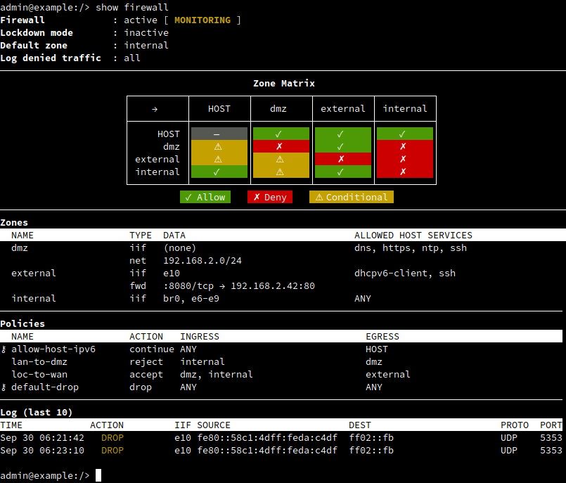

{ align=left width="60" }

# Firewall Documentation

## Introduction

A zone-based firewall aims to *simplify network security*.  Instead of complex
per-interface rules, you work with **zones** and **policies**.  Briefly, ^^zones
define a level of trust^^ for all interfaces or networks assigned to it, and
^^policies regulate the traffic flow^^ between zones.

{ width=600 }
/// figure-caption
Zones group interfaces, policies control traffic flows.
///

Three distinct traffic flows exist: traffic destined for the host itself,
traffic between interfaces within the same zone (intra-zone), and traffic
between different zones (inter-zones).

---

The zone approach is not just more intuitive and maintainable, it allows you
to think more in terms of trust relationships:

- "internal networks can access the Internet"
- "Internet cannot access my internal network, except this port forward"

When you add new interfaces to existing zones, they automatically inherit the
established security policies.  The amount of actual rules *that matter to
you* is kept to a minimum.

> [!TIP] Impatient and ready to get going?
> [Fast forward to the Examples: End Device, Home/Office Router, Enterprise Gateway](#examples)

## Visual Overview

Use the **zone matrix** to quickly audit your firewall configuration and
identify potential security gaps.  It provides an overview and shows the
relationship between zones and the policies that connect them.  Each cell in
the matrix represents a potential traffic flow, with rows indicating the
ingress zone and columns the egress zone.


/// figure-caption
Example output from <kbd>show firewall</kbd> command.
///

The matrix uses visual indicators to show the status of each zone and policy:

**✓ Green checkmark** — traffic is explicitly allowed by policy  
**✗ Red cross** — traffic is blocked (default behavior)  
**⚠ Yellow warning** — watch out! Some traffic allowed, such as port forwarding rules

This visualization helps you quickly understand your firewall's behavior and
identify any unintended gaps or overly permissive rules in your configuration.

> [!TIP] Use the ++question++ key in the CLI
> This admin-exec (top-level) CLI command has sub-commands that you can use to
> drill down on the operational data.  Tap the ++question++ key once to see an
> overview after <kbd>show firewall</kbd>, or just use the classic UNIX ++tab++ key to
> complete everything until you've found your command.

## Zones

Zones are logical groupings of network interfaces or IP networks that share
the same trust level.  Each zone has a *default action* that determines what
happens to traffic destined for the host itself (INPUT chain).  A LAN zone may
have this set to *accept*, while a DMZ zone may be set to *reject* by default
and only allow a subset of available *services* (e.g., DHCP, DNS, SSH) that
devices in the DMZ can use to reach the host.

> [!IMPORTANT]
> Interfaces and networks are mutually exclusive in zones — attempting to
> configure both will result in a validation error.  When setting up
> [*port forwarding*](#port-forwarding) from one zone to another, the
> destination network must be declared in a zone.

### Default Zone

You must specify a default zone.  This serves as a safety net: any interface
not explicitly assigned to a zone automatically belongs to the default zone,
ensuring network interfaces remain protected by the firewall.  This automatic
assignment is particularly useful when configuring new interfaces (e.g.,
VLANs, bridges, or hotplugged devices).

Choose your default zone carefully — it should be the most restrictive zone
appropriate for unmanaged interfaces.  For routers, this is typically the
`wan` zone, but you can of course also set up a dedicated `block` zone. In the
CLI, when first enabling the firewall, a `public` zone is created.  See more
about this in the [example below](#end-device-protection).

> [!IMPORTANT] Remember IP forwarding on interfaces!
> Firewall policies only control whether traffic is allowed on input, to be
> forwarded, or blocked (default).  For the actual routing between interfaces
> to work, you must also enable [IP forwarding](networking.md#ipv4-forwarding)
> on the relevant interfaces.

### Intra-Zone Traffic

Traffic between different interfaces, or networks, in the same zone is not
forwarded by default.  In most cases, if devices on separate interfaces need
to communicate, they should be in different zones with a policy between them.
Alternatively, if you want true LAN-like behavior, [bridge the interfaces][1]
at layer-2 instead of routing between them at layer-3.

*Intra-zone* forwarding — routing traffic within a single zone — is rarely
needed.  But if you do require it, create a policy where both ingress and
egress are set to the same zone, e.g., `lan` → `lan`.

### Port Forwarding

Port forwarding, also known as destination NAT (DNAT), redirects inbound
traffic to another address and/or port.  This allows external access to
internal services.  See [Enterprise Gateway](#enterprise-gateway) for an
example.

Each zone can have port forwarding rules that apply to traffic arriving at
that zone's interfaces or matching its networks.  The forwarded traffic must
then be allowed by appropriate policies to reach the destination zone.

The *Zone Matrix* shows a ⚠ conditional warning flag, coloring the cell
yellow, when exceptions like port forwarding are active.

## Policies

In short, policy rules control traffic **between** zones.  By default all
inter-zone (and intra-zone) traffic is rejected.  Meaning you must explicitly
allow the traffic flows you intend.

{ width=600 }
/// figure-caption
Example of common traffic flows (policies) between zones.
///

IP masquerading (SNAT) is a policy setting that applies to traffic egressing
a target zone.  (Essential for Internet access from private networks.)

A policy, like zones, have a default action.  If it is *not* set to `accept`
you must specify which services on the host any zone interface and network are
allowed access to.

> [!NOTE]
> Policy rules apply in-order, the first matching rule with action `drop` will
> terminate the traffic flow.  Use action `continue` to allow processing to go
> to the next rule, until the last (implicit) default-drop rule at the end.
>
> The CLI currently does not support reordering rules.  As a workaround, save
> your `running-config` to `startup-config`, then exit to the shell and edit
> the file with `edit /cfg/startup-config.cfg`.

See the [examples below](#enterprise-gateway) for how to set up a policy.  The
built-in help system can also be useful:
<code><pre>admin@example:/config/firewall/policy/lan-to-dmz/> <b>help masquerade</b>
<b>NAME</b>
        masquerade <true/false><br/>
<b>DESCRIPTION</b>
        Enable masquerading (SNAT) for traffic matching this policy.<br/>
        Matching traffic will have their source IP address changed on egress,
        using the IP address of the interface the traffic egresses.";<br/>
admin@example:/config/firewall/policy/lan-to-dmz/>
</pre></code>

### Symbolic Names

The symbolic names `HOST` and `ANY` are available for use in both `ingress`
and `egress` zones.  In fact, the CLI uses inference when first enabling the
firewall to inject a default policy to allow automatic IPv6 address
assignment.

- `HOST` → `ANY`: Control device to any outbound connection (default: allowed)
- `ANY` → `HOST`: Control what can reach device services (uncommon, usually per-zone)
- Zone → `HOST`: Allow specific zone to access device services

### Custom Filters

For more advanced firewall scenarios *custom filters* can be used.  Currently
only various ICMP type traffic control is supported.  Enough to support the
built-in `allow-host-ipv6` policy and allow certain ICMP types on input or
forward.

You can inspect this built-in (locked) policy from admin-exec level with the
command: <kbd>show firewall policy allow-host-ipv6</kbd>.

### Default Behavior

ICMP messages (particularly `echo-request` and `echo-reply`) can be used to
reveal network information for malicious purposes. Therefore, the firewall
blocks ICMP requests by default. This applies unless the zone's default
action is `accept`.

To enable `echo-request` (IPv4) for any interface, or per zone when action is
set to drop or reject, set up a dedicated policy with `ingress ANY` and `egress
HOST` that use a custom filter to accept that ICMP type.  Make this policy the
first rule in your list of policies, and remember to use `continue` for
non-matching traffic.

Another built-in behavior is automatically allowing "established,related"
return traffic flows. This uses connection tracking - the firewall remembers
outbound connections you initiate and automatically allows the corresponding
inbound response traffic. This means you only need to configure rules for
new connections; the firewall handles return traffic automatically without
additional rules.

## Services

Several pre-defined services exist, that cover most use-cases, but you can
also define custom services for applications not covered by the built-in ones.

The firewall includes over 100 pre-defined services, such as:

- **`ssh`** — Secure Shell (port 22/tcp)
- **`http`** — Web traffic (port 80/tcp)
- **`https`** — Secure web traffic (port 443/tcp)
- **`dns`** — Domain Name System (port 53/tcp and 53/udp)
- **`dhcp`** — DHCP server (port 67/udp)
- **`dhcpv6-client`** — DHCPv6 client traffic
- **`netconf`** — Network Configuration Protocol (port 830/tcp)
- **`restconf`** — REST-based Network Configuration Protocol (port 443/tcp)

> [!TIP] Use the ++question++ key in the CLI
> See the YANG model for the full list, or tap the ++question++ key
> when setting up an allowed host service in a zone `set service`

## Examples

### End Device Protection

This is the default firewall setup, useful for end devices on untrusted
networks.  It provides maximum protection while allowing essential
connectivity.
<code><pre>admin@example:/> <b>configure</b>
admin@example:/config/> <b>edit firewall</b>
admin@example:/config/firewall/> <b>show</b>
default public;
zone public {
  action reject;
  description "Public, unknown network. Only SSH and DHCPv6 client allowed.";
  service dhcpv6-client;
  service ssh;
}
admin@example:/config/firewall/> <b>leave</b>
</pre></code>

The `reject` action differs from `drop` in that it responds to ICMP messages,
although maybe not how you may think.  Pinging the device we may[^1] see this:
<code><pre>
<b>$</b> ping 192.168.122.161
From 192.168.122.161 icmp_seq=1 <u>Packet filtered</u>
</pre></code>

If we run `tcpdump` it shows us why:
<code><pre>
<b>$</b> tcpdump -lni eth0
20:10:40.245707 IP 192.168.122.1 > 192.168.122.161: ICMP echo request, id 56838, seq 1, length 64
20:10:40.245961 IP 192.168.122.161 > 192.168.122.1: ICMP <u>host 192.168.122.161 unreachable - admin prohibited filter</u>, length 92
</pre></code>

The key here is that, yes the device responds, but not with `ICMP reply` but
`ICMP unreachable`, and a little helpful message.

The default zone is `public`, so all interfaces that are not explicitly
assigned to another zone will be operationally placed in this zone as a
safeguard.  Inspect this from admin-exec context with <kbd>show firewall</kbd>, as can
be seen in the below screenshot, the only interface `e1` has been assigned
automatically to the public zone.  This information is also saved to the
system log.


/// figure-caption
Zone matrix and firewall overview from <kbd>show firewall</kbd>.
///

> [!IMPORTANT]
> These defaults are *inferred* for interactive CLI users.  Enabling the
> firewall using NETCONF/RESTCONF will not yield the same results.

[^1]: The output from ping clients differ A LOT.  Some do not consider ICMP
    unreachable to be a proper response and it will appear as if the device is
    not responding at all.  Use `tcpdump` or `wireshark` to get to the bottom
    of network mysteries.

### Home/Office Router

For typical routers that need to protect internal devices while providing
internet access.  The LAN zone trusts internal devices, while the WAN zone
blocks external threats.
<code><pre>admin@example:/> <b>configure</b>
admin@example:/config/> <b>edit firewall</b>
admin@example:/config/firewall/> <b>set default wan</b>
admin@example:/config/firewall/> <b>edit zone lan</b>
admin@example:/config/firewall/zone/lan/> <b>set description "Internal LAN network - trusted"</b>
admin@example:/config/firewall/zone/lan/> <b>set action accept</b>
admin@example:/config/firewall/zone/lan/> <b>set interface eth1</b>
admin@example:/config/firewall/zone/lan/> <b>set service ssh</b>
admin@example:/config/firewall/zone/lan/> <b>set service dhcp</b>
admin@example:/config/firewall/zone/lan/> <b>set service dns</b>
admin@example:/config/firewall/zone/lan/> <b>end</b>
admin@example:/config/firewall/> <b>edit zone wan</b>
admin@example:/config/firewall/zone/wan/> <b>set description "External WAN interface - untrusted"</b>
admin@example:/config/firewall/zone/wan/> <b>set action drop</b>
admin@example:/config/firewall/zone/wan/> <b>set interface eth0</b>
admin@example:/config/firewall/zone/wan/> <b>end</b>
admin@example:/config/firewall/> <b>edit policy loc-to-wan</b>
admin@example:/config/firewall/policy/loc-to-wan/> <b>set description "Allow LAN traffic to WAN with SNAT"</b>
admin@example:/config/firewall/policy/loc-to-wan/> <b>set ingress lan</b>
admin@example:/config/firewall/policy/loc-to-wan/> <b>set egress wan</b>
admin@example:/config/firewall/policy/loc-to-wan/> <b>set action accept</b>
admin@example:/config/firewall/policy/loc-to-wan/> <b>set masquerade</b>
admin@example:/config/firewall/policy/loc-to-wan/> <b>leave</b>
</pre></code>

### Enterprise Gateway

For businesses that need to host public services while protecting internal
resources.  We can build upon the Home/Office Router example above and add
a DMZ zone with additional policies for controlled access.
<code><pre>admin@example:/> <b>configure</b>
admin@example:/config/> <b>edit firewall zone dmz</b>
admin@example:/config/firewall/zone/dmz/> <b>set description "Semi-trusted public services"</b>
admin@example:/config/firewall/zone/dmz/> <b>set action drop</b>
admin@example:/config/firewall/zone/dmz/> <b>set interface eth1</b>
admin@example:/config/firewall/zone/dmz/> <b>set service ssh</b>
admin@example:/config/firewall/zone/dmz/> <b>end</b>
admin@example:/config/firewall/> <b>edit policy loc-to-wan</b>
admin@example:/config/firewall/policy/loc-to-wan/> <b>set description "Allow local networks (LAN+DMZ) to WAN with SNAT"</b>
admin@example:/config/firewall/policy/loc-to-wan/> <b>set ingress dmz</b>
admin@example:/config/firewall/policy/loc-to-wan/> <b>set egress wan</b>
admin@example:/config/firewall/policy/loc-to-wan/> <b>set action accept</b>
admin@example:/config/firewall/policy/loc-to-wan/> <b>set masquerade</b>
admin@example:/config/firewall/policy/loc-to-wan/> <b>end</b>
admin@example:/config/firewall/> <b>edit policy lan-to-dmz</b>
admin@example:/config/firewall/policy/lan-to-dmz/> <b>set description "Allow LAN to manage DMZ services"</b>
admin@example:/config/firewall/policy/lan-to-dmz/> <b>set ingress lan</b>
admin@example:/config/firewall/policy/lan-to-dmz/> <b>set egress dmz</b>
admin@example:/config/firewall/policy/lan-to-dmz/> <b>set action accept</b>
admin@example:/config/firewall/policy/lan-to-dmz/> <b>end</b>
admin@example:/config/firewall/> <b>edit zone wan port-forward 8080 tcp</b>
admin@example:/config/firewall/zone/wan/port-forward/8080/tcp/> <b>set to addr 192.168.2.10</b>
admin@example:/config/firewall/zone/wan/port-forward/8080/tcp/> <b>set to port 80</b>
admin@example:/config/firewall/zone/wan/port-forward/8080/tcp/> <b>leave</b>
</pre></code>

This adds a DMZ zone for public services, updates the internet access policy
to include DMZ traffic, allows LAN management of DMZ services, and forwards
external web traffic to the DMZ server.

## Logging and Monitoring

Different log levels are available to monitor and debug firewall behavior.
Configure logging using the CLI:
<code><pre>
admin@example:/> <b>configure</b>
admin@example:/config/> <b>edit firewall</b>
admin@example:/config/firewall/> <b>set logging all</b>
admin@example:/config/firewall/> <b>leave</b>
</pre></code>

Firewall logs help you understand traffic patterns and security events.  The
CLI admin-exec command <kbd>show firewall</kbd> shows the last 10 log messages in the
overview:

{width=100%}
/// figure-caption
Summary of recent logs at the end of <kbd>show firewall</kbd>.
///

Use the command <kbd>show log firewall.log</kbd> to display the full logfile
(remember, the syslog daemon rotates and zips too big log files).  You can
also use the <kbd>follow firewall.log</kbd> command to continuously monitor
firewall log messages.

## Netfilter Integration

The Infix firewall operates through Linux netfilter hooks.  Understanding how
the *zones* and *policy* concepts map to these hooks will hopefully help you
understand the firewall's behavior and ease troubleshooting.

### Packet Flow

{width=750}
/// figure-caption
Linux netfilter hooks in layer-3 traffic flow.
///

| **Netfilter Hook** | **Function** | **Description**                                                          |
|--------------------|--------------|--------------------------------------------------------------------------|
| `prerouting`       | ZONE         | Classification of incoming traffic, match interfaces/networks with zones |
| `prerouting`       | ZONE         | Port forwarding (DNAT) from zone configuration                           |
| `input`            | ZONE         | Host input filtering (`services`)                                        |
| `input`            | ZONE         | Default action for non-matching services (`action`)                      |
| `forward`          | POLICY       | Allow traffic between zones (inter-zone rules)                           |
| `postrouting`      | POLICY       | Masquerade (SNAT) when traffic egresses a zone                           |

#### PREROUTING Hook

- **Zone Classification**: Traffic is tagged based on ingress interface or
  source network
- **Port Forwarding**: DNAT from zone configuration occurs before routing decisions
- **Connection Tracking**: Early state establishment for stateful filtering

#### INPUT Hook

- **ANY-to-HOST Policies**: Enforces policy rules for traffic destined to the
  host itself
- **Zone Services**: Allows configured services (SSH, HTTP, etc.) based on
  zone trust level
- **Zone Action**: Applies a default action (accept/reject/drop) for
  unmatched traffic

#### FORWARD Hook

- **Policy Enforcement**: Primary location for inter-zone traffic filtering
- **Custom Filters**: ICMP and other protocol-specific rules within policies
- **Service Matching**: Allows or denies services based on policy configuration

#### POSTROUTING Hook

- **Masquerading**: Source NAT for outbound traffic when policies enable masquerading


## Emergency Lockdown

For security emergencies (active breaches, suspicious activity), the firewall
supports an immediate lockdown mode that blocks ALL traffic.

> [!DANGER]
> This will immediately terminate all network connections, including SSH.
> Physical console access is required to restore normal operation.  It is
> also possible to restore normal operation by power-cycling the device.

To activate emergency lockdown:

```json
~$ curl -kX POST -u admin:admin -H "Content-Type: application/yang-data+json" \
        -d '{"infix-firewall:input": {"operation": "now"}}'                   \
        https://example.local/restconf/operations/infix-firewall:firewall/lockdown-mode
```

To cancel lockdown mode (requires console access):

```json
~$ curl -kX POST -u admin:admin -H "Content-Type: application/yang-data+json" \
        -d '{"infix-firewall:input": {"operation": "cancel"}}'                \
        https://example.local/restconf/operations/infix-firewall:firewall/lockdown-mode
```

You can check the current lockdown state:

```json
~$ curl -kX GET -u admin:admin -H 'Accept: application/yang-data+json' \
        https://example.local/restconf/data/infix-firewall:firewall/lockdown
{
  "infix-firewall:firewall": {
    "lockdown": false
  }
}
```

[1]: networking.md#bridging
