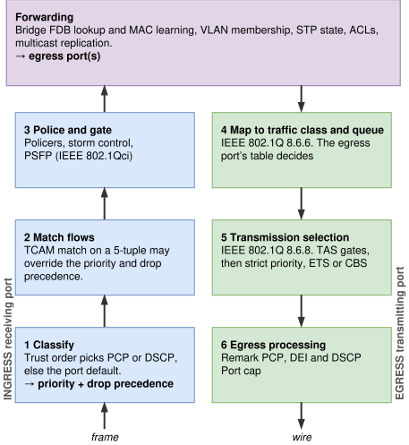
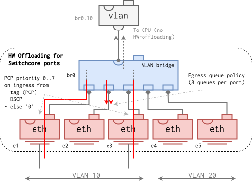
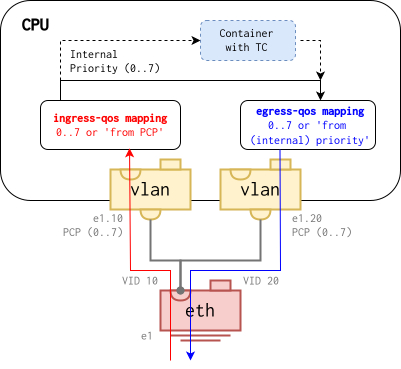
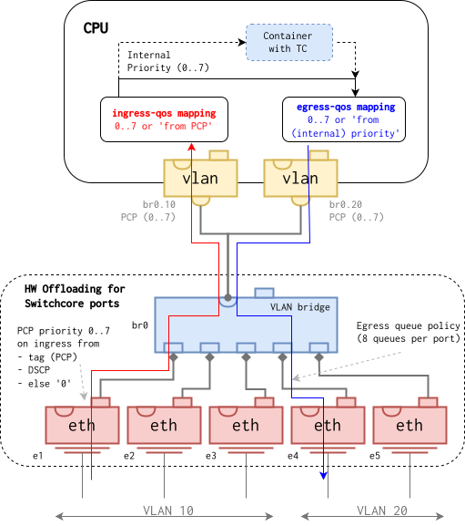

Quality of Service
==================

On occasion, most networks will experience congestion due to some
extraordinary load being placed upon it.  If the load is transient,
switches and routers may be able to absorb such bursts of traffic by
queuing packets in internal memories.  However, if the load is sustained
over long periods of time, queues will fill up and packets will start to
be dropped.  When such situations arise, it is the job of the network's
Quality of Service (QoS) policy to define _which_ packets to drop and
which ones to prioritize, such that critical services remain operational.

QoS is configured per interface, under `/interfaces/interface[name='eth0']/qos/`.
Every interface type is accepted; what the hardware can offload varies
and is reported back in the operational datastore, see [Hardware
Offload](#hardware-offload).

## Terminology

QoS vocabulary comes from two families of standards.  IEEE 802.1Q[^1]
defines priorities and traffic classes for bridged Ethernet, the IETF
Differentiated Services (DiffServ) RFCs define how IP packets are marked.

**Priority** is the internal value, 0 to 7, that every frame carries
through the system from classification to transmission.  IEEE 802.1Q
Annex I names a traffic type for each priority.  Higher is better,
except that priority 1 is meant for traffic that may yield to best
effort:

| Priority | Traffic type          |
|---------:|-----------------------|
| 0        | Best Effort (default) |
| 1        | Background            |
| 2        | Excellent Effort      |
| 3        | Critical Applications |
| 4        | Video                 |
| 5        | Voice                 |
| 6        | Internetwork Control  |
| 7        | Network Control       |
/// table-caption
IEEE 802.1Q-2022 Table I-2, traffic types.
///

**PCP and DEI** are the Priority Code Point and Drop Eligible Indicator,
the three-bit priority and one-bit drop flag in a VLAN tag[^2].  A frame
without a VLAN tag has neither.

**DSCP** is the six-bit Differentiated Services Code Point in the IP
header[^3].  Named codepoints group into _per-hop behaviours_ (PHB), the
forwarding treatment a router or switch gives them[^4]:

| Name                     | Codepoints                     | Reference      |
|--------------------------|--------------------------------|----------------|
| Default Forwarding, DF   | 0, also written CS0            | RFC 4594 1.5.1 |
| Class Selector, CS1..7   | 8, 16, 24, 32, 40, 48, 56      | RFC 4594 1.5.4 |
| Assured Forwarding, AFxy | 10..14, 18..22, 26..30, 34..38 | RFC 4594 1.5.2 |
| Expedited Forwarding, EF | 46                             | RFC 4594 1.5.3 |
/// table-caption
DiffServ per-hop behaviours and their codepoints.
///

The class selectors carry the old IP precedence in the top three bits,
so CS_n_ maps naturally to priority _n_.  Assured forwarding has four
classes, AF1 to AF4, each with three drop precedences, e.g. AF11, AF12,
AF13.  RFC 4594 groups the codepoints into service classes, telephony,
signaling, multimedia and so on, with a recommended treatment for
each[^5].

**Traffic class** is a transmit queue on the egress port.  A port has 1
to 8 of them, numbered so that the highest class is served first, and a
table binds each of the eight priorities to one class[^6].

**Transmission selection** is how the port picks the next class to send
from[^7].  _Strict priority_ always serves the highest non-empty class.
_Enhanced Transmission Selection_ (ETS)[^8] shares bandwidth between
classes in proportion to a weight.

**Stream Reservation (SR) classes** are the two priorities reserved for
time-sensitive audio and video streams in AVB and TSN networks[^9]:
SR class A on priority 3 and SR class B on priority 2.

**DCB**, Data Center Bridging[^10], is the Linux kernel interface through
which per-port priority tables are programmed into switch hardware.

## The Pipeline

{ width=460 }
/// figure-caption
The QoS pipeline: ingress climbs to forwarding, egress descends to the wire.
///

A frame passes six stages, three on the port it arrives on and three on
the port it leaves by:

1. **Classify** assigns the priority from the PCP of the VLAN tag or the
   DSCP of the IP header, depending on what the port trusts.  Frames
   matching neither get the port's default priority.
2. **Match flows** may override the classification for traffic picked out
   by, e.g., source address and port.
3. **Police and gate** limits the rate of a port, of broadcast and
   multicast, or of an individual stream.
4. **Map to traffic class** on the egress port binds the eight priorities
   to the port's traffic classes.
5. **Transmission selection** decides which class transmits next.
6. **Egress processing** rewrites PCP and DSCP from the priority and caps
   the port rate.

Stages 1, 4 and 5, and the remarking half of stage 6, are configurable
today and described below.  The others show where later features
attach; the figure is the intended pipeline, not a promise of hardware
support for every stage.

## Ingress Classification

Configured under `qos ingress`:

| Setting            | Description                                    |
|--------------------|------------------------------------------------|
| `trust`            | Trusted fields in order, default `pcp`         |
| `default-priority` | Priority when no trusted field matches         |
| `pcp-map`          | PCP to priority, preset or custom table        |
| `dscp-map`         | DSCP to priority, preset or custom table       |

The first trusted field that yields a result wins, and a field only
yields a result for frames that carry it.  So the five `trust` values
differ on frames that have one field but not the other:

| Frame           | `pcp`   | `pcp-dscp` | `dscp`  | `dscp-pcp` | `none`  |
|-----------------|---------|------------|---------|------------|---------|
| Tagged IP       | PCP     | PCP        | DSCP    | DSCP       | default |
| Tagged, not IP  | PCP     | PCP        | default | PCP        | default |
| Untagged IP     | default | DSCP       | DSCP    | DSCP       | default |
| Untagged, other | default | default    | default | default    | default |
/// table-caption
Which field sets the priority, per frame type and trust setting.
///

"default" is `default-priority`, 0 unless set.  The default `trust` is
`pcp`: a bridge trusts the tag, as IEEE 802.1Q has it, and classification
is on out of the box for tagged traffic.

The usual arrangement classifies once, where traffic enters the network:
edge ports are set to `dscp-pcp` or `dscp` and remark both fields from
the result, see [Egress Remarking](#egress-remarking).  Every switch
behind them keeps the default and carries the edge's decision through.

A custom `pcp-map` is keyed by PCP and DEI.  A custom `dscp-map` is keyed
by DSCP with a `trusted` flag per entry, so individual codepoints can be
believed while the rest fall through to the default priority.

### Presets

| Preset | Map  | Mapping                                          |
|--------|------|--------------------------------------------------|
| `ieee` | PCP  | 802.1Q default decoding, PCP _n_ to priority _n_ |
| `ietf` | DSCP | RFC 4594 service classes                         |
| `msb`  | DSCP | Top three bits of the DSCP, CS_n_ to _n_         |

Both maps default to their first preset.  The `ietf` preset follows the
RFC 4594 service classes[^5]; codepoints not listed fall through to the
default priority:

| Service class                   | DSCP       | Priority |
|---------------------------------|------------|---------:|
| Network control                 | CS6, CS7   | 6, 7     |
| Telephony, signaling            | EF, CS5    | 5        |
| Real-time and conferencing      | CS4, AF4x  | 4        |
| Streaming and broadcast video   | CS3, AF3x  | 3        |
| Low-latency data, OAM           | CS2, AF2x  | 2        |
| High-throughput, low-priority   | CS1, AF1x  | 1        |
| Standard                        | CS0        | 0        |
/// table-caption
The `ietf` DSCP preset.
///

### Examples

A trunk port trusting DSCP first, then PCP, with the standard maps:

<pre class="cli"><code>admin@example:/config/> <b>edit interface e1 qos ingress</b>
admin@example:/config/interface/e1/qos/ingress/> <b>set trust dscp-pcp</b>
admin@example:/config/interface/e1/qos/ingress/> <b>set default-priority 0</b>
admin@example:/config/interface/e1/qos/ingress/> <b>set dscp-map preset ietf</b>
admin@example:/config/interface/e1/qos/ingress/> <b>set pcp-map preset ieee</b>
admin@example:/config/interface/e1/qos/ingress/> <b>leave</b>
</code></pre>

An access port that believes only EF (46) and AF31 (26) and gives
everything else the port default:

<pre class="cli"><code>admin@example:/config/> <b>edit interface e2 qos ingress</b>
admin@example:/config/interface/e2/qos/ingress/> <b>set trust dscp</b>
admin@example:/config/interface/e2/qos/ingress/> <b>set default-priority 0</b>
admin@example:/config/interface/e2/qos/ingress/> <b>set dscp-map entry 46 priority 5</b>
admin@example:/config/interface/e2/qos/ingress/> <b>set dscp-map entry 26 priority 3</b>
admin@example:/config/interface/e2/qos/ingress/> <b>leave</b>
</code></pre>

Which trust orders a port accepts is hardware dependent and listed in
`qos capabilities supported-trust-order`.  An order the port cannot
honour is rejected.  On ports whose driver has no ingress classification
support the same rules are applied by the kernel to the traffic it
forwards, see [Hardware Offload](#hardware-offload).

## Traffic Classes and Transmission Selection

Configured under `qos egress`:

| Setting                      | Description                          |
|------------------------------|--------------------------------------|
| `preset`                     | `ieee` (default) or `ieee-sr`        |
| `priority0` .. `priority7`   | Custom traffic class per priority    |
| `traffic-class ID algorithm` | Transmission selection algorithm     |
| `traffic-class ID weight`    | Bytes per round for a weighted class |

The first two live under `traffic-class-table`.  The number of classes
is not configuration: a port has one class per transmit queue, at most
eight, and a single-queue port has no queue structure to respect and gets
all eight.  The count is reported as `max-traffic-classes` and picks the
column of the preset.  The mapping is a preset, `ieee` for an ordinary
bridge or `ieee-sr` for ports carrying reserved streams, both described
below, or a custom table where an unset priority falls back to the `ieee`
value.  The algorithm is `strict-priority` (default) or
`enhanced-transmission-selection`, the latter sharing what the strict
classes leave in proportion to `weight`, default 1514 bytes.

Strict-priority classes must be the highest-numbered ones, with the
weighted classes below them; other layouts are rejected.

A port with four queues, the top two classes strict, the bottom two
sharing what is left in a 2:1 ratio.  No map is set, so the `ieee`
preset supplies Table 8-5's four-class column, `0 0 1 1 2 2 3 3`:

<pre class="cli"><code>admin@example:/config/> <b>edit interface e1 qos egress</b>
admin@example:/config/interface/e1/qos/egress/> <b>set traffic-class 3 algorithm strict-priority</b>
admin@example:/config/interface/e1/qos/egress/> <b>set traffic-class 2 algorithm strict-priority</b>
admin@example:/config/interface/e1/qos/egress/> <b>set traffic-class 1 algorithm enhanced-transmission-selection</b>
admin@example:/config/interface/e1/qos/egress/> <b>set traffic-class 1 weight 3028</b>
admin@example:/config/interface/e1/qos/egress/> <b>set traffic-class 0 algorithm enhanced-transmission-selection</b>
admin@example:/config/interface/e1/qos/egress/> <b>set traffic-class 0 weight 1514</b>
admin@example:/config/interface/e1/qos/egress/> <b>leave</b>
</code></pre>

### Egress Remarking

Configured under `qos egress remark`, both leaves default to `none`:

| Setting | Description                                      |
|---------|--------------------------------------------------|
| `pcp`   | `from-priority` writes PCP and DEI on transmit   |
| `dscp`  | `from-priority` writes DSCP on transmit          |

PCP is set to the priority, DSCP to the class selector with the same
number, CS0 to CS7.  Together with a trust order on the receiving port,
a downstream device then sees this device's classification rather than
the sender's marking.  With `none` nothing is rewritten by configuration,
and what a tagged frame leaves with depends on the path it took: frames
the kernel forwards keep the PCP they arrived with, while a switch fabric
encodes the PCP from the frame's priority, as an IEEE 802.1Q bridge
does[^16].  With the default `pcp-map` the two are the same:

<pre class="cli"><code>admin@example:/config/> <b>edit interface e1 qos egress remark</b>
admin@example:/config/interface/e1/qos/egress/remark/> <b>set pcp from-priority</b>
admin@example:/config/interface/e1/qos/egress/remark/> <b>set dscp from-priority</b>
admin@example:/config/interface/e1/qos/egress/remark/> <b>leave</b>
</code></pre>

Remarking uses the same driver support as ingress classification, see
[Hardware Offload](#hardware-offload).  Without it, DSCP is rewritten by
the kernel for the traffic it forwards.  PCP is not: the kernel cannot
change a tag's priority without also setting its VLAN ID, so on a port
without driver support, PCP follows priority only where the tag is
created, on VLAN interfaces with `egress-qos pcp from-priority`, see
[VLAN Interfaces](#vlan-interfaces).

### Defaults

An interface without `qos` configuration is fully specified by the
defaults, and every physical port runs them from boot: trust PCP with
the `ieee` preset, default priority 0 for untagged frames, one traffic
class per queue with the `ieee` preset, IEEE 802.1Q-2022 Table 8-5, the
standard's recommendation for ordinary bridges, and strict priority
throughout.  Columns are the number of traffic classes on the port:

| Priority | 2 | 3 | 4 | 5 | 6 | 7 | 8 |
|:---------|--:|--:|--:|--:|--:|--:|--:|
| 0        | 0 | 0 | 0 | 0 | 1 | 1 | 1 |
| 1        | 0 | 0 | 0 | 0 | 0 | 0 | 0 |
| 2        | 0 | 0 | 1 | 1 | 2 | 2 | 2 |
| 3        | 0 | 0 | 1 | 1 | 2 | 3 | 3 |
| 4        | 1 | 1 | 2 | 2 | 3 | 4 | 4 |
| 5        | 1 | 1 | 2 | 2 | 3 | 4 | 5 |
| 6        | 1 | 2 | 3 | 3 | 4 | 5 | 6 |
| 7        | 1 | 2 | 3 | 4 | 5 | 6 | 7 |
/// table-caption
IEEE 802.1Q-2022 Table 8-5, recommended priority to traffic class mappings.
///

The factory configuration carries no `qos` settings; removing a port's
`qos` container returns it to these defaults.  Virtual interfaces,
bridges, VLANs and the like, get a pipeline only when configured.

### Stream Reservation Layout

The `ieee-sr` preset is IEEE 802.1Q-2022 Table 34-1, the recommended
mapping for ports carrying reserved streams.  The SR classes, priority 3
(class A) and priority 2 (class B), map to the _highest_ traffic classes
so they outrank everything else at transmission selection, with best
effort below:

| Priority | 2 | 3 | 4 | 5 | 6 | 7 | 8 |
|:---------|--:|--:|--:|--:|--:|--:|--:|
| 0        | 0 | 0 | 0 | 0 | 0 | 0 | 1 |
| 1        | 0 | 0 | 0 | 0 | 0 | 0 | 0 |
| 2 (SR B) | 1 | 1 | 2 | 3 | 4 | 5 | 6 |
| 3 (SR A) | 1 | 2 | 3 | 4 | 5 | 6 | 7 |
| 4        | 0 | 0 | 1 | 1 | 1 | 1 | 2 |
| 5        | 0 | 0 | 1 | 1 | 1 | 2 | 3 |
| 6        | 0 | 0 | 1 | 2 | 2 | 3 | 4 |
| 7        | 0 | 0 | 1 | 2 | 3 | 4 | 5 |
/// table-caption
IEEE 802.1Q-2022 Table 34-1, priority to traffic class mappings with SR classes.
///

Apply it on ports where reserved streams are expected; the credit-based
shaper for the SR classes is a later addition:

<pre class="cli"><code>admin@example:/config/> <b>edit interface e1 qos egress traffic-class-table</b>
admin@example:/config/…/traffic-class-table/> <b>set preset ieee-sr</b>
admin@example:/config/…/traffic-class-table/> <b>leave</b>
</code></pre>

## Hardware Offload

The system runs on a wide range of hardware, and offload is best effort.
The same configuration is accepted everywhere; where it ends up differs,
and each port reports it under `qos capabilities`:

| Capability              | Meaning                                    |
|-------------------------|--------------------------------------------|
| `max-traffic-classes`   | Traffic classes on the port, eight unless shown |
| `supported-trust-order` | `trust` values the driver accepts          |
| `offload`               | Stages the driver runs in hardware         |

`supported-trust-order` is absent when the driver has no ingress
classification support.  `offload` lists `classification`, `remarking`
and `transmission-selection` as the driver takes them; a stage not
listed runs in the kernel.

Each feature maps to one Linux mechanism, and whether it reaches the
hardware depends on the driver implementing the matching hook:

| Feature                | Linux mechanism | Driver hook         | Without it           |
|------------------------|-----------------|---------------------|----------------------|
| Ingress classification | `dcb app`       | `dcbnl` app ops     | `tc flower`, software |
| Trust order            | `dcb apptrust`  | `dcbnl_setapptrust` | Rule order, software |
| Egress remarking       | `dcb rewr`      | `dcbnl_setrewr`     | DSCP only, software  |
| Traffic class table    | `tc mqprio`     | `ndo_setup_tc`      | `tc ets`, software   |
/// table-caption
QoS features and their Linux backends.
///

"Software" means the kernel does the work for every frame the CPU
handles on the port: `tc flower` rules classify what arrives, the `ets`
qdisc schedules what leaves and `pedit` rewrites its DSCP, for locally
originated, routed, and software-bridged traffic alike.  On a NIC-based device that is all
traffic.  On a switch it excludes frames the fabric forwards port to
port without the CPU, so there it covers routed traffic, traffic to and
from the device itself, and bridging between ports in different switch
domains.

Driver support in the Linux kernel, as of 6.18:

| Driver                              | Classification | Remarking     | Traffic classes |
|-------------------------------------|----------------|---------------|-----------------|
| Microchip `sparx5`, `lan966x`       | hardware       | hardware      | hardware        |
| DSA `mv88e6xxx`, Marvell LinkStreet | hardware[^15]  | hardware[^15] | hardware        |
| Data-center NICs[^12]               | software[^14]  | DSCP, software| hardware        |
| DSA `felix`, `ksz`                  | software[^14]  | DSCP, software| hardware        |
| Other NICs and SoC MACs[^13]        | software       | DSCP, software| software        |
/// table-caption
QoS support per driver family.
///

On a switch whose driver lacks DCB the fabric keeps classifying
port-to-port traffic by its own defaults while the kernel classifies the
CPU path per configuration.  PCP remarking has no software counterpart;
where the driver lacks it the setting is accepted and noted in the system
log.  Per-board notes live in the board's `README.md` under `board/`.

### Marvell LinkStreet

This family of switch chips is managed by the `mv88e6xxx` driver in the
Linux kernel.  The system carries patches that expose the per-port
classification and remarking tables of the 88E6390 and 88E6393X
generations through DCB, so ingress classification, remarking and the
traffic class table are all offloaded on these chips.  This section is
_only_ valid for generations with 8 output queues per port.

{ width=600 }
/// figure-caption
Hardware offloading for Marvell LinkStreet.
///

The picture illustrates packets having their priority determined at
ingress, here interface _e1_ and _e3_.  In this example, both packets
are forwarded to the same outgoing interface (_e2_), subject to output
queueing.

Each port has its own PCP and DSCP tables, so the `pcp-map`, `dscp-map`
and `default-priority` settings apply as configured, and all four trust
orders are accepted.  Two hardware details show through:

- A frame that is both VLAN-tagged and IP always takes its _frame_
  priority, the value written back as PCP on egress, from the tag.  The
  trust order `dscp-pcp` decides only which field selects the output
  queue.
- The PCP of every tagged frame encodes the frame's priority, on one
  chip as across a cascade of chips, which only carry the priority
  between them.  The `remark pcp` setting therefore changes nothing on
  these switches; the DEI comes from the frame's color, never from a
  table.
- Frames the CPU itself sends, routed or locally originated, are injected
  past the tables, so their DSCP is remarked by the kernel instead and
  their PCP comes from the VLAN interface settings described below.

The `traffic-class-table` applies to hardware forwarded frames as well:
each priority is queued in the first queue of its traffic class.  The
class algorithms and weights are not offloaded, however.  The switch
serves its eight queues by the fixed Weighted Round Robin (WRR)[^11]
weights below, whatever the `traffic-class` list says, for frames the
CPU sends as well as for forwarded ones.

| Queue | Weight |
|------:|-------:|
|     0 |      1 |
|     1 |      2 |
|     2 |      3 |
|     3 |      6 |
|     4 |     12 |
|     5 |     17 |
|     6 |     25 |
|     7 |     33 |
/// table-caption
Marvell LinkStreet WRR weights per output queue.
///

The sum of all weights adds up to 99, meaning that the weight of any
given queue is roughly equivalent to the percentage of the available
bandwidth reserved for it.

## VLAN Interfaces

For VLAN interfaces, the system supports mapping the PCP to internal
priority on ingress, and the reverse on egress.  This is separate from
the `qos` settings above, which on a VLAN interface govern only its
traffic classes.

{ width=600 }
/// figure-caption
Ingress and egress priority mapping for VLAN interfaces.
///

These `ingress-qos` and `egress-qos` settings are done per VLAN, both
defaulting to '0'.  The example below shows how to keep the PCP priority
for packets being routed between two VLAN interfaces.

<pre class="cli"><code>admin@example:/config/> <b>edit interface e1.10</b>
admin@example:/config/interface/e1.10/> <b>set vlan ingress-qos priority from-pcp</b>
admin@example:/config/interface/e1.10/> <b>up</b>
admin@example:/config/> <b>edit interface e1.20</b>
admin@example:/config/interface/e1.20/> <b>set vlan egress-qos pcp from-priority</b>
admin@example:/config/interface/e1.20/> <b>leave</b>
admin@example:/>
</code></pre>

## Software Forwarded Traffic

For packets which are processed by a CPU, i.e. typically routed traffic,
and bridged traffic between interfaces that do not belong to the same
hardware switching domain, the traffic class table and transmission
selection above apply in software.  For classification and marking
beyond what the `qos` settings offer, an [nftables container][nft] can
be used to define a QoS policy.

The picture below shows a packet flow subject to both: classified and
queued by the switch fabric on the way in and out, and carrying its
priority through the VLAN interfaces and a container with a traffic
control policy in between.

{ width=600 }
/// figure-caption
Hardware and software QoS handling.
///

[nft]: container.md#application-container-nftables

[^1]: IEEE Std 802.1Q-2022, Bridges and Bridged Networks,
      <https://ieeexplore.ieee.org/document/10004498>, also
      <https://en.wikipedia.org/wiki/IEEE_802.1Q>
[^2]: <https://en.wikipedia.org/wiki/IEEE_802.1Q#Frame_format>
[^3]: RFC 2474, Definition of the Differentiated Services Field,
      <https://www.rfc-editor.org/rfc/rfc2474>
[^4]: RFC 4594, Configuration Guidelines for DiffServ Service Classes,
      sections 1.4.5 and 1.5, <https://www.rfc-editor.org/rfc/rfc4594#section-1.5>
[^5]: RFC 4594, section 2.3, Service Class Characteristics,
      <https://www.rfc-editor.org/rfc/rfc4594#section-2.3>
[^6]: IEEE Std 802.1Q-2022, clause 8.6.6, Queuing frames
[^7]: IEEE Std 802.1Q-2022, clause 8.6.8, Transmission selection
[^8]: <https://en.wikipedia.org/wiki/Data_center_bridging#Enhanced_Transmission_Selection>
[^9]: <https://en.wikipedia.org/wiki/Audio_Video_Bridging>
[^10]: <https://en.wikipedia.org/wiki/Data_center_bridging>, and
       the `dcb(8)` manual page
[^11]: <https://en.wikipedia.org/wiki/Weighted_round_robin>
[^12]: Intel `ixgbe`, `i40e`, `ice`, Mellanox `mlx5`, Broadcom `bnxt`,
       Chelsio `cxgb4`, Marvell `qede`, HiSilicon `hns3`, Netronome `nfp`
[^13]: E.g. Raspberry Pi `bcmgenet`, MediaTek `mtk_eth_soc`, Intel `igb`
       and `e1000`, and `virtio_net` in QEMU
[^14]: These drivers take a DSCP map but not the PCP map or trust order;
       the table is programmed as a whole, so it falls back to software
[^15]: 88E6390 and 88E6393X generations, through patches carried by the
       system until they land upstream.  Older generations classify by
       their hardware defaults and are offloaded like `felix` and `ksz`.
[^16]: Clause 6.9.3 of IEEE Std 802.1Q-2022, the PCP encoding table.
       The received PCP is only kept because the default tables decode
       and encode it to itself; once classification changes the
       priority, the transmitted PCP follows.
