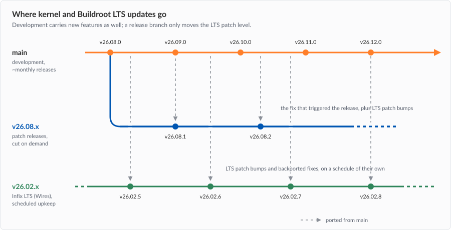

# Releases & Support

This page answers a question that comes up in every deployment: *how
long will this version keep getting updates, and who makes them?*  It
describes how releases are numbered and branched, what goes into a
patch release, and the levels of maintenance available for products
that must stay on one version for years.

## Version Numbers

Releases are tagged `vYY.MM.z`:

- `YY.MM` identifies the release *series*, e.g., `v26.08`
- `z` is the patch level within that series, starting at `0`

Release candidates leading up to a release are tagged `-rcN`, e.g.,
`v26.08.0-rc1`.  They exist to flush out issues before the final tag
and are not intended for production.

A series starts on `main` and is tagged `vYY.MM.0`.  Every patch release
in that series is made on the branch `vYY.MM.x`, e.g., `v26.08.x`.  The
branch is never rebased and never gains features -- it only moves
forward, one patch release at a time.

## The Foundation: Kernel & Buildroot LTS

Every release builds on a Linux kernel LTS series and a Buildroot LTS
series, e.g., Linux 6.18.y and Buildroot 2025.02.x.  Both upstream
projects publish patch releases on their own schedule, carrying security
and stability fixes.  The team tracks them closely, and `main` moves to
the latest patch level of both as soon as it is available.

Within a release series, the LTS *line* never changes.  A device on
v26.08.z stays on the same kernel and Buildroot generation for the life
of the series; what moves is the patch level, e.g., Linux 6.18.48 →
6.18.49 → 6.18.51.  Changing to a new kernel or Buildroot LTS brings new
drivers, new behavior, and new regressions, so it only ever happens on
`main`, in a new series.

The Buildroot LTS is tracked in a fork where a handful of critical
packages -- the routing stack (FRR), for one -- are kept newer than the
LTS itself ships.  Those upgrades travel with the Buildroot bump, and
each gets its own line in the ChangeLog, so they are never a surprise.

## Levels of Maintenance

The first two levels are what the open source project itself provides,
free of charge and without commitment.  The last two are commercial
services from [*Wires*][wires], the company sponsoring Infix
development.  They exist because some products cannot follow a monthly
release train, and someone still has to do the work.

| **Level**                   | **Provided by**              | **Contains**                                           | **When**                     |
|-----------------------------|------------------------------|--------------------------------------------------------|------------------------------|
| Latest release              | The project, free            | Features, fixes, latest kernel & Buildroot LTS patches | Roughly monthly              |
| Patch release on `vYY.MM.x` | The project, free            | The fix that motivated it, plus LTS patch bumps        | Only when one is scheduled   |
| Infix LTS                   | [*Wires*][wires], commercial | LTS patch bumps and backported fixes                   | Schedule set in the contract |
| Custom agreement            | [*Wires*][wires], commercial | Whatever the product needs                             | Per agreement                |

### Latest Release

The supported version of the open source project is the latest release.
New releases come roughly once a month and carry the same kernel and
Buildroot LTS patch level as every other level below -- together with
new features, refactoring, and everything else that landed on `main`
since the previous series.

For a lab, an evaluation, or any deployment that can follow the project,
this is the recommended track: upgrade to the latest release, and the
foundation stays current by itself.

### Patch Release on a Release Branch

Patch releases happen when there is a concrete reason, typically a fix
someone needs on a version that has already shipped.  There is no
schedule, and no promise that a given series will ever see another patch
release.  Old branches remain on GitHub, but a branch with no patch
release is not the same as a maintained branch.

When a patch release *is* scheduled, the same recipe applies every time:

1. The fix, or fixes, that motivated the release
2. The latest kernel LTS patch level, ported from `main`
3. The latest Buildroot LTS patch level, ported from `main`, along with
   the package upgrades the fork carries at that point

The last two are the important part.  Someone who takes v26.08.2 for a
single file permission fix also receives every kernel and Buildroot
security fix published since v26.08.1, which is usually the larger part
of their exposure.

> [!IMPORTANT]
> Ported means the *patch level* only: 6.18.49 → 6.18.51, 2025.02.17 →
> 2025.02.18, FRR 10.5.4 → 10.5.5.  A patch release never moves to
> another LTS line, never adds features, and never changes the YANG
> models, so a device can take it without a configuration migration.

### Infix LTS (Commercial)

For products that have to stay on one version for years,
[*Wires*][wires] offers *Infix LTS*: maintenance of one release series,
sold as a support contract.  No series is designated LTS up front -- the
series a product shipped on is the series that gets maintained.

> [!IMPORTANT]
> Infix LTS is a commercial service from [*Wires*][wires], not a
> promise made by the open source project.  A release series is
> maintained this way only for as long as a contract covers it.

Compared to the level above, what changes is the trigger and the scope:

- **Trigger:** updates are made on a schedule of their own, not in
  response to a request.  Nobody has to notice a problem first, and the
  interval is agreed in the contract
- **Scope:** besides the kernel and Buildroot LTS patch bumps, important
  fixes are backported from `main` -- security fixes first, then
  stability fixes relevant to the hardware and the feature set in use
- **Work:** a dedicated team does the porting, testing, and release
  notes, and the result is regression tested on the hardware the
  contract covers

### Custom Agreement (Commercial)

Requirements differ, and some cannot be met by any of the above: a
kernel held at a fixed version for a certification, a longer support
period than the upstream LTS provides, extra hardware, or a private
branch with customer-specific features.  [*Wires*][wires] handles these
case by case, see [Support][support] for how to get in touch.

## Support Periods for Products

Whoever ships the product is its manufacturer, and the support period
promised to end users -- along with the vulnerability handling behind it
-- belongs to them.  This is what the EU Cyber Resilience Act (CRA) has
made concrete for anyone selling into the European market.  What this
page defines is the operating system underneath: how long it keeps
receiving fixes, and who produces them.

Two things are worth settling before a product ships, not after:

- **Which series it ships on**, and which level of maintenance covers
  that series.  Building on the latest release and following it is a
  valid answer; so is an Infix LTS contract with [*Wires*][wires].
  Shipping on an old series with no maintenance arrangement is the one
  combination that leaves nobody responsible for the next kernel CVE
- **Whether the device can be updated in the field.**  Updates that
  cannot be delivered are not updates.  See [Upgrading the
  System](upgrade.md) for the update mechanism and rollback behavior

## Questions

For the open source project, use the [community resources][support]:
GitHub issues and discussions, or Discord.  For support contracts, Infix
LTS, and custom agreements, contact [*Wires*][wires] -- by email at
<infix@wires.se>.

[support]: https://github.com/kernelkit/infix/blob/main/.github/SUPPORT.md
[wires]:   https://wires.se
