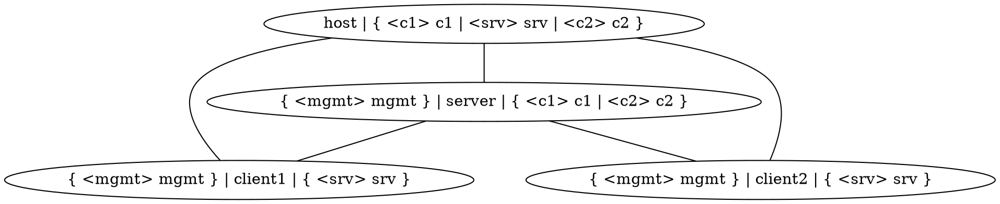
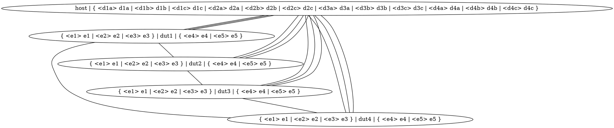

Test System Architecture
========================

Tenets
------

- **Keep overhead to a minimum**.  Tests should be fast to both write
  and run.  Ideally, the developer should _want_ to add tests early in
  the development cycle because they instinctively feel that that is
  the quickest route to arrive at a correct and robust implementation.

- **Both physical and virtual hardware matters**.  Infix is primarily
  deployed on physical hardware, so being able to run the test suite
  on real devices is crucial to guarantee a high quality product.  At
  the same time, there is much value in running the same suite on
  virtual hardware, as it makes it easy to catch regressions early.
  It is also much more practical and economical to build large virtual
  networks than physical ones.

- **Avoid CLI scripting & scraping**.  Reliably interacting with a DUT
  over a serial line in a robust way is _very_ hard to get right.
  Given that we have a proper API (RESTCONF), we should leverage that
  when testing.  Front-ends can be tested by other means.


Overview
--------


The test system is made up of several independent components, which
are typically used in concert to run a full test suite.

### Test Cases

A test case is an executable, receiving the physical topology as a
positional argument, which produces [TAP][] compliant output on its
`stdout`. I.e., it is executed in the following manner:

    test-case [OPTS] <physical-topology>

Test cases are typically written in Python, using the
[Infamy](#infamy) library.  Ultimately though, it can be implemented
in any language, as long as it matches the calling convention above.

### Infamy

Rather than having each test case come up with its own implementation
of how to map topologies, how to push NETCONF data to a device, etc.,
we provide a library of functions to take care of all that, dubbed
"Infamy".  When adding a new test case, ask yourself if any parts of
it might belong in Infamy as a generalized component that can be
reused by other tests.

Some of the core functions provided by Infamy are:

- Mapping a logical topology to a physical one
- Finding and attaching to a device over an Ethernet interface, using
  NETCONF
- Pushing/pulling NETCONF data to/from a device
- Generating TAP compliant output

### 9PM

To run multiple tests, we employ [9PM][]. It let's us define test
suites as simple YAML files. Suites can also be hierarchically
structured, with a suite being made up of other suites, etc.

It also validates the TAP output, making sure to catch early exits
from a case, and produces a nice summary report.

### `/test/env`

A good way to ensure that nobody ever runs the test suite is to make
it _really_ hard to do so.  `/test/env`'s job is instead to make it
very _easy_ to create a reproducible environment in which tests can be
executed.

Several technologies are leveraged to accomplish this:

- **Containers**: The entire execution is optionally done inside a
  standardized `docker` container environment.  This ensures that the
  software needed to run the test suite is always available, no matter
  which distribution the user is running on their machine.

- **Python Virtual Environments**: To make sure that the expected
  versions of all Python packages are available, the execution is
  wrapped inside a `venv`.  This is true for containerized executions,
  where the container comes with a pre-installed environment, but it
  can also be sourced from the host system when running outside of the
  container.

- **Virtual Test Topology**: Using [Qeneth][], the environment can
  optionally be started with a virtual topology of DUTs to run the
  tests on.

> `docker` is the only supported container environment when running
> tests in the host's network namespace. When running on a virtual
> Qeneth topology, `podman` may also be used by installing the
> `podman-docker` package from your host system's distro.


Physical and Logical Topologies
-------------------------------

Imagine that we want to create a test with three DUTs; one acting as a
DHCP server, and the other two as DHCP clients - with all three having
a management connection to the host PC running the test.  In other
words, the test requires a _logical_ topology like the one below.




When running in a virtualized environment, one could simply create a
setup that matches the test's logical topology.  But in scenarios when
devices are physical systems, connected by real copper cables, this is
not possible (unless you have some wicked L1 relay matrix thingy).

Instead, the test implementation does not concern itself with the
exact nodes used to run the test, only that the _logical_ topology can
be _mapped_ to some subset of the _physical_ topology.  In
mathematical terms, the physical topology must contain a subgraph that
is _isomorphic_ to the logical topology.

Standing on the shoulders of giants (i.e. people with mathematics
degrees), we can deploy well-known algorithms to find such subgraphs.
Continuing our example, let's say we want to run our DHCP test on the
_physical_ topology below.




Our test (in fact, all tests) receives the physical topology as an
input parameter, and then maps the desired logical topology onto it,
producing a mapping from logical nodes and ports to their physical
counterparts.

```dot
{
  "client1": "dut1",
  "client1:mgmt": "dut1:e1",
  "client1:srv": "dut1:e4",
  "client2": "dut3",
  "client2:mgmt": "dut3:e2",
  "client2:srv": "dut3:e5",
  "host": "host",
  "host:c1": "host:d1a",
  "host:c2": "host:d3b",
  "host:srv": "host:d4c",
  "server": "dut4",
  "server:c1": "dut4:e5",
  "server:c2": "dut4:e4",
  "server:mgmt": "dut4:e3"
}
```

With this information, the test knows that, in this particular
environment, the server should be managed via the port called `d4c` on
the node called `host`; that the port connected to the server on
`client1` is `e4` on `dut1`, etc.  Thereby separating the
implementation of the test from any specific physical setup.

Testcases are not required to use a logical topology; they may choose
to accept whatever physical topology its given, and dynamically
determine the DUTs to use for testing.  As an example, an STP test
could accept an arbitrary physical topology, run the STP algorithm on
it offline, enable STP on all DUTs, and then verify that the resulting
spanning tree matches the expected one.

Integration to Infix
--------------------
When the test environment is started with Qeneth, it doesn't use the 
base image directly. Instead, it creates a copy and inserts a `test-mode`
flag into it. During the bootstrap phase, the system checks for the 
presence of the test-mode flag (file).

If the flag exists, a 'test-config.cfg' file is generated. In the 
following step, the system loads the 'test-config' instead of the
standard `startup-config` (or `factory-config`). This configuration
is simple and safe, equivalent to the one used in 'Secure Mode' 
(also known as 'failure-config').

Additionally, the configuration enables extra RPCs related to system 
restart and configuration overrides, allowing tests to be run even on 
systems where the factory configuration may potentially create L2 loops. 

[9PM]:    https://github.com/rical/9pm
[Qeneth]: https://github.com/wkz/qeneth
[TAP]:    https://testanything.org/
