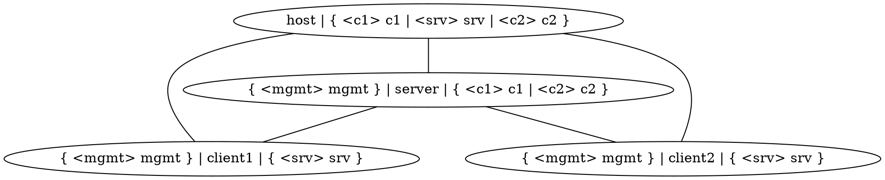
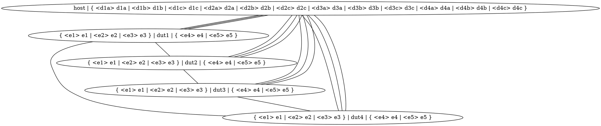

Regression Testing with Infamy
==============================

Infix comes with a test suite that is intended to provide end-to-end
verification of supported features.  Generally speaking, this means
that one or more DUTs are configured over NETCONF; the resulting
network is then black-box tested by injecting and inspecting network
traffic at various points.


TL;DR
-----

Build Infix and run the test suite on a set of virtual Infix nodes.

    $ make x86_64_defconfig
    $ make
    $ make test

To run a subset of tests, e.g., only the DHCP client tests:

    $ make test INFIX_TESTS=case/infix_dhcp/all.yaml

> **Note:** see the below section [Quick Start Guide][] for how to
> connect to the test system, debug and develop tests, and more.


Tenets
------

- **Keep overhead to a minimum**.  Tests should be fast to both write
  and run.  Ideally, the developer should _want_ to add tests early in
  the development cycle because they instinctively feel that that is
  the quickest route to arrive at a correct and robust implementation.

- **Both physical and virtual hardware matters**.  Infix is primarily
  deployed on physical hardware, so being able to run the test suite
  on real devices is crucial to guarantee a high quality product.  At
  the same time, there is much value in running the same suite on
  virtual hardware, as it makes it easy to catch regressions early.
  It is also much more practical and economical to build large virtual
  networks than physical ones.

- **Avoid CLI scipting & scraping**.  Reliably interacting with a DUT
  over a serial line in a robust way is _very_ hard to get right.
  Given that we have a proper API (RESTCONF), we should leverage that
  when testing.  Front-ends can be tested by other means.


Architectural Overview
----------------------


The test system is made up of several independent components, which
are typically used in concert to run a full test suite.

### Test Cases

A test case is an executable, receiving the physical topology as a
positional argument, which produces [TAP][] compliant output on its
`stdout`. I.e., it is executed in the following manner:

    test-case [OPTS] <physical-topology>

Test cases are typically written in Python, using the
[Infamy](#infamy) library.  Ultimately though, it can be implemented
in any language, as long as it matches the calling convention above.

### Infamy

Rather than having each test case come up with its own implementation
of how to map topologies, how to push NETCONF data to a device, etc.,
we provide a library of functions to take care of all that, dubbed
"Infamy".  When adding a new test case, ask yourself if any parts of
it might belong in Infamy as a generalized component that can be
reused by other tests.

Some of the core functions provided by Infamy are:

- Mapping a logical topology to a physical one
- Finding and attaching to a device over an Ethernet interface, using
  NETCONF
- Pushing/pulling NETCONF data to/from a device
- Generating TAP compliant output

### 9PM

To run multiple tests, we employ [9PM][]. It let's us define test
suites as simple YAML files. Suites can also be hierarchically
structured, with a suite being made up of other suites, etc.

It also validates the TAP output, making sure to catch early exits
from a case, and produces a nice summary report.

### `/test/env`

A good way to ensure that nobody ever runs the test suite is to make
it _really_ hard to do so.  `/test/env`'s job is instead to make it
very _easy_ to create a reproducible environment in which tests can be
executed.

Several technologies are leveraged to accomplish this:

- **Containers**: The entire execution is optionally done inside a
  standardized container environment, using either `podman` or
  `docker`.  This ensures that the software needed to run the test
  suite is always available, no matter which distribution the user is
  running on their machine.

- **Python Virtual Environments**: To make sure that the expected
  versions of all Python packages are available, the execution is
  wrapped inside a `venv`.  This is true for containerized executions,
  where the container comes with a pre-installed environment, but it
  can also be sourced from the host system when running outside of the
  container.

- **Virtual Test Topology**: Using [Qeneth][], the environment can
  optionally be started with a virtual topology of DUTs to run the
  tests on.


Interactive Usage
-----------------

Some tests only require a single DUT.  These can therefore be run
against an Infix image started from `make run`. When the instance is
running, you can open a separate terminal and run `make test-run`, to
run the subset of the test suite that can be mapped to it.

Both `make test` and `make test-run` targets have a respective target
with a `-sh` suffix.  These can be used to start an interactive session
in the reproducible environment, which is usually much easier to work
with during a debugging session.

Inside the reproducible environment, a wrapper for Qeneth is created for
the running network's directory.  E.g., calling `qeneth status` inside a
`make test-sh` environment show the expected status information.

> **Note:** for more information and help writing a test, see the below
> [Quick Start Guide][].


Physical and Logical Topologies
-------------------------------

Imagine that we want to create a test with three DUTs; one acting as a
DHCP server, and the other two as DHCP clients - with all three having
a management connection to the host PC running the test.  In other
words, the test requires a _logical_ topology like the one below.




When running in a virtualized environment, one could simply create a
setup that matches the test's logical topology.  But in scenarios when
devices are physical systems, connected by real copper cables, this is
not possible (unless you have some wicked L1 relay matrix thingy).

Instead, the test implementation does not concern itself with the
exact nodes used to run the test, only that the _logical_ topology can
be _mapped_ to some subset of the _physical_ topology.  In
mathematical terms, the physical topology must contain a subgraph that
is _isomorphic_ to the logical topology.

Standing on the shoulders of giants (i.e. people with mathematics
degrees), we can deploy well-known algorithms to find such subgraphs.
Continuing our example, let's say we want to run our DHCP test on the
_physical_ topology below.




Our test (in fact, all tests) receives the physical topology as an
input parameter, and then maps the desired logical topology onto it,
producing a mapping from logical nodes and ports to their physical
counterparts.

```dot
{
  "client1": "dut1",
  "client1:mgmt": "dut1:e1",
  "client1:srv": "dut1:e4",
  "client2": "dut3",
  "client2:mgmt": "dut3:e2",
  "client2:srv": "dut3:e5",
  "host": "host",
  "host:c1": "host:d1a",
  "host:c2": "host:d3b",
  "host:srv": "host:d4c",
  "server": "dut4",
  "server:c1": "dut4:e5",
  "server:c2": "dut4:e4",
  "server:mgmt": "dut4:e3"
}
```

With this information, the test knows that, in this particular
environment, the server should be managed via the port called `d4c` on
the node called `host`; that the port connected to the server on
`client1` is `e4` on `dut1`, etc.  Thereby separating the
implementation of the test from any specific physical setup.

Testcases are not required to use a logical topology; they may choose
to accept whatever physical topology its given, and dynamically
determine the DUTs to use for testing.  As an example, an STP test
could accept an arbitrary physical topology, run the STP algorithm on
it offline, enable STP on all DUTs, and then verify that the resulting
spanning tree matches the expected one.


Quick Start Guide
-----------------

When developing a test, instead of blindly coding in Python and running
`make test` over and over, start a test shell:

    $ make test-sh
    Info: Generating topology
    Info: Generating node YAML
    Info: Generating executables
    Info: Launching dut1
    Info: Launching dut2
    Info: Launching dut3
    Info: Launching dut4
    11:42:52 infamy0:test #

It takes a little while to start up, but then we have a shell prompt
inside the container running Infamy.  It's a very limited environment,
but it has enough to easily run single tests, connect to the virtual
devices, and *step* your code.  Let's run a test:

    11:42:53 infamy0:test # ./case/infix_dhcp/dhcp_basic.py

### Connecting to Infamy

The test system runs in a Docker container, so to get a shell prompt in
*another terminal* you need to connect to that container.  Infamy comes
with a helper script for this:

    $ ./test/shell

By default it connect to the latest started Infamy instance.  If you for
some reason run multiple instances of Infamy the `shell` script takes an
optional argument "system", which is the hostname of the container you
want to connect to:

    $ ./test/shell infamy2

### Connecting to a DUT

All DUTs in a virtual Infamy topology are emulated in Qemu instances
managed by qeneth.  If you want to watch what's happening on one of the
target systems, e.g., tail a log file or run `tcpdump` during the test,
there is another helper script in Infamy for this:

    $ ./test/console 1
    Trying 127.0.0.1...
    Connected to 127.0.0.1.
    
    Infix -- a Network Operating System v23.11.0-226-g0c144da (console)
    infix-00-00-00 login: admin
    Password:
    .-------.
    |  . .  | Infix -- a Network Operating System
    |-. v .-| https://kernelkit.github.io
    '-'---'-'
    
    Run the command 'cli' for interactive OAM
    
    admin@infix-00-00-00:~$

From here we can observe `dut1` freely while running tests.

> The `console` script uses `telnet` to connect to a port forwarded to
> `localhost` by the Docker container.  To exit Telnet, use Ctrl-] and
> then 'q' followed by enter.  This can be customized in `~/.telnetrc`

Like the `shell` script, `console` takes an optional "system" argument
in case you run multiple instances of Infamy:

    $ ./test/console 1 infamy2

You can also connect to the console of a DUT from within a `shell`:

    $ ./test/shell
    11:42:54 infamy0:test # qeneth status
    11:42:54 infamy0:test # qeneth console dut1
    login: admin
    password: *****
    admin@infix-00-00-00:~$

> **Note:** disconnect from the qeneth console by using bringing up the
> old Telnet "menu" using Ctrl-], compared to standard Telnet this is
> the BusyBox version so you press 'e' + enter instead of 'q' to quit.


### Debug a Test

First, add a Python `breakpoint()` to your test and run it from your
`make test-sh` Infamy instance:

    11:42:58 infamy0:test # ./case/infix_dhcp/dhcp_basic.py
    # Starting (2024-02-10 11:42:59)
    # Probing dut1 on port d1a for IPv6LL mgmt address ...
    # Connecting to mgmt IP fe80::ff:fe00:0%d1a:830 ...
    ok 1 - Initialize
    > /home/jocke/src/infix/test/case/infix_dhcp/dhcp_basic.py(44)<module>()
    (Pdb)

You are now in the Python debugger, Pdb.

### Debug a Test in a MacVLAN

Most tests use some sort of network connection to the DUTs.  From a test
shell you cannot see or debug that connection by default.  So you need
to employ a little trick.

Open another terminal, and start a test shell in your Infamy instance:

    $ ./test/shell
    11:43:19 infamy0:test #

MacVLAN interfaces created by Infamy run in another network namespace,
to enter it we can look for a sleeper process:

    11:43:20 infamy0:test # nsenter -n U -t $(pidof sleep infinity)

You are now one step further down:

    infamy0:/home/jocke/src/infix/test# ip -br a
    lo               UNKNOWN        127.0.0.1/8 ::1/128
    iface@if7        UP             10.0.0.1/24 fe80::38d0:88ff:fe77:b7cd/64

You can now freely debug the network activity of your test and the
responses from the DUT.


### Deterministic Topology Mappings

By default, mappings from logical to physical topologies are not
stable across test case executions. This can be very frustrating when
debugging a failing test, since logical nodes are suffled around
between phyical nodes. In such cases, supplying a `PYTHONHASHSEED`
variable (set to any 32-bit unsigned integer) when launching the test
environment will make sure that topology mappings are deterministic:

    $ make PYTHONHASHSEED=0 test-sh

If a seed is not supplied, a random value is chosen. This seed is
logged by the `meta/reproducible.py` test case when running a test
suite:

    $ make test
    Info: Generating topology
    Info: Generating node YAML
    Info: Generating executables
    Info: Launching dut1
    Info: Launching dut2
    Info: Launching dut3
    Info: Launching dut4
    9PM - Simplicity is the ultimate sophistication

    Starting test 0002-reproducible.py
    2024-05-03 10:40:30 # Starting (2024-05-03 10:40:30)
    2024-05-03 10:40:30 # Specify PYTHONHASHSEED=3773822171 to reproduce this test environment
    2024-05-03 10:40:30 ok 1 - $PYTHONHASHSEED is set
    2024-05-03 10:40:30 # Exiting (2024-05-03 10:40:30)
    2024-05-03 10:40:30 1..1
    ...

This is useful because this value can then be used to rerun a test (or
the whole suite) with identical topology mappings:

    $ make PYTHONHASHSEED=3773822171 INFIX_TESTS=case/ietf_system/hostname.py test


[9PM]:    https://github.com/rical/9pm
[Qeneth]: https://github.com/wkz/qeneth
[TAP]:    https://testanything.org/
