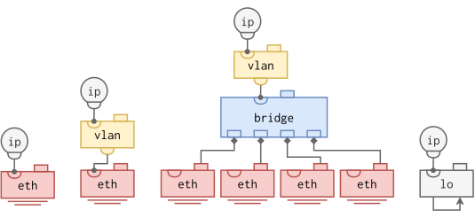

# IP Addresses And Other Per-Interface IP settings

Infix supports several network interface types, and each can be
assigned one or more IP addresses. Both IPv4 and IPv6 are supported.

## IPv4 address assignment

Multiple address assignment methods are available:

| **Type**   | **Yang Model**    | **Description**                                                |
|:-----------|:------------------|:---------------------------------------------------------------|
| static     | ietf-ip           | Static assignment of IPv4 address, e.g., *10.0.1.1/24*         |
| link-local | infix-ip          | Auto-assignment of IPv4 address in 169.254.x.x/16 range        |
| dhcp       | infix-dhcp-client | Assignment of IPv4 address by DHCP server, e.g., *10.0.1.1/24* |

DHCP address method is only available for *LAN* interfaces (ethernet, virtual ethernet (veth), bridge, etc.)

### Configuration examples

    root@example:/> show interfaces 
    INTERFACE       STATE          PROTOCOL/ADDRESS          SOURCE                 
    lo              up             00:00:00:00:00:00         unknown
                                   127.0.0.1/8

    eth0            up             02:00:00:00:00:00         unknown
    root@example:/>

#### Configuring static IP and link-local IP addresses

    root@example:/> configure
    root@example:/config/> edit interfaces interface eth0 ipv4
    root@example:/config/interfaces/interface/eth0/ipv4/> set address 10.0.1.1 prefix-length 24
    root@example:/config/interfaces/interface/eth0/ipv4/> set autoconf enabled true 
    root@example:/config/interfaces/interface/eth0/ipv4/> leave
    root@example:/> show interfaces 
    INTERFACE       STATE          PROTOCOL/ADDRESS          SOURCE                 
    lo              up             00:00:00:00:00:00         unknown
                                   127.0.0.1/8

    eth0            up             02:00:00:00:00:00         unknown
                                   169.254.1.3/16
                                   10.0.1.1/24

    root@example:/>
	
#### Use of DHCP for address assignment

    root@example:/> configure 
    root@example:/config/> edit dhcp-client 
    root@example:/config/dhcp-client/> set client-if eth0
    root@example:/config/dhcp-client/> set enabled true 
    root@example:/config/dhcp-client/> leave
    root@example:/> show interfaces 
    INTERFACE       STATE          PROTOCOL/ADDRESS          SOURCE                 
    lo              up             00:00:00:00:00:00         unknown
                                   127.0.0.1/8

    eth0            up             02:00:00:00:00:00         unknown
                                   10.1.2.100/24

    root@example:/>

## IPv6 address assignment

Multiple address assignment methods are available:

| **Type**         | **Yang Model** | **Description**                                                                                                                                   |
|:-----------------|:---------------|:--------------------------------------------------------------------------------------------------------------------------------------------------|
| static           | ietf-ip        | Static assignment of IPv6 address, e.g., *2001:db8:0:1::1/64*                                                                                     |
| link-local       | ietf-ip[^1]    | (RFC4862) Auto-configured link-local IPv6 address (*fe80::0* prefix + interface identifier, e.g., *fe80::ccd2:82ff:fe52:728b/64*)                 |
| global auto-conf | ietf-ip        | (RFC4862) Auto-configured (stateless) global IPv6 address (prefix from router + interface identifier, e.g., *2001:db8:0:1:ccd2:82ff:fe52:728b/64* |

[^1]: Link-local IPv6 addresses are implicitly enabled when enabling IPv6. IPv6 can be enabled/disabled per interface in *ietf-ip* YANG model.

### Example configurations

    root@infix-00-00-00:/> show ip
    1: lo: <LOOPBACK,UP,LOWER_UP> mtu 65536 qdisc noqueue state UP group iface qlen 1000
        link/loopback 00:00:00:00:00:00 brd 00:00:00:00:00:00
        inet 127.0.0.1/8 scope host lo
           valid_lft forever preferred_lft forever
        inet6 ::1/128 scope host 
           valid_lft forever preferred_lft forever
    2: eth0: <BROADCAST,MULTICAST,UP,LOWER_UP> mtu 1500 qdisc pfifo_fast state UP group default qlen 1000
        link/ether 02:00:00:00:00:00 brd ff:ff:ff:ff:ff:ff
        inet6 fe80::ff:fe00:0/64 scope link 
           valid_lft forever preferred_lft forever
    root@infix-00-00-00:/>

#### Disabling IPv6 link-local (disabling IPv6 on interface)

    root@infix-00-00-00:/> configure 
    root@infix-00-00-00:/config/> edit interfaces interface eth0 ipv6
    root@infix-00-00-00:/config/interfaces/interface/eth0/ipv6/> set enabled false
    root@infix-00-00-00:/config/interfaces/interface/eth0/ipv6/> leave
    root@infix-00-00-00:/> show ip
    1: lo: <LOOPBACK,UP,LOWER_UP> mtu 65536 qdisc noqueue state UP group iface qlen 1000
        link/loopback 00:00:00:00:00:00 brd 00:00:00:00:00:00
        inet 127.0.0.1/8 scope host lo
           valid_lft forever preferred_lft forever
        inet6 ::1/128 scope host 
           valid_lft forever preferred_lft forever
    2: eth0: <BROADCAST,MULTICAST,UP,LOWER_UP> mtu 1500 qdisc pfifo_fast state UP group default qlen 1000
        link/ether 02:00:00:00:00:00 brd ff:ff:ff:ff:ff:ff
    root@infix-00-00-00:/>

#### Setting Static IPv6 address

    root@infix-00-00-00:/> configure 
    root@infix-00-00-00:/config/> edit interfaces interface eth0 ipv6
    root@infix-00-00-00:/config/interfaces/interface/eth0/ipv6/> set address 2001:db8::1 prefix-length 64
    root@infix-00-00-00:/config/interfaces/interface/eth0/ipv6/> leave
    root@infix-00-00-00:/> show ip
    1: lo: <LOOPBACK,UP,LOWER_UP> mtu 65536 qdisc noqueue state UP group iface qlen 1000
        link/loopback 00:00:00:00:00:00 brd 00:00:00:00:00:00
        inet 127.0.0.1/8 scope host lo
           valid_lft forever preferred_lft forever
        inet6 ::1/128 scope host 
           valid_lft forever preferred_lft forever
    2: eth0: <BROADCAST,MULTICAST,UP,LOWER_UP> mtu 1500 qdisc pfifo_fast state UP group default qlen 1000
        link/ether 02:00:00:00:00:00 brd ff:ff:ff:ff:ff:ff
        inet6 2001:db8::1/64 scope global 
           valid_lft forever preferred_lft forever
        inet6 fe80::ff:fe00:0/64 scope link 
           valid_lft forever preferred_lft forever
    root@infix-00-00-00:/>

#### Stateless Autoconfiguration of Global IPv6 Address

Concatenation of prefix advertised by router (here 2001:db8:0:1::0/64)
and interface identifier.

    root@infix-00-00-00:/> configure 
    root@infix-00-00-00:/config/> edit interfaces interface eth0 ipv6
    root@infix-00-00-00:/config/interfaces/interface/eth0/ipv6/> set address 2001:db8::1 prefix-length 64
    root@infix-00-00-00:/config/interfaces/interface/eth0/ipv6/> leave
    root@infix-00-00-00:/> show ip
    1: lo: <LOOPBACK,UP,LOWER_UP> mtu 65536 qdisc noqueue state UP group iface qlen 1000
        link/loopback 00:00:00:00:00:00 brd 00:00:00:00:00:00
        inet 127.0.0.1/8 scope host lo
           valid_lft forever preferred_lft forever
        inet6 ::1/128 scope host 
           valid_lft forever preferred_lft forever
    2: eth0: <BROADCAST,MULTICAST,UP,LOWER_UP> mtu 1500 qdisc pfifo_fast state UP group default qlen 1000
        link/ether 02:00:00:00:00:00 brd ff:ff:ff:ff:ff:ff
        inet6 2001:db8:0:1:0:ff:fe00:0/64 scope global dynamic mngtmpaddr 
           valid_lft 86398sec preferred_lft 14398sec
        inet6 fe80::ff:fe00:0/64 scope link 
           valid_lft forever preferred_lft forever
    root@infix-00-00-00:/>

