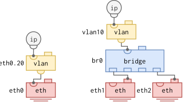

# VLAN Interfaces

A VLAN interface is an interface stacked on top of another Linux interface
that filters traffic for a single 802.1Q VID.  `tcpdump` on a VLAN interface
shows only frames matching that VID, compared to *all* VIDs when listening
on the lower-layer interface.

This page covers VLAN interfaces stacked on Ethernet, on a VLAN-filtering
bridge, and on other VLAN interfaces.  For VLAN handling *inside* a bridge
(port VIDs, tagged/untagged membership, pvid), see [VLAN Filtering
Bridge](bridging.md#vlan-filtering-bridge).

## On Top of an Ethernet Interface

A VLAN interface for VID 20 on top of an Ethernet interface `eth0` is by
convention named `eth0.20`.

<pre class="cli"><code>admin@example:/> <b>configure</b>
admin@example:/config/> <b>edit interface eth0.20</b>
admin@example:/config/interface/eth0.20/> <b>show</b>
type vlan;
vlan {
  tag-type c-vlan;
  id 20;
  lower-layer-if eth0;
}
admin@example:/config/interface/eth0.20/> <b>leave</b>
</code></pre>

The `tag-type` defaults to `c-vlan` (802.1Q customer VLAN, EtherType 0x8100).
Set to `s-vlan` (802.1ad service VLAN, EtherType 0x88A8) to terminate an outer
S-Tag.

> [!TIP]
> If you name your VLAN interface `foo0.N` or `vlanN`, where `N` is a
> number, the CLI infers the interface type automatically.  Otherwise
> the type must be set explicitly.

## On Top of a Bridge

When the lower-layer interface is a VLAN-filtering bridge, the VLAN interface
gives the CPU an IP-addressable endpoint inside the bridged broadcast domain
for that VID.  This pattern is named `vlanN` by convention.

<pre class="cli"><code>admin@example:/> <b>configure</b>
admin@example:/config/> <b>edit interface vlan10</b>
admin@example:/config/interface/vlan10/> <b>set vlan id 10</b>
admin@example:/config/interface/vlan10/> <b>set vlan lower-layer-if br0</b>
admin@example:/config/interface/vlan10/> <b>leave</b>
</code></pre>

The bridge `br0` must have VLAN 10 configured with the bridge itself as a
tagged member.  See [VLAN Filtering Bridge](bridging.md#vlan-filtering-bridge)
for the bridge-side configuration.

## Stacked (Q-in-Q)

VLAN interfaces can be stacked.  A VLAN interface whose lower-layer is itself
a VLAN interface terminates the inner tag, leaving the outer tag for the
parent to handle.

<pre class="cli"><code>admin@example:/> <b>configure</b>
admin@example:/config/> <b>edit interface eth0.10</b>
admin@example:/config/interface/eth0.10/> <b>set vlan tag-type s-vlan</b>
admin@example:/config/interface/eth0.10/> <b>leave</b>
admin@example:/config/> <b>edit interface eth0.10.20</b>
admin@example:/config/interface/eth0.10.20/> <b>show</b>
type vlan;
vlan {
  tag-type c-vlan;
  id 20;
  lower-layer-if eth0.10;
}
admin@example:/config/interface/eth0.10.20/> <b>leave</b>
</code></pre>

The summary view shows each VLAN row pointing at its immediate parent:

<pre class="cli"><code>admin@example:/> <b>show interface</b>
INTERFACE       PROTOCOL      STATE       DATA                  
eth0.10         vlan          UP          vid: 10
│               ipv4                      10.0.10.1/24 (static)
└ eth0
eth0.10.20      vlan          UP          vid: 20
│               ipv4                      10.0.10.20/28 (static)
└ eth0.10
</code></pre>
