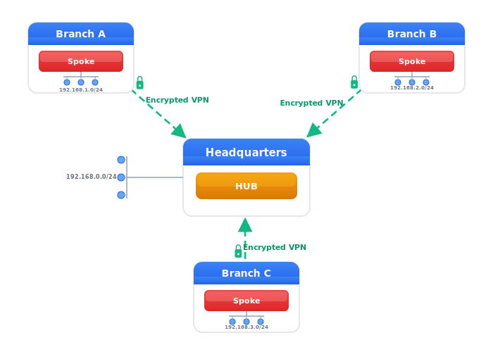

# WireGuard VPN

> [!NOTE]
> For a general introduction to VPN concepts and deployment models, see
> [VPN Configuration](vpn.md).

WireGuard is a modern, high-performance VPN protocol that uses state-of-the-art
cryptography.  It is significantly simpler and faster than traditional VPN
solutions like IPsec or OpenVPN, while maintaining strong security guarantees.

Key features of WireGuard:

- **Simple Configuration:** Minimal settings required compared to IPsec
- **High Performance:** Runs in kernel space with efficient cryptography
- **Strong Cryptography:** Uses Curve25519, ChaCha20, Poly1305, and BLAKE2
- **Roaming Support:** Seamlessly handles endpoint IP address changes
- **Dual-Stack:** Supports IPv4 and IPv6 for both tunnel endpoints and traffic

> [!IMPORTANT]
> When issuing `leave` to activate your changes, remember to also save
> your settings, `copy running-config startup-config`.  See the [CLI
> Introduction](cli/introduction.md) for a background.

## Key Management

WireGuard uses public-key cryptography similar to SSH.  Each WireGuard interface
requires a private key, and each peer is identified by its public key.

**Generate a WireGuard key pair using the `wg` command:**

```bash
admin@example:~$ wg genkey | tee privatekey | wg pubkey > publickey
admin@example:~$ cat privatekey
aMqBvZqkSP5JrqBvZqkSP5JrqBvZqkSP5JrqBvZqkSP=
admin@example:~$ cat publickey
bN1CwZ1lTP6KsrCwZ1lTP6KsrCwZ1lTP6KsrCwZ1lTP=
```

This generates a private key, saves it to `privatekey`, derives the public key,
and saves it to `publickey`.

**Import the private key into the keystore:**

<pre class="cli"><code>admin@example:/> <b>configure</b>
admin@example:/config/> <b>edit keystore asymmetric-key wg-site-a</b>
admin@example:/config/keystore/asymmetric-key/wg-site-a/> <b>set public-key-format x25519-public-key-format</b>
admin@example:/config/keystore/asymmetric-key/wg-site-a/> <b>set private-key-format x25519-private-key-format</b>
admin@example:/config/keystore/asymmetric-key/wg-site-a/> <b>set public-key bN1CwZ1lTP6KsrCwZ1lTP6KsrCwZ1lTP6KsrCwZ1lTP=</b>
admin@example:/config/keystore/asymmetric-key/wg-site-a/> <b>set cleartext-private-key aMqBvZqkSP5JrqBvZqkSP5JrqBvZqkSP5JrqBvZqkSP=</b>
admin@example:/config/keystore/asymmetric-key/wg-site-a/> <b>leave</b>
admin@example:/>
</code></pre>

**Import peer public keys into the truststore:**

<pre class="cli"><code>admin@example:/> <b>configure</b>
admin@example:/config/> <b>edit truststore public-key-bag wg-peers public-key peer-b</b>
admin@example:/config/truststore/…/peer-b/> <b>set public-key-format x25519-public-key-format</b>
admin@example:/config/truststore/…/peer-b/> <b>set public-key PEER_PUBLIC_KEY_HERE</b>
admin@example:/config/truststore/…/peer-b/> <b>leave</b>
admin@example:/>
</code></pre>

> [!IMPORTANT]
> Keep private keys secure!  Never share your private key.  Only exchange
> public keys with peers.  Delete the `privatekey` file after importing it
> into the keystore.

## Point-to-Point Configuration

> [!TIP]
> If you name your WireGuard interface `wgN`, where `N` is a number, the
> CLI infers the interface type automatically.

A basic WireGuard tunnel between two sites:

**Site A configuration:**

<pre class="cli"><code>admin@siteA:/> <b>configure</b>
admin@siteA:/config/> <b>edit interface wg0</b>
admin@siteA:/config/interface/wg0/> <b>set wireguard listen-port 51820</b>
admin@siteA:/config/interface/wg0/> <b>set wireguard private-key wg-site-a</b>
admin@siteA:/config/interface/wg0/> <b>set ipv4 address 10.0.0.1 prefix-length 24</b>
admin@siteA:/config/interface/wg0/> <b>edit wireguard peer wg-peers peer-b</b>
admin@siteA:/config/interface/…/wg-peers/peer/peer-b/> <b>set endpoint 203.0.113.2</b>
admin@siteA:/config/interface/…/wg-peers/peer/peer-b/> <b>set endpoint-port 51820</b>
admin@siteA:/config/interface/…/wg-peers/peer/peer-b/> <b>set allowed-ips 10.0.0.2/32</b>
admin@siteA:/config/interface/…/wg-peers/peer/peer-b/> <b>set persistent-keepalive 25</b>
admin@siteA:/config/interface/…/wg-peers/peer/peer-b/> <b>leave</b>
admin@siteA:/>
</code></pre>

**Site B configuration:**

<pre class="cli"><code>admin@siteB:/> <b>configure</b>
admin@siteB:/config/> <b>edit interface wg0</b>
admin@siteB:/config/interface/wg0/> <b>set wireguard listen-port 51820</b>
admin@siteB:/config/interface/wg0/> <b>set wireguard private-key wg-site-b</b>
admin@siteB:/config/interface/wg0/> <b>set ipv4 address 10.0.0.2 prefix-length 24</b>
admin@siteB:/config/interface/wg0/> <b>edit wireguard peer wg-peers peer-a</b>
admin@siteB:/config/interface/…/wg-peers/peer/peer-a/> <b>set endpoint 203.0.113.1</b>
admin@siteB:/config/interface/…/wg-peers/peer/peer-a/> <b>set endpoint-port 51820</b>
admin@siteB:/config/interface/…/wg-peers/peer/peer-a/> <b>set allowed-ips 10.0.0.1/32</b>
admin@siteB:/config/interface/…/wg-peers/peer/peer-a/> <b>set persistent-keepalive 25</b>
admin@siteB:/config/interface/…/wg-peers/peer/peer-a/> <b>leave</b>
admin@siteB:/>
</code></pre>

This creates an encrypted tunnel with Site A at 10.0.0.1 and Site B at 10.0.0.2.

## Understanding Allowed IPs

The `allowed-ips` setting in WireGuard serves two critical purposes:

1. **Ingress Filtering:** Only packets with source IPs in the allowed list
   are accepted from the peer
2. **Cryptokey Routing:** Determines which peer receives outbound packets
   for a given destination

Think of `allowed-ips` as a combination of firewall rules and routing table.


*Figure: WireGuard key exchange and allowed-ips configuration between two peers*

For a simple point-to-point tunnel, you typically allow only the peer's
tunnel IP address (e.g., `10.0.0.2/32`).  For site-to-site VPNs connecting
entire networks, include the remote network prefixes:

<pre class="cli"><code>admin@example:/config/interface/…/wg-peers/peer/peer-a/> <b>set allowed-ips 10.0.0.2/32</b>
admin@example:/config/interface/…/wg-peers/peer/peer-a/> <b>set allowed-ips 192.168.2.0/24</b>
</code></pre>

This allows traffic to/from the peer at 10.0.0.2 and routes traffic destined
for 192.168.2.0/24 through this peer.

> [!NOTE]
> When routing traffic to networks behind WireGuard peers, you also need
> to configure static routes pointing to the WireGuard interface.  See
> [Static Routes](routing.md) for more information.

## Peer Configuration and Key Bags

WireGuard peer configuration supports a two-level hierarchy that allows
efficient management of multiple peers with shared settings.

**Public Key Bags** group related peers together (e.g., all mobile clients,
all branch offices) and allow you to configure default settings that apply
to all peers in the bag.  Individual peers can then override these defaults
when needed.

Settings that support bag-level defaults and per-peer overrides:

- `endpoint` - Remote peer's IP address
- `endpoint-port` - Remote peer's UDP port (defaults to 51820 at bag level)
- `persistent-keepalive` - Keepalive interval in seconds
- `preshared-key` - Optional pre-shared key for additional quantum resistance
- `allowed-ips` - IP addresses allowed to/from this peer

> [!IMPORTANT]
> **Key Bag Configuration Rules:**
> - **Single key in bag:** You can use bag-level settings (endpoint, allowed-ips, etc.)
>   without specifying individual peer configurations. All settings apply to that one peer.
> - **Multiple keys in bag:** You MUST provide individual `peer` configuration for
>   each key in the bag. Settings like `endpoint` and `allowed-ips` must be unique
>   per peer and cannot be shared at the bag level when multiple peers exist.
>
> This prevents configuration errors where multiple peers would incorrectly share
> the same endpoint address or allowed-ips ranges.

**Example with bag-level defaults:**

<pre class="cli"><code>admin@example:/> <b>configure</b>
admin@example:/config/> <b>edit interface wg0</b>
admin@example:/config/interface/wg0/> <b>set wireguard listen-port 51820</b>
admin@example:/config/interface/wg0/> <b>set wireguard private-key wg-key</b>
admin@example:/config/interface/wg0/> <b>set ipv4 address 10.0.0.1 prefix-length 24</b>

# Configure defaults for all peers in the 'branch-offices' bag
admin@example:/config/interface/wg0/> <b>edit wireguard peers branch-offices</b>
admin@example:/config/interface/…/wireguard/peers/branch-offices/> <b>set endpoint-port 51820</b>
admin@example:/config/interface/…/wireguard/peers/branch-offices/> <b>set persistent-keepalive 25</b>
admin@example:/config/interface/…/wireguard/peers/branch-offices/> <b>end</b>

# Configure peer-specific settings (inherits endpoint-port and keepalive from bag)
admin@example:/config/interface/…/wireguard/peers/branch-offices/> <b>edit peer office-east</b>
admin@example:/config/interface/…/branch-offices/peer/office-east/> <b>set endpoint 203.0.113.10</b>
admin@example:/config/interface/…/branch-offices/peer/office-east/> <b>set allowed-ips 10.0.0.10/32</b>
admin@example:/config/interface/…/branch-offices/peer/office-east/> <b>set allowed-ips 192.168.10.0/24</b>
admin@example:/config/interface/…/branch-offices/peer/office-east/> <b>end</b>

# Another peer with an override for persistent-keepalive
admin@example:/config/interface/…/wireguard/peers/branch-offices/> <b>edit peer office-west</b>
admin@example:/config/interface/…/branch-offices/peer/office-west/> <b>set endpoint 203.0.113.20</b>
admin@example:/config/interface/…/branch-offices/peer/office-west/> <b>set allowed-ips 10.0.0.20/32</b>
admin@example:/config/interface/…/branch-offices/peer/office-west/> <b>set allowed-ips 192.168.20.0/24</b>
admin@example:/config/interface/…/branch-offices/peer/office-west/> <b>set persistent-keepalive 10</b>
admin@example:/config/interface/…/branch-offices/peer/office-west/> <b>leave</b>
admin@example:/>
</code></pre>

In this example:
- Both peers inherit `endpoint-port 51820` and `persistent-keepalive 25` from the bag
- `office-west` overrides the keepalive to 10 seconds while `office-east` uses the default 25
- Each peer has its own `endpoint` and `allowed-ips` configuration

This approach simplifies management when you have many peers with similar
configurations - set the common defaults once at the bag level, then only
specify per-peer differences.

## Site-to-Site VPN


*Figure: Site-to-Site VPN connecting two office networks*

A site-to-site VPN connects entire networks across locations, creating a unified
private network over the internet.  This allows devices in one location to
seamlessly access resources in another as if they were on the same local network.

This is the point-to-point configuration shown earlier, extended with routing
to allow access to networks behind each peer.  Configure the WireGuard tunnel
as shown in [Point-to-Point Configuration](#point-to-point-configuration),
then add the remote network to `allowed-ips` and configure static routes.

## Road Warrior VPN


*Figure: Mobile clients connecting to corporate network*

For mobile clients or peers without fixed IPs, omit the `endpoint` setting.
WireGuard learns the peer's endpoint from authenticated incoming packets:

<pre class="cli"><code>admin@hub:/> <b>configure</b>
admin@hub:/config/> <b>edit interface wg0 wireguard peers wg-peers peer mobile-client</b>
admin@hub:/config/interface/…/wg-peers/peer/mobile-client/> <b>set allowed-ips 10.0.0.10/32</b>
admin@hub:/config/interface/…/wg-peers/peer/mobile-client/> <b>leave</b>
admin@hub:/>
</code></pre>

The mobile client configures the hub's endpoint normally.  The hub learns
and tracks the mobile client's changing IP address automatically.

## Hub-and-Spoke Topology


*Figure: Hub-and-Spoke topology with central hub routing traffic between spokes*

WireGuard excels at hub-and-spoke (star) topologies where multiple remote
sites connect to a central hub.

**Hub configuration:**

<pre class="cli"><code>admin@hub:/> <b>configure</b>
admin@hub:/config/> <b>edit interface wg0</b>
admin@hub:/config/interface/wg0/> <b>set ipv4 address 10.0.0.1 prefix-length 24</b>
admin@hub:/config/interface/wg0/> <b>set wireguard listen-port 51820</b>
admin@hub:/config/interface/wg0/> <b>set wireguard private-key wg-hub</b>
admin@hub:/config/interface/wg0/> <b>edit wireguard peers wg-peers</b>

# Spoke 1
admin@hub:/config/interface/…/wireguard/peers/wg-peers/> <b>edit peer spoke1</b>
admin@hub:/config/interface/…/wg-peers/peer/spoke1/> <b>set allowed-ips 10.0.0.2/32</b>
admin@hub:/config/interface/…/wg-peers/peer/spoke1/> <b>set allowed-ips 192.168.1.0/24</b>
admin@hub:/config/interface/…/wg-peers/peer/spoke1/> <b>end</b>

# Spoke 2
admin@hub:/config/interface/…/wireguard/peers/wg-peers/> <b>edit peer spoke2</b>
admin@hub:/config/interface/…/wg-peers/peer/spoke2/> <b>set allowed-ips 10.0.0.3/32</b>
admin@hub:/config/interface/…/wg-peers/peer/spoke2/> <b>set allowed-ips 192.168.2.0/24</b>
admin@hub:/config/interface/…/wg-peers/peer/spoke2/> <b>leave</b>

# Add routes for spoke networks
admin@hub:/> <b>configure</b>
admin@hub:/config/> <b>edit routing control-plane-protocol static name default</b>
admin@hub:/config/routing/…/static/name/default/> <b>set ipv4 route 192.168.1.0/24 wg0</b>
admin@hub:/config/routing/…/static/name/default/> <b>set ipv4 route 192.168.2.0/24 wg0</b>
admin@hub:/config/routing/…/static/name/default/> <b>leave</b>
admin@hub:/>
</code></pre>

**Spoke 1 configuration:**

<pre class="cli"><code>admin@spoke1:/> <b>configure</b>
admin@spoke1:/config/> <b>edit interface wg0</b>
admin@spoke1:/config/interface/wg0/> <b>set wireguard listen-port 51820</b>
admin@spoke1:/config/interface/wg0/> <b>set wireguard private-key wg-spoke1</b>
admin@spoke1:/config/interface/wg0/> <b>set ipv4 address 10.0.0.2 prefix-length 24</b>
admin@spoke1:/config/interface/wg0/> <b>edit wireguard peers wg-peers peer hub</b>
admin@spoke1:/config/interface/…/wg-peers/peer/hub/> <b>set endpoint 203.0.113.1</b>
admin@spoke1:/config/interface/…/wg-peers/peer/hub/> <b>set endpoint-port 51820</b>
admin@spoke1:/config/interface/…/wg-peers/peer/hub/> <b>set allowed-ips 10.0.0.1/32</b>
admin@spoke1:/config/interface/…/wg-peers/peer/hub/> <b>set allowed-ips 10.0.0.3/32</b>
admin@spoke1:/config/interface/…/wg-peers/peer/hub/> <b>set allowed-ips 192.168.0.0/24</b>
admin@spoke1:/config/interface/…/wg-peers/peer/hub/> <b>set allowed-ips 192.168.2.0/24</b>
admin@spoke1:/config/interface/…/wg-peers/peer/hub/> <b>set persistent-keepalive 25</b>
admin@spoke1:/config/interface/…/wg-peers/peer/hub/> <b>leave</b>
admin@spoke1:/> <b>configure</b>
admin@spoke1:/config/> <b>edit routing control-plane-protocol static name default</b>
admin@spoke1:/config/routing/…/static/name/default/> <b>set ipv4 route 192.168.0.0/24 wg0</b>
admin@spoke1:/config/routing/…/static/name/default/> <b>set ipv4 route 192.168.2.0/24 wg0</b>
admin@spoke1:/config/routing/…/static/name/default/> <b>leave</b>
admin@spoke1:/>
</code></pre>

This configuration allows Spoke 1 to reach both the hub network (192.168.0.0/24)
and Spoke 2's network (192.168.2.0/24) via the hub, enabling spoke-to-spoke
communication through the central hub.

## Persistent Keepalive

The `persistent-keepalive` setting sends periodic packets to keep the tunnel
active through NAT devices and firewalls:

<pre class="cli"><code>admin@example:/config/interface/…/wg-peers/peer/hub/> <b>set persistent-keepalive 25</b>
</code></pre>

This is particularly important when:

- The peer is behind NAT
- Intermediate firewalls have connection timeouts
- You need the tunnel to remain ready for bidirectional traffic

A value of 25 seconds is recommended for most scenarios.  Omit this setting
for peers with public static IPs that initiate connections.

> [!NOTE]
> Only the peer behind NAT needs `persistent-keepalive` configured.  The
> peer with a public IP learns the NAT endpoint from incoming packets.

## IPv6 Endpoints

WireGuard fully supports IPv6 for tunnel endpoints:

<pre class="cli"><code>admin@example:/> <b>configure</b>
admin@example:/config/> <b>edit interface wg0</b>
admin@example:/config/interface/wg0/> <b>set wireguard listen-port 51820</b>
admin@example:/config/interface/wg0/> <b>set wireguard private-key wg-key</b>
admin@example:/config/interface/wg0/> <b>set ipv4 address 10.0.0.1 prefix-length 24</b>
admin@example:/config/interface/wg0/> <b>set ipv6 address fd00::1 prefix-length 64</b>
admin@example:/config/interface/wg0/> <b>edit wireguard peers wg-peers peer remote</b>
admin@example:/config/interface/…/wg-peers/peer/remote/> <b>set endpoint 2001:db8::2</b>
admin@example:/config/interface/…/wg-peers/peer/remote/> <b>set endpoint-port 51820</b>
admin@example:/config/interface/…/wg-peers/peer/remote/> <b>set allowed-ips 10.0.0.2/32</b>
admin@example:/config/interface/…/wg-peers/peer/remote/> <b>set allowed-ips fd00::2/128</b>
admin@example:/config/interface/…/wg-peers/peer/remote/> <b>leave</b>
admin@example:/>
</code></pre>

WireGuard can carry both IPv4 and IPv6 traffic regardless of whether the
tunnel endpoints use IPv4 or IPv6.

## Monitoring WireGuard Status

Check WireGuard interface status and peer connections:

<pre class="cli"><code>admin@example:/> <b>show interfaces</b>
wg0             wireguard  UP          2 peers (1 up)
                ipv4                   10.0.0.1/24 (static)
                ipv6                   fd00::1/64 (static)

admin@example:/> <b>show interfaces wg0</b>
name                : wg0
type                : wireguard
index               : 12
operational status  : up
peers               : 2

  Peer 1:
    status            : UP
    endpoint          : 203.0.113.2:51820
    latest handshake  : 2025-12-09T10:23:45+0000
    transfer tx       : 125648 bytes
    transfer rx       : 98432 bytes

  Peer 2:
    status            : DOWN
    endpoint          : 203.0.113.3:51820
    latest handshake  : 2025-12-09T09:15:22+0000
    transfer tx       : 45120 bytes
    transfer rx       : 32768 bytes
</code></pre>

The connection status shows `UP` if a handshake occurred within the last 3
minutes, indicating an active tunnel.  The `latest handshake` timestamp shows
when the peers last successfully authenticated and exchanged keys.

## Post-Quantum Security (Preshared Keys)

WireGuard supports optional preshared keys (PSK) that add an extra layer of
symmetric encryption alongside Curve25519.  This provides defense-in-depth
against future quantum computers that might break elliptic curve cryptography.

PSKs protect your data from "harvest now, decrypt later" attacks - adversaries
recording traffic today would still need the PSK even if they break Curve25519
later.  However, peer authentication still relies on Curve25519, so PSKs don't
provide complete post-quantum security.

**Generate a preshared key using `wg genpsk`:**

```bash
admin@example:~$ wg genpsk > preshared.key
admin@example:~$ cat preshared.key
cO2DxZ2mUQ7LtsrDxZ2mUQ7LtsrDxZ2mUQ7LtsrDxZ2m=
```

**Import the preshared key into the keystore:**

<pre class="cli"><code>admin@example:/> <b>configure</b>
admin@example:/config/> <b>edit keystore symmetric-key wg-psk</b>
admin@example:/config/keystore/symmetric-key/wg-psk/> <b>set key-format octet-string-key-format</b>
admin@example:/config/keystore/symmetric-key/wg-psk/> <b>set cleartext-symmetric-key cO2DxZ2mUQ7LtsrDxZ2mUQ7LtsrDxZ2mUQ7LtsrDxZ2m=</b>
admin@example:/config/keystore/symmetric-key/wg-psk/> <b>end</b>
admin@example:/config/interface/wg0/> <b>edit wireguard peers wg-peers peer remote</b>
admin@example:/config/interface/…/wg-peers/peer/remote/> <b>set preshared-key wg-psk</b>
admin@example:/config/interface/…/wg-peers/peer/remote/> <b>leave</b>
admin@example:/>
</code></pre>

The preshared key must be securely shared between both peers and configured
on both sides.

> [!IMPORTANT]
> Preshared keys must be kept secret and exchanged through a secure channel,
> just like passwords.  Delete the `preshared.key` file after importing it
> into both peer keystores.
