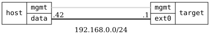

=== Container NETCONF Port Forwarding

ifdef::topdoc[:imagesdir: {topdoc}../../test/case/containers/netconf_port_forward]

==== Description

Verify that a NETCONF agent in a container can be reached on port 830
from the outside, and that the agent can reach the NETCONF server on
the target over the internal network.

....
                                                         <-- container -->
.-------------.            .----------------------.      .---------------.
|      | mgmt |------------| mgmt |        |      |      |      |  nc    |
| host | data |------------| ext0 | target | int0 |------| eth0 | agent  |
'-------------'.42       .1'----------------------'.1  .2'---------------'
              192.168.0.0/24                       10.0.0.0/24
                                                    VETH pair
....

The target's firewall puts `ext0` in a `wan` zone, which drops all
traffic to the target except TCP port 830.  That port is forwarded to
the container at 10.0.0.2:830, so a connection to port 830 on `ext0`
ends up in the container, not at the target's NETCONF server.  The
target end of the VETH pair, `int0`, is in an `int` zone that allows
only the `netconf` service.

The agent is a netcat listener on port 830.  For each connection it
prints a known greeting, connects to the target at 10.0.0.1:830, and
relays the first line it receives, which is the SSH banner of the
target's NETCONF server.

The test host connects to 192.168.0.1:830.  If the greeting arrives,
the port forward works.  If the SSH banner follows it, the container
reached NETCONF on the target.

==== Topology

==== Sequence

. Set up topology and attach to target DUT
. Configure ext0 and VETH pair for agent container
. Forward port 830 on ext0 to agent container
. Create agent container from bundled OCI image
. Verify agent container has started
. Verify port 830 on ext0 reaches the agent container
. Verify agent container reaches NETCONF on the target

