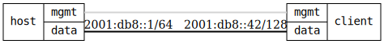

=== DHCPv6 Basic

ifdef::topdoc[:imagesdir: {topdoc}../../test/case/dhcp/client6_basic]

==== Description

Enable a DHCPv6 client and verify it requests an IPv6 lease from a
DHCPv6 server that is then set on the interface.

==== Topology

==== Sequence

. Set up topology and attach to target DUT
. Configure DHCPv6 client
. Verify client lease for {CLIENT}
. Verify client default route ::/0
. Verify client domain name resolution

