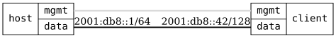

=== DHCPv6 Basic

ifdef::topdoc[:imagesdir: {topdoc}../../test/case/dhcp/client6_basic]

==== Description

Enable a DHCPv6 client and verify it requests an IPv6 lease from a
DHCPv6 server that is then set on the interface.

The default route, learned from the router advertisement, must be a
static route with the DHCPv6 route preference, the same as a route
from a DHCPv4 server.  A changed route preference must reach the route,
and the route must be removed with the client.

==== Topology

==== Sequence

. Set up topology and attach to target DUT
. Configure DHCPv6 client
. Verify DHCPv6 client is running
. Verify client lease for {CLIENT}
. Verify client default route ::/0 is static with preference 5
. Verify client domain name resolution
. Set DHCPv6 route preference 20
. Verify client default route ::/0 has preference 20
. Remove DHCPv6 client
. Verify client default route ::/0 is removed

