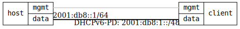

=== DHCPv6 Prefix Delegation

ifdef::topdoc[:imagesdir: {topdoc}../../test/case/infix_dhcp/client6_prefix_delegation]

==== Description

Verify DHCPv6 prefix delegation (IA_PD) where a client requests an IPv6
prefix from a DHCPv6 server.  This is commonly used on WAN interfaces of
routers to obtain a prefix for distribution to downstream networks.

==== Topology

==== Sequence

. Set up topology and attach to target DUT
. Configure DHCPv6 client w/ prefix delegation
. Verify DHCPv6 client is running
. Verify prefix delegation in logs

