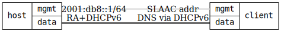

=== DHCPv6 SLAAC/RA (Stateless)

ifdef::topdoc[:imagesdir: {topdoc}../../test/case/dhcp/client6_slaac_ra]

==== Description

Verify DHCPv6 client works in stateless mode (information-only) where:
- Router Advertisements (RA) provide the IPv6 address via SLAAC
- DHCPv6 provides DNS servers and domain search options only

This is a common ISP deployment scenario where the router sends RAs for
address autoconfiguration, and DHCPv6 is only used for providing additional
configuration like DNS servers.

The test verifies that odhcp6c correctly integrates both RA and DHCPv6
information, which is something the old udhcpc6 client could not do.

==== Topology

==== Sequence

. Set up topology and attach to target DUT
. Configure DHCPv6 client in information-only mode
. Verify DHCPv6 client is running
. Verify client got SLAAC address from RA
. Verify client domain name resolution

