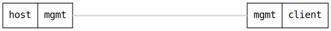

=== DHCP Hostname Resend

ifdef::topdoc[:imagesdir: {topdoc}../../test/case/dhcp/client_hostname_resend]

==== Description

Verify that updating the system hostname restarts the DHCP client so
subsequent DHCP requests advertise the current hostname (option 12,
RFC 2132).

Regression test for a bug where the DHCP client callback only reacts
on diffs in infix-dhcp-client, so a standalone change of
ietf-system:system/hostname leaves the running udhcpc untouched with
the old '-x hostname:' argument from when it was first started.

==== Topology

==== Sequence

. Set up topology and attach to target DUT
. Configure initial hostname '{HOSTNM_A}'
. Enable DHCP client sending hostname option
. Verify running udhcpc announces hostname '{HOSTNM_A}'
. Update system hostname to '{HOSTNM_B}'
. Verify running udhcpc announces hostname '{HOSTNM_B}'

