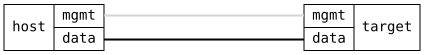

=== DHCP Server Network Boot

ifdef::topdoc[:imagesdir: {topdoc}../../test/case/dhcp/server_boot]

==== Description

Verify that network boot parameters are handed out in the BOOTP header
fields, which BOOTP clients, U-Boot and PXE ROMs read, and that the most
specific scope wins: host over subnet over global.

The DHCP client on the host records the server address (siaddr) and
boot file it receives in the lease.

==== Topology

==== Sequence

. Set up topology and attach to target DUT
. Configure DHCP server with global, subnet, and host boot parameters
. Verify pool client gets subnet boot file from this server
. Verify static host gets its own boot file
. Remove subnet and host boot, verify client falls back to global boot file and server

