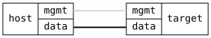

=== Firewall Address-Sets with Dynamic Entries

ifdef::topdoc[:imagesdir: {topdoc}../../test/case/firewall/address-set]

==== Description

Verifies firewall address-sets used as zone sources, in a setup where
all traffic from the data network is dropped by default and end devices
are granted access per-IP at runtime.

- The default zone "public" drops all traffic on the data interface
- The "trusted" zone accepts traffic from members of the "allowed"
  address-set: one static entry from the configuration, and dynamic
  entries managed at runtime with the add/remove/flush actions
- Dynamic entries must survive unrelated firewall configuration
  changes, but are not saved to the configuration
- Static entries cannot be removed with the remove action
- Entries in timeout sets ("greylist") expire on their own

==== Topology

==== Sequence

. Set up topology and attach to target
. Configure firewall with address-set as zone source
. Verify host is blocked by default
. Add dynamic entry for host, verify it is allowed
. Verify operational state distinguishes static/dynamic
. Verify dynamic entry survives configuration change
. Verify static entry cannot be removed with action
. Remove dynamic entry, verify host is blocked
. Flush dynamic entries, static remain
. Verify entries in timeout set expire on their own

