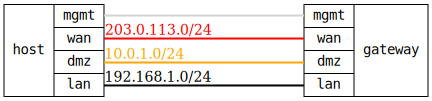

=== WAN-DMZ-LAN Firewall with Port Forwarding

ifdef::topdoc[:imagesdir: {topdoc}../../test/case/firewall/wan-dmz-lan]

==== Description

Multi-zone firewall setup with port forwarding (DNAT) to a DMZ server,
and masquerading (SNAT) of WAN-bound traffic.

image::wan-dmz-lan.svg[align=center, scaledwidth=50%]

- DUT/Gateway with WAN/DMZ/LAN zones and NAT
- Test host's WAN interface acts as external Internet client
- Test host's DMZ interface acts as internal server (HTTP on port 80)
- Test host's LAN interface acts as internal LAN client

==== Topology

==== Sequence

. Set up topology and attach to gateway
. Configure gateway with multi-zone firewall and NAT
. Verify basic connectivity within zones
. Verify WAN to DMZ port forwarding (DNAT)
. Verify LAN to DMZ connectivity
. Verify DMZ to LAN blocking
. Verify WAN isolation
. Verify LAN to WAN connectivity with SNAT
. Verify DMZ to WAN connectivity with SNAT
. Verify zone default actions/services

