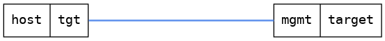

=== USB configuration with two USB ports
==== Description
Test that the configuration is consistent
when having two USB ports.

==== Topology
ifdef::topdoc[]
image::../../test/case/ietf_hardware/usb_two_ports/topology.png[USB configuration with two USB ports topology]
endif::topdoc[]
ifndef::topdoc[]
ifdef::testgroup[]
image::usb_two_ports/topology.png[USB configuration with two USB ports topology]
endif::testgroup[]
ifndef::testgroup[]

endif::testgroup[]
endif::topdoc[]
==== Test sequence
. Initialize
. Lock the first  USB port, and unlock the second USB port
. Verify that the correct port is locked and the correct one is unlocked
. Unlock the first USB port, and lock the second USB port
. Verify that the correct port is locked and the correct one is unlocked

<<<

