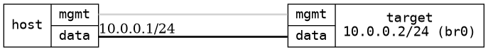

=== Bridge basic
==== Description
Test basic connectivity to a bridge

==== Topology
ifdef::topdoc[]
image::../../test/case/ietf_interfaces/bridge_basic/topology.png[Bridge basic topology]
endif::topdoc[]
ifndef::topdoc[]
ifdef::testgroup[]
image::bridge_basic/topology.png[Bridge basic topology]
endif::testgroup[]
ifndef::testgroup[]

endif::testgroup[]
endif::topdoc[]
==== Test sequence
. Initialize
. Configure single bridge with a single physical port, bridge @ IP 10.0.0.2
. Verify ping 10.0.0.2 is possible from host:data

<<<

