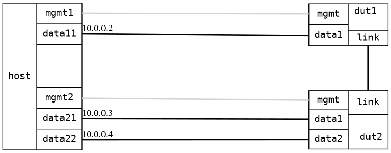

=== Bridge forwarding dual DUTs
==== Description
Ping through two bridges on two different DUTs.

....

  ,-------------------------------------,   ,-------------------------------------,
  |                          dut1:link  |   | dut2:link                           |
  |                      br0  ----------|---|---------  br0                       |
  |                     /               |   |          /   \                      |
  |dut1:mgmt       dut1:data1           |   | dut2:data1    dut2:data2  dut2:mgmt |
  '-------------------------------------'   '-------------------------------------'
      |                |                             |     |                 |
      |                |                             |     |                 |
,-----------------------------------------------------------------------------------,
| host:mgmt1    host:data11                 host:data21    host:data22   host:mgmt2 |
|               [10.0.0.2]                       [10.0.0.3]     [10.0.0.4]          |
|                 (ns11)                           (ns20)         (ns21)            |
|                                       [ HOST ]                                    |
'-----------------------------------------------------------------------------------'

....

==== Topology
ifdef::topdoc[]
image::../../test/case/ietf_interfaces/bridge_fwd_dual_dut/topology.png[Bridge forwarding dual DUTs topology]
endif::topdoc[]
ifndef::topdoc[]
ifdef::testgroup[]
image::bridge_fwd_dual_dut/topology.png[Bridge forwarding dual DUTs topology]
endif::testgroup[]
ifndef::testgroup[]

endif::testgroup[]
endif::topdoc[]
==== Test sequence
. Set up topology and attach to target DUT
. Configure a bridge with triple physical port
. Verify ping 10.0.0.3 and 10.0.0.4 from host:data11

<<<

