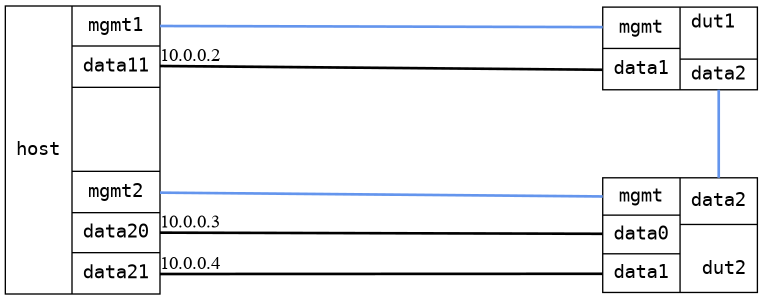

=== Bridge forwarding dual DUTs
==== Description
Ping through two bridges on two different DUTs.

==== Topology
ifdef::topdoc[]
image::../../test/case/ietf_interfaces/bridge_fwd_dual_dut/topology.png[Bridge forwarding dual DUTs topology]
endif::topdoc[]
ifndef::topdoc[]
ifdef::testgroup[]
image::bridge_fwd_dual_dut/topology.png[Bridge forwarding dual DUTs topology]
endif::testgroup[]
ifndef::testgroup[]

endif::testgroup[]
endif::topdoc[]
==== Test sequence
. Initialize
. Configure a bridge with triple physical port
. Verify ping 10.0.0.3 and 10.0.0.4 from host:data11

<<<

