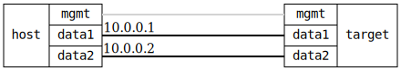

=== Bridge forwarding single DUTs

ifdef::topdoc[:imagesdir: {topdoc}../../test/case/ietf_interfaces/bridge_fwd_sgl_dut]

==== Description

Tests forwarding through a DUT with two bridged interfaces on one DUT.

....

,------------------------------------------,
|                                          |
|                          br0             |
|                         /   \            |
| target:mgmt   target:data1  target:data2 |
'------------------------------------------'
        |                |     |
        |                |     |
,------------------------------------------,
|   host:mgmt   host:data1     host:data2  |
|               [10.0.0.1]     [10.0.0.2]  |
|                  (ns0)         (ns1)     |
|                                          |
|                 [ HOST ]                 |
'------------------------------------------'

....

==== Topology

==== Sequence

. Set up topology and attach to target DUT
. Configure a bridge with dual physical port
. Verify ping from host:data1 to 10.0.0.2

