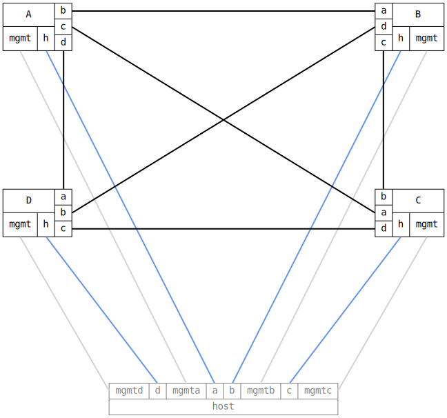

=== Bridge STP Basic
==== Description
First, verify that a fully connected mesh of 4 DUTs is pruned to a
spanning tree.

Since the mesh contains 3 redundant paths, can infer that a spanning
tree has been created if all host interfaces can reach each other
while exactly three links are in the blocking state.

Then, assign explicit priorities to all bridges and ports, and verify
that a spanning tree rooted at A is formed, with B, C, and D all
directly connected to A.

==== Topology
ifdef::topdoc[]
image::{topdoc}../../test/case/ietf_interfaces/bridge_stp_basic/topology.svg[Bridge STP Basic topology]
endif::topdoc[]
ifndef::topdoc[]
ifdef::testgroup[]
image::bridge_stp_basic/topology.svg[Bridge STP Basic topology]
endif::testgroup[]
ifndef::testgroup[]

endif::testgroup[]
endif::topdoc[]
==== Test sequence
. Set up topology and attach to target DUT
. Configure a bridge with spanning tree eneabled on dut a, b, c, and d
. Add an IP address to each host interface in the 10.0.0.0/24 subnet
. Verify that exactly three links are blocking
. Verify that host:a can reach host:{b,c,d}
. Add explicit port and bridge priorities: a,b,c,d=>1,2,3,4
. Verify that A, B, C and D agrees on A being the root bridge
. Verify that B, C and D all use their direct connection to on A
. Verify that host:a can reach host:{b,c,d}

<<<

