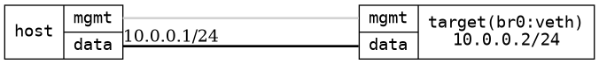

=== Bridge with a physical port and a veth
==== Description
This tests the possibility to add software added interfaces, in this case
VETH and bridge it with a physical interface

==== Topology
ifdef::topdoc[]
image::../../test/case/ietf_interfaces/bridge_veth/topology.png[Bridge with a physical port and a veth topology]
endif::topdoc[]
ifndef::topdoc[]
ifdef::testgroup[]
image::bridge_veth/topology.png[Bridge with a physical port and a veth topology]
endif::testgroup[]
ifndef::testgroup[]

endif::testgroup[]
endif::topdoc[]
==== Test sequence
. Initialize
. Configure bridged eth port and veth pair with IP 10.0.0.2
. Verify ping from host:data to 10.0.0.2

<<<

