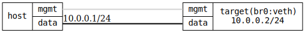

=== Bridge with a physical port and a veth
==== Description
This tests the possibility to add software added interfaces, in this case
VETH and bridge it with a physical interface

....

PING -->      br0
             /   \
 PC- target:data  veth0a -- veth0b
     10.0.0.1               10.0.0.2

....

==== Topology
ifdef::topdoc[]
image::{topdoc}../../test/case/ietf_interfaces/bridge_veth/topology.svg[Bridge with a physical port and a veth topology]
endif::topdoc[]
ifndef::topdoc[]
ifdef::testgroup[]
image::bridge_veth/topology.svg[Bridge with a physical port and a veth topology]
endif::testgroup[]
ifndef::testgroup[]

endif::testgroup[]
endif::topdoc[]
==== Test sequence
. Set up topology and attach to target DUT
. Configure bridged eth port and veth pair with IP 10.0.0.2
. Verify ping from host:data to 10.0.0.2

<<<

