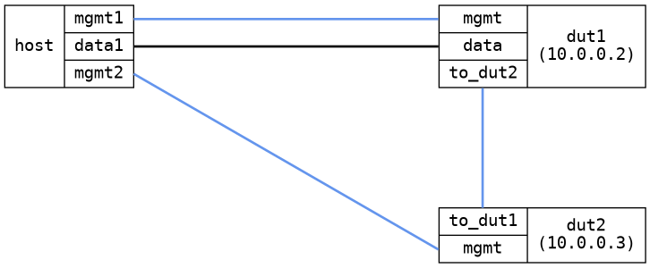

=== Bridge VLAN
==== Description
Basic test of VLAN functionality in a bridge

==== Topology
ifdef::topdoc[]
image::../../test/case/ietf_interfaces/bridge_vlan/topology.png[Bridge VLAN topology]
endif::topdoc[]
ifndef::topdoc[]
ifdef::testgroup[]
image::bridge_vlan/topology.png[Bridge VLAN topology]
endif::testgroup[]
ifndef::testgroup[]

endif::testgroup[]
endif::topdoc[]
==== Test sequence
. Configure DUTs
. Verify ping from host:data1 to 10.0.0.2 and 10.0.0.3

<<<

