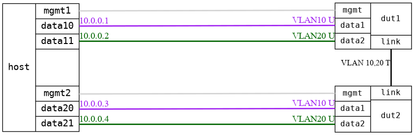

=== Bridge VLAN separation
==== Description
Test that two VLAN is correctly separaretade in the bridge

==== Topology
ifdef::topdoc[]
image::../../test/case/ietf_interfaces/bridge_vlan_separation/topology.png[Bridge VLAN separation topology]
endif::topdoc[]
ifndef::topdoc[]
ifdef::testgroup[]
image::bridge_vlan_separation/topology.png[Bridge VLAN separation topology]
endif::testgroup[]
ifndef::testgroup[]

endif::testgroup[]
endif::topdoc[]
==== Test sequence
. Initialize
. Configure a bridge with triple physical port
. Ping host:data20 [10.0.0.3] from host:data10 [10.0.0.1] through <bridge-vlan-10> and host:data21 [10.0.0.4] from host:data11 [10.0.0.2] through <bridge-vlan-20>

<<<

