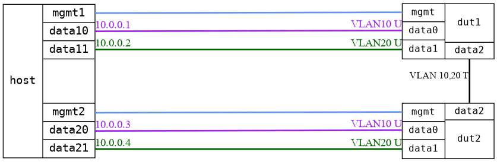

=== Bridge VLAN separation
==== Description
Test that two VLANs are correctly separated in the bridge

==== Topology
ifdef::topdoc[]
image::../../test/case/ietf_interfaces/bridge_vlan_separation/topology.png[Bridge VLAN separation topology]
endif::topdoc[]
ifndef::topdoc[]
ifdef::testgroup[]
image::bridge_vlan_separation/topology.png[Bridge VLAN separation topology]
endif::testgroup[]
ifndef::testgroup[]

endif::testgroup[]
endif::topdoc[]
==== Test sequence
. Initialize
. Configure DUTs
. Verify ping 10.0.0.3 from host:data10
. Verify ping 10.0.0.4 from host:data11
. Verify ping not possible host:data10->10.0.0.4, host:data11->10.0.0.3, host:data10->10.0.0.2, host:data11->10.0.0.1

<<<

