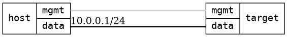

=== Dual bridges
==== Description
Test that it is possible to ping through a bridge to another bridge via VETH interfaces.

==== Topology
ifdef::topdoc[]
image::../../test/case/ietf_interfaces/dual_bridge/topology.png[Dual bridges topology]
endif::topdoc[]
ifndef::topdoc[]
ifdef::testgroup[]
image::dual_bridge/topology.png[Dual bridges topology]
endif::testgroup[]
ifndef::testgroup[]

endif::testgroup[]
endif::topdoc[]
==== Test sequence
. Initialize
. Configure two bridges linked with a veth pair furthest bridge has IP 10.0.0.2
. Verify ping from host:data to 10.0.0.2

<<<

