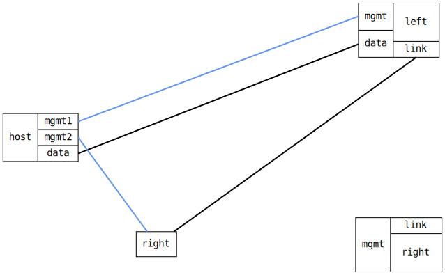

=== Basic IP GRE test
==== Description
Test setting up IP GRE tunnels using IPv4 and IPv6,
and then a connectivity test.

==== Topology
ifdef::topdoc[]
image::../../test/case/ietf_interfaces/gre_basic/topology.svg[Basic IP GRE test topology]
endif::topdoc[]
ifndef::topdoc[]
ifdef::testgroup[]
image::gre_basic/topology.svg[Basic IP GRE test topology]
endif::testgroup[]
ifndef::testgroup[]

endif::testgroup[]
endif::topdoc[]
==== Test sequence
. Set up topology and attach to target DUTs
. Configure DUTs

<<<

