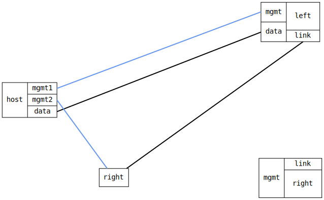

=== GRETAP interface bridged with physical
==== Description
Test that GRETAP works as it should and that it possible to bridge it.

==== Topology
ifdef::topdoc[]
image::../../test/case/ietf_interfaces/gretap_bridged/topology.svg[GRETAP interface bridged with physical topology]
endif::topdoc[]
ifndef::topdoc[]
ifdef::testgroup[]
image::gretap_bridged/topology.svg[GRETAP interface bridged with physical topology]
endif::testgroup[]
ifndef::testgroup[]

endif::testgroup[]
endif::topdoc[]
==== Test sequence
. Set up topology and attach to target DUTs
. Configure DUTs
. Test connectivity host:data to right:gre0 at 192.168.10.2

<<<

