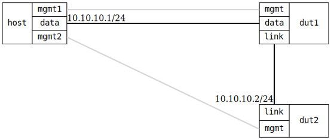

=== Interface status
==== Description
Verify interface status properly propagate changes when an interface
is disabled and then re-enabled.

Both admin-status and oper-status are verified.

==== Topology
ifdef::topdoc[]
image::{topdoc}../../test/case/ietf_interfaces/iface_enable_disable/topology.svg[Interface status topology]
endif::topdoc[]
ifndef::topdoc[]
ifdef::testgroup[]
image::iface_enable_disable/topology.svg[Interface status topology]
endif::testgroup[]
ifndef::testgroup[]

endif::testgroup[]
endif::topdoc[]
==== Test sequence
. Set up topology and attach to target DUTs
. Configure bridge and associated interfaces in target1
. Disable interface in target2
. Verify the interface is disabled
. Enable the interface and assign an IP address
. Verify the interface is enabled
. Verify it is possible to ping the interface

<<<

