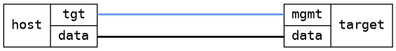

=== Custom MAC address on interface
==== Description
Test possibility to set and remove custom mac address on interfaces

==== Topology
ifdef::topdoc[]
image::../../test/case/ietf_interfaces/iface_phys_address/topology.png[Custom MAC address on interface topology]
endif::topdoc[]
ifndef::topdoc[]
ifdef::testgroup[]
image::iface_phys_address/topology.png[Custom MAC address on interface topology]
endif::testgroup[]
ifndef::testgroup[]

endif::testgroup[]
endif::topdoc[]
==== Test sequence
. Initialize
. Set custom MAC address to '02:01:00:c0:ff:ee' on target:mgmt
. Verify target:mgmt has MAC address '02:01:00:c0:ff:ee'
. Remove custom MAC address '02:01:00:c0:ff:ee'
. Verify that target:mgmt has the original MAC address again

<<<

