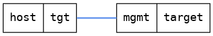

=== Interface status
==== Description
Check that interface status works

==== Topology
ifdef::topdoc[]
image::../../test/case/ietf_interfaces/iface_status/topology.png[Interface status topology]
endif::topdoc[]
ifndef::topdoc[]
ifdef::testgroup[]
image::iface_status/topology.png[Interface status topology]
endif::testgroup[]
ifndef::testgroup[]

endif::testgroup[]
endif::topdoc[]
==== Test sequence
. Initialize

<<<

