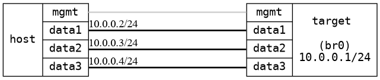

=== IGMP basic
==== Description
Verify that all multicast get flooded when no IGMP join exists in the system and
the flooding stops as soon a join arrives

              .1
 .---------------------------.
 |            DUT            |
 '-data1-----data2-----data3-'
     |         |         |
     |         |         |      10.0.0.0/24
     |         |         |
 .-data1-. .-data2-. .-data3-.
 | msend | | mrecv | | !memb |
 '-------' '-------' '-------'
    .2         .3        .4
             HOST

==== Topology
ifdef::topdoc[]
image::../../test/case/ietf_interfaces/igmp_basic/topology.png[IGMP basic topology]
endif::topdoc[]
ifndef::topdoc[]
ifdef::testgroup[]
image::igmp_basic/topology.png[IGMP basic topology]
endif::testgroup[]
ifndef::testgroup[]

endif::testgroup[]
endif::topdoc[]
==== Test sequence
. Set up topology and attach to target DUTs
. Configure device
. Start multicast sender on host:data0, group 224.1.1.1
. Verify that the group 224.1.1.1 is flooded on host:data2 and host:data3
. Join multicast group 224.1.1.1 on host:data2
. Verify group 224.1.1.1 is received on host:data2
. Verify that the group 224.1.1.1 is no longer received on host:data3

<<<

